# 📊 Диаграммы Архитектуры TwoComms

## 1. High-Level Architecture

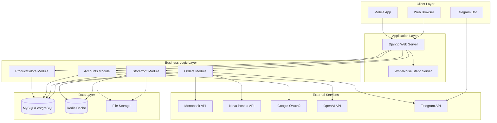

## 2. Module Dependencies

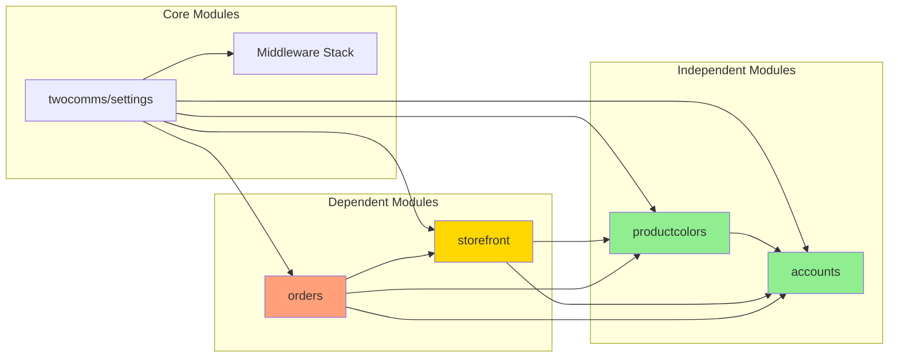

## 3. Data Flow: Order Processing

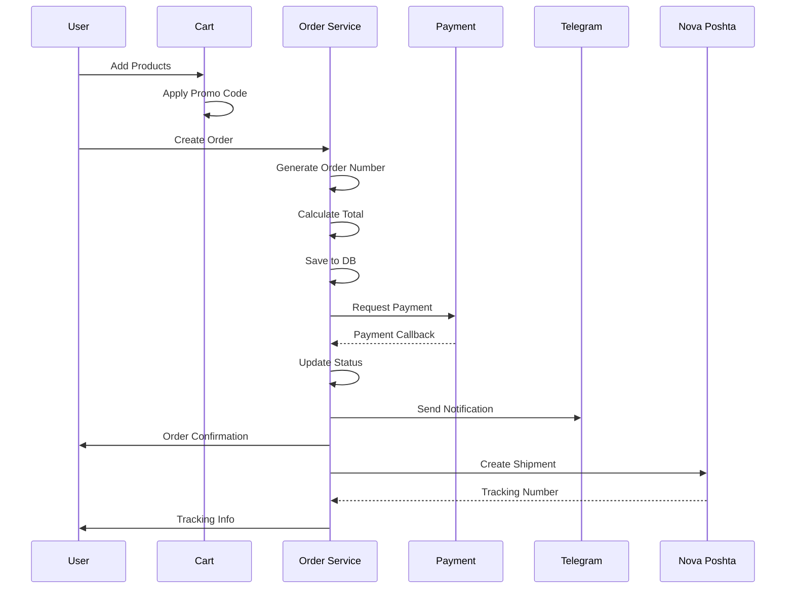

## 4. Caching Strategy

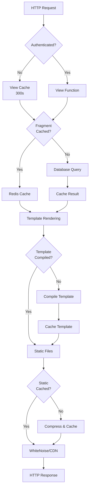

## 5. Security Layers

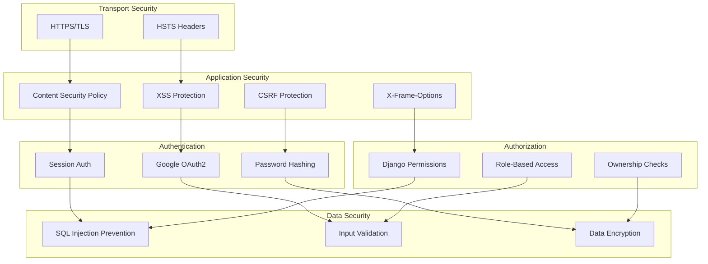

## 6. Deployment Architecture

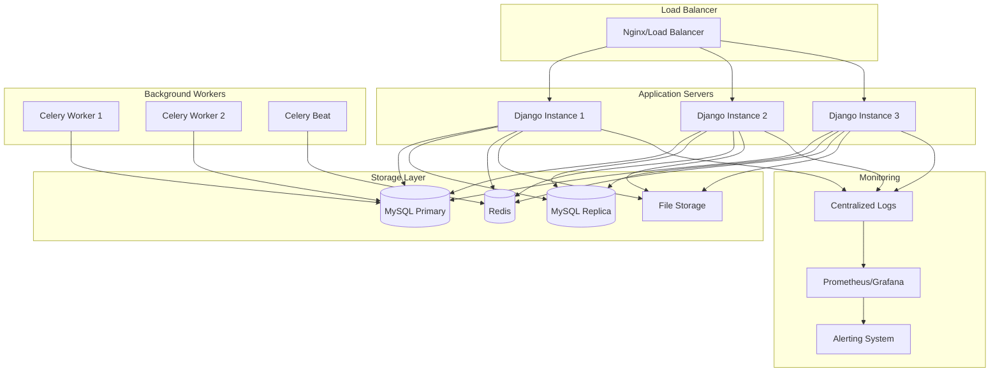

## 7. Database Schema (Simplified)

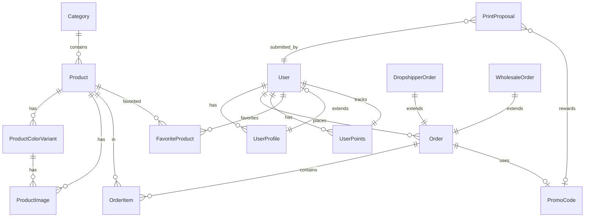

## 8. Middleware Pipeline

```mermaid
graph LR
    Request[HTTP Request] --> M1[ForceHTTPSMiddleware]
    M1 --> M2[WWWRedirectMiddleware]
    M2 --> M3[SecurityMiddleware]
    M3 --> M4[SecurityHeadersMiddleware]
    M4 --> M5[WhiteNoiseMiddleware]
    M5 --> M6[ImageOptimizationMiddleware]
    M6 --> M7[SessionMiddleware]
    M7 --> M8[CommonMiddleware]
    M8 --> M9[CsrfViewMiddleware]
    M9 --> M10[AuthenticationMiddleware]
    M10 --> M11[MessageMiddleware]
    M11 --> M12[ClickjackingMiddleware]
    M12 --> M13[RedirectFallbackMiddleware]
    M13 --> M14[SimpleAnalyticsMiddleware]
    M14 --> View[View Function]
    View --> Response[HTTP Response]
```

## 9. AI Content Generation Flow

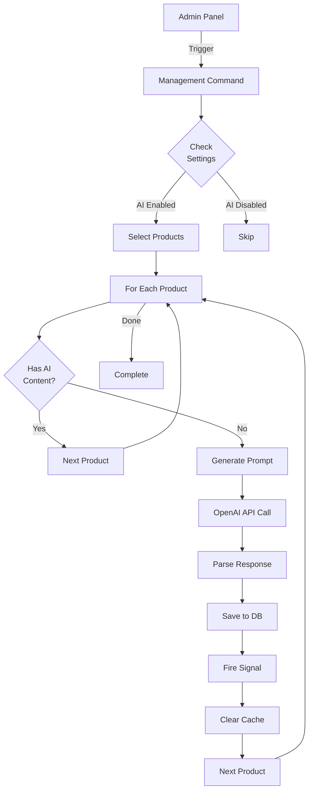

## 10. Dropshipping Flow

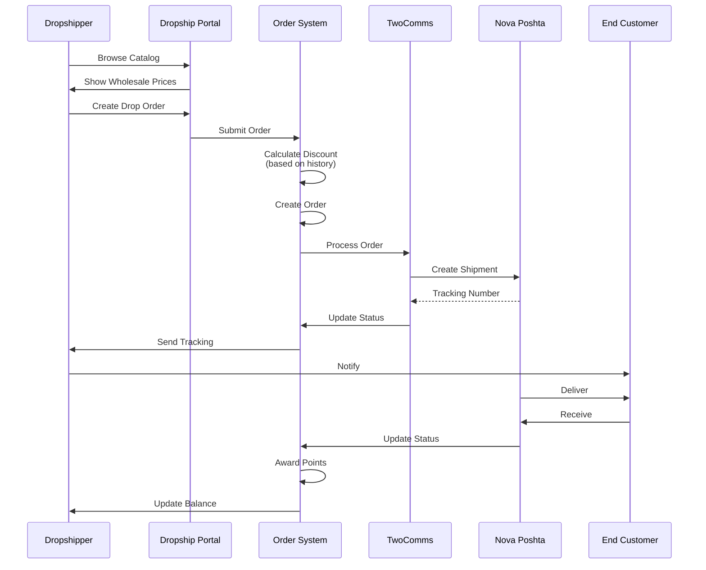

## 11. Performance Optimization Layers

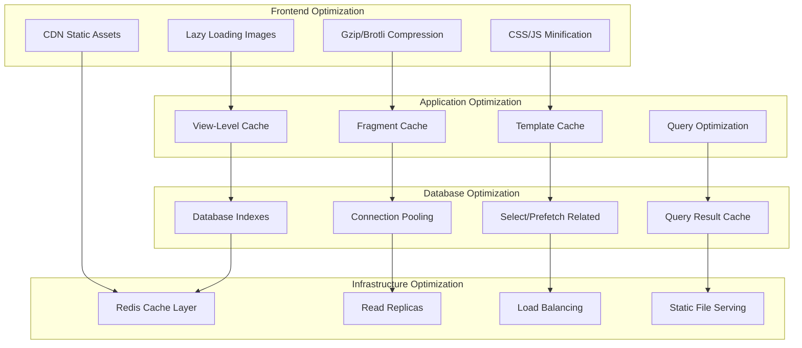

## 12. Error Handling & Monitoring

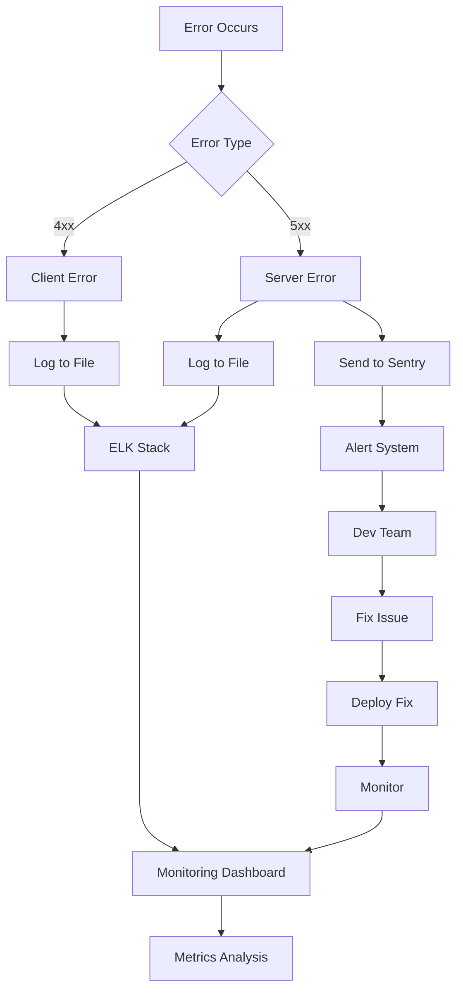

## 13. User Journey: Purchase Flow

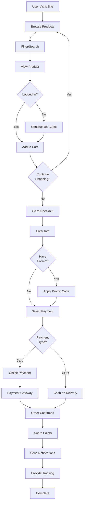

---

## Legend

### Status Colors

- 🟢 **Green**: Stable, Independent Module
- 🟡 **Yellow**: Core Module with Dependencies
- 🟠 **Orange**: High-Level Application Module
- 🔴 **Red**: Critical Path

### Dependency Types

- **Solid Line**: Direct Dependency
- **Dashed Line**: Indirect/Optional Dependency
- **Bold Line**: Critical Dependency

### Module Stability

- **Circle**: Stable (rarely changes)
- **Rectangle**: Semi-stable
- **Diamond**: Unstable (frequently changes)

---

## Notes

1. All diagrams represent the **current state** of the architecture as of October 24, 2025
2. External services dependencies are clearly marked
3. Cache layers are shown separately for clarity
4. Security layers are depicted in separate diagram
5. Data flow diagrams show typical user journeys

---

**Generated:** October 24, 2025  
**Tool:** Mermaid Diagrams  
**Version:** 1.0

