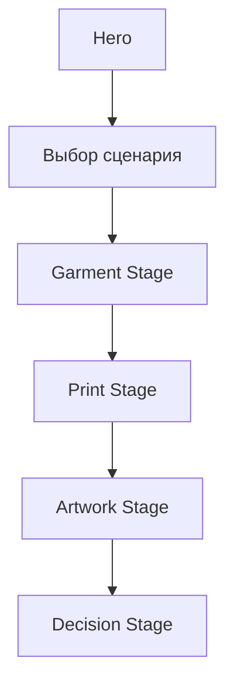
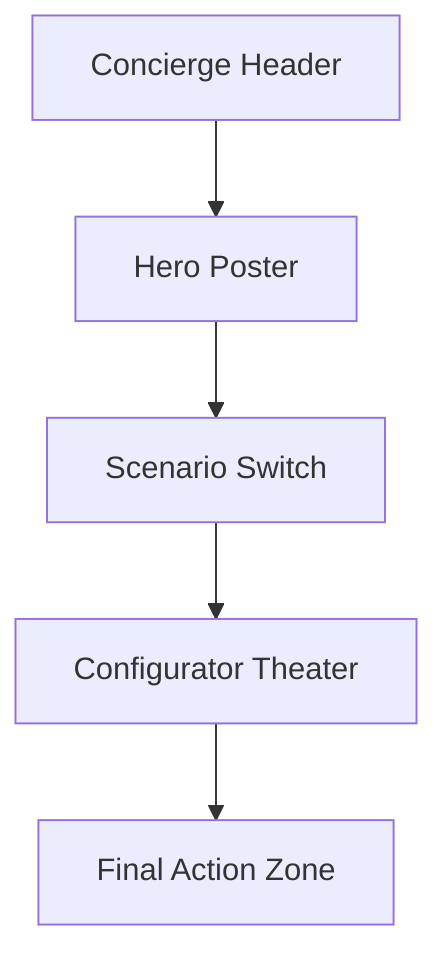

# GPT — авторская концепция редизайна лендинга кастомной одежды

> Дата: 2026-04-11  
> Автор: Codex / GPT  
> Формат: подробная дизайн-спецификация  
> Подход: отдельная концепция, не повторяющая `OPUS` и `GEMINI`

---

## О чем этот документ

Этот файл описывает **мою собственную концепцию** того, как должна выглядеть новая страница кастомной одежды на главном сайте. Это не пересказ старых идей и не адаптация уже написанного `OPUS`. Я сознательно строю здесь другой образ страницы:

- не как просто “форму, разбитую по шагам”,
- не как “лендинг + справа бухгалтерский summary”,
- а как **atelier-конфигуратор**, в котором главный объект на экране — сама вещь и ощущение сборки кастомного продукта.

Ниже я опираюсь не только на ваше описание, но и на реальный текущий код страницы, формы, модели, админки и уведомлений.

---

## Содержание

1. [Главная идея](#1-главная-идея)
2. [Что я реально изучил в проекте](#2-что-я-реально-изучил-в-проекте)
3. [Почему текущая страница ощущается тяжелой](#3-почему-текущая-страница-ощущается-тяжелой)
4. [Моя концепция: Atelier Flow](#4-моя-концепция-atelier-flow)
5. [Чем эта концепция отличается от стандартного wizard](#5-чем-эта-концепция-отличается-от-стандартного-wizard)
6. [Архитектура страницы](#6-архитектура-страницы)
7. [Сильная верхушка: хедер и hero](#7-сильная-верхушка-хедер-и-hero)
8. [Переход в сценарий выбора](#8-переход-в-сценарий-выбора)
9. [Новый shell конфигуратора](#9-новый-shell-конфигуратора)
10. [Подробный поток для худи](#10-подробный-поток-для-худи)
11. [Логика цен и визуализация стоимости](#11-логика-цен-и-визуализация-стоимости)
12. [Как я вижу B2B](#12-как-я-вижу-b2b)
13. [Как я вижу мобильную версию](#13-как-я-вижу-мобильную-версию)
14. [Тексты и микрокопирайт](#14-тексты-и-микрокопирайт)
15. [Вау-эффекты и motion](#15-вау-эффекты-и-motion)
16. [Что нужно менять в backend и админке](#16-что-нужно-менять-в-backend-и-админке)
17. [План внедрения](#17-план-внедрения)
18. [Критерии, по которым дизайн будет считаться удачным](#18-критерии-по-которым-дизайн-будет-считаться-удачным)

---

## 1. Главная идея

Если сформулировать концепцию одной фразой, то она такая:

> Новый лендинг должен ощущаться как премиальная мастерская по кастомной одежде, где пользователь сначала понимает, кому и зачем он собирает вещь, а потом шаг за шагом формирует изделие вокруг большого живого превью, а не вокруг набора карточек и технических полей.

То есть я предлагаю сместить акцент:

- **с формы на вещь**,
- **с перегруза на сцену выбора**,
- **с “правой колонки” на управляемое состояние сборки**,
- **с “все сразу” на “одна понятная задача в один момент времени”**.

Это важное отличие от стандартного подхода “сделаем просто почище и аккуратнее”.

---

## 2. Что я реально изучил в проекте

Чтобы идея не была абстрактной, я посмотрел фактическую реализацию.

### Текущая страница

- [custom_print.html](/Users/zainllw0w/TwoComms/site/twocomms/twocomms_django_theme/templates/pages/custom_print.html)

Сейчас там уже есть:

- split hero,
- выбор `Для себе` / `Для тиражу, брендування та мерчу`,
- B2B-подвиды,
- выбор изделия,
- зоны нанесения,
- услуга дизайнера,
- количество,
- размеры,
- контакты,
- sticky summary,
- mobile bar.

### Текущая обработка заявки

- [static_pages.py](/Users/zainllw0w/TwoComms/site/twocomms/storefront/views/static_pages.py)
- [forms.py](/Users/zainllw0w/TwoComms/site/twocomms/storefront/forms.py)
- [models.py](/Users/zainllw0w/TwoComms/site/twocomms/storefront/models.py)

Что важно:

- сейчас это **lead flow**, а не полноценный товарный конфигуратор,
- backend принимает только один `product_type`,
- текущая структура не знает ничего про `classic/oversize`, ткань, цвет, размер принта, люверсы, рукава и мульти-товарный заказ.

### Админка и менеджерский контур

- [admin_panel.html](/Users/zainllw0w/TwoComms/site/twocomms/twocomms_django_theme/templates/pages/admin_panel.html)
- [custom_print_notifications.py](/Users/zainllw0w/TwoComms/site/twocomms/storefront/custom_print_notifications.py)

Это важно, потому что красивый фронт бессмысленен, если менеджер потом получает в админке обрубок конфигурации.

### Общий стиль сайта

- [base.html](/Users/zainllw0w/TwoComms/site/twocomms/twocomms_django_theme/templates/base.html)
- [header.html](/Users/zainllw0w/TwoComms/site/twocomms/twocomms_django_theme/templates/partials/header.html)
- [index.html](/Users/zainllw0w/TwoComms/site/twocomms/twocomms_django_theme/templates/pages/index.html)

Я также сверил текущий визуальный язык сайта:

- dark theme,
- warm accent,
- e-commerce шапка,
- сильная роль карточек,
- активные CTA в верхних сценариях.

---

## 3. Почему текущая страница ощущается тяжелой

Проблема не только в количестве блоков. Проблема в том, **как именно распределена сложность**.

## 3.1 Все важное показывается слишком рано

Сейчас страница почти с первых экранов пытается одновременно показать:

- сегментацию,
- B2B-ветку,
- выбор изделия,
- зоны нанесения,
- pricing,
- upload,
- контакт,
- summary.

Пользователь не ощущает, что его ведут. Он ощущает, что ему выдали пакет задач.

## 3.2 Правый блок в текущем виде структурно неправильный

Он кажется “просто лежащим справа” не потому, что плохо нарисован, а потому что его роль не совпадает с моментом воронки.

Когда человек еще не выбрал:

- для кого заказ,
- какой именно худи,
- какой формат принта,

видеть рядом “чек” — это рано.

Правильный порядок должен быть такой:

1. доверие,
2. путь,
3. сборка,
4. только потом детальный расчет.

## 3.3 Текущий flow больше похож на техническую анкету

Это особенно чувствуется из-за того, что выбор начинается не с самой вещи, а с технических сущностей:

- зоны,
- услуга,
- количество,
- режим размеров.

Но пользователь в вашей задаче мыслит иначе:

- для себя или для команды,
- худи или футболка,
- классик или оверсайз,
- какой цвет,
- какой принт,
- где будет принт,
- насколько готов макет.

То есть текущая структура смотрит на процесс глазами системы, а не глазами клиента.

## 3.4 B2B-сценарий сейчас не выделен как отдельный опыт

Он просто встроен в общую форму и из-за этого выглядит как “еще один блок опций”, а не как отдельная задача с отдельной логикой.

Для B2B нужно сразу дать человеку ощущение:

- “да, тут предусмотрен мой кейс”,
- “да, тут понимают партии, брендирование и команды”,
- “да, это не просто такая же форма, только с полем названия бренда”.

---

## 4. Моя концепция: Atelier Flow

Я бы назвал эту концепцию:

## **Atelier Flow**

Почему именно так:

- страница должна ощущаться как мастерская,
- пользователь не просто заполняет форму, а “собирает вещь”,
- каждая следующая сцена строится вокруг результата предыдущей,
- на первом месте ощущение предмета, а не набора controls.

## 4.1 Основные принципы

### 1. Сначала предмет, потом параметры

Вещь должна быть главным визуальным носителем страницы.

### 2. Сначала смысл, потом опции

Сначала пользователь определяет сценарий:

- для себя,
- в подарок,
- для команды,
- для бренда.

Только потом он переходит к деталям изделия.

### 3. Один большой выбор за сцену

Каждый экран / блок должен иметь **одну доминирующую задачу**:

- выбрать путь,
- выбрать силуэт,
- выбрать принт,
- выбрать тип помощи по макету,
- выбрать действие.

### 4. Сводка не должна быть отдельным “чужим блоком”

Она должна ощущаться как продолжение конфигуратора.

### 5. B2C и B2B должны быть разными по поведению, а не только по тексту

Это очень важно.

---

## 5. Чем эта концепция отличается от стандартного wizard

Обычный wizard выглядит так:

```text
Шаг 1
Шаг 2
Шаг 3
Шаг 4
справа summary
```

Моя концепция другая.

### Она строится как набор сцен



Каждая `stage` — это не просто список полей. Это отдельная мини-сцена:

- со своим главным выбором,
- своим визуальным акцентом,
- и своим типом обратной связи.

### Что это дает

- страница перестает выглядеть как форма,
- появляется чувство прогресса,
- легче встроить wow-эффекты,
- легче сделать мобильную версию сильной, а не компромиссной.

---

## 6. Архитектура страницы

## 6.1 Верхний уровень

Я вижу страницу как 5 больших уровней:



## 6.2 Структура внутри `Configurator Theater`

Это центральная идея моей концепции.

Вместо большого полотна с формой я предлагаю:

```text
┌───────────────────────────────────────────────────────────────┐
│ BUILD STRIP                                                   │
│ [Для себе] [Худі] [Класик] [Чорний] [A4] [Редагувати]        │
├───────────────────────────────────────────────────────────────┤
│                                                               │
│                    PRODUCT STAGE                              │
│         Большое превью худи / принта / расположения           │
│                                                               │
├───────────────────────────────────────────────────────────────┤
│ DECISION PANEL                                                │
│ Текущий активный выбор                                        │
│ Кнопки / карты / свичи / подсказки                            │
├───────────────────────────────────────────────────────────────┤
│ PRICE CAPSULE + CTA                                           │
└───────────────────────────────────────────────────────────────┘
```

### Что здесь важно

- превью живет в центре,
- текущий выбор происходит в отдельной панели,
- сумма и действие — компактны,
- build strip дает контекст и чувство маршрута.

Это совсем другой характер, чем у классического “левая колонка + правая колонка”.

---

## 7. Сильная верхушка: хедер и hero

Вы очень правильно выделили верхушку как критически важную. Я тоже считаю, что именно она должна выправить первое впечатление и сразу объяснить, что здесь можно:

- собрать вещь для себя,
- сделать подарок,
- сделать мерч для команды,
- заказать брендирование для подразделения или компании,
- и при этом быстро связаться с менеджером.

## 7.1 Какой я вижу хедер

Я бы не делал хедер просто копией стандартного header сайта. Здесь нужен специальный режим страницы.

### Формат

```text
┌────────────────────────────────────────────────────────────────────┐
│ TwoComms Custom         Каталог   Кастом   Про бренд   Контакти   │
│                                                                    │
│ Потрібна консультація?  Telegram  +38...  [Поговорити з менеджером]│
└────────────────────────────────────────────────────────────────────┘
```

### Главное отличие

Во второй строке появляется не “служебный текст”, а `concierge bar`.

Это легкий бар доверия, который отвечает на главный страх:

> Если у меня не стандартный кейс, я не останусь один на один с формой.

## 7.2 Какой я вижу hero

Hero должен быть не информационным комбайном, а **постером**.

### Композиция

- слева текст,
- справа вещь,
- снизу 2 маршрута,
- под ними 3 сигнала доверия.

### Ядро hero

**Заголовок:**  
`Кастомний одяг, який хочеться носити, а не просто дарувати`

**Подзаголовок:**  
`Від одного худі для себе до брендованої партії для команди. Оберіть базу, принт і формат замовлення — або одразу обговоріть ідею з менеджером.`

### CTA

- primary: `Почати збірку`
- secondary: `Поговорити з менеджером`

### Trust line

- `Для себе`
- `Для подарунка`
- `Для команди та бренду`

### Визуальная подача

Справа не просто mockup. Там должен быть `hero object`:

- темное худи,
- мягкий теплый контур,
- в воздухе легкая глубина,
- ощущение, что это не карточка, а вещь в пространстве.

## 7.3 Что точно не нужно делать в hero

- не вставлять туда сразу stepper,
- не грузить техническими преимуществами,
- не дублировать кнопки,
- не пихать туда правую колонку summary.

## 7.4 Сценарий manager CTA в верхушке

Это должно быть оформлено не как “второстепенная ссылка”, а как:

```text
Маєте нестандартний запит?
Одяг для себе, подарунок, мерч для магазину або форма для підрозділу —
менеджер допоможе визначити базу, принт і формат замовлення.
```

Важно: этот текст должен успокаивать и расширять доверие, а не мешать основному действию.

---

## 8. Переход в сценарий выбора

Сразу после hero я бы делал **не таблицу и не просто две карточки**, а `Mode Switch`.

## 8.1 Как это выглядит

```text
Оберіть сценарій

[ Для себе / на подарунок ]      [ Для команди / бренду ]
```

Но эти кнопки-карточки должны ощущаться как **режим страницы**, а не просто как пара опций.

## 8.2 Что меняется после выбора

### Если выбран `Для себе / на подарунок`

Страница переключается в режим:

- мягче copy,
- меньше B2B-терминов,
- акцент на единичную вещь,
- CTA ориентирован на корзину или быстрый заказ.

### Если выбран `Для команди / бренду`

Страница переключается в режим:

- появляется B2B-интро,
- в build strip фиксируется тип клиента,
- активируется quantity economy logic,
- CTA ориентирован на менеджера и партию.

## 8.3 Почему это лучше обычной пары карточек

Потому что пользователь видит, что он не просто отметил одну опцию, а **переключил страницу в другой режим поведения**.

Это дает больше ясности.

---

## 9. Новый shell конфигуратора

Это ключевой уникальный элемент моей концепции.

## 9.1 Build Strip

Это верхняя горизонтальная линия выбранных решений.

Пример:

```text
[ Для себе ] [ Худі ] [ Класик ] [ Преміум ] [ Чорний ] [ A4 ] [ Дрібні правки ]
```

Каждый чип:

- показывает уже принятое решение,
- кликабелен,
- возвращает к нужной сцене.

### Почему это важно

Вместо длинного вертикального summary пользователь всегда видит:

- где он находится,
- что уже выбрал,
- куда можно вернуться.

## 9.2 Product Stage

Центр экрана — это `product stage`.

Там живет:

- превью худи,
- цвет,
- расположение принта,
- активная зона,
- реакция на выборы.

Это место должно быть самым “дорогим” визуально.

## 9.3 Decision Panel

Под превью находится панель текущего решения.

Принцип:

- одна сцена = один тип решения,
- выборы большие,
- объяснение рядом,
- нет лишних полей.

## 9.4 Price Capsule

Я не хочу полноценный sticky block справа. Вместо этого предлагаю компактную `price capsule`.

### Формат на desktop

```text
┌──────────────────────┐
│ Разом: 1290₴         │
│ Класик / A6 / 1 шт   │
│ [Деталі] [В кошик]   │
└──────────────────────┘
```

Она может:

- прилипать к нижнему краю viewport,
- быть компактной,
- раскрываться по клику в breakdown drawer.

### Почему это лучше

- не давит,
- не спорит с контентом,
- всегда рядом с действием,
- не выглядит “забытым блоком”.

## 9.5 Breakdown Drawer

Детализация цены не обязана торчать на экране все время.

Лучше сделать drawer:

- по клику `Деталі`,
- открывается справа на desktop,
- снизу на mobile.

Внутри:

- база,
- ткань,
- рукава,
- люверсы,
- правки / дизайн,
- quantity discount,
- итог.

---

## 10. Подробный поток для худи

Ниже мой полный сценарий именно под ваш кейс.

## 10.1 Шаг A — выбор типа изделия

Название:

`Що будемо кастомізувати?`

Логика:

- можно выбрать несколько карточек,
- но активной для полной настройки сейчас будет `Худі`.

Карточки:

- `Худі`
- `Футболка` — `незабаром`
- `Лонгслів` — `незабаром`

Ниже легкая строка:

> `Потрібен принт на вашому одязі? Напишіть менеджеру — підкажемо по тканині, ризиках і вартості.`

Это важно: `свій одяг` не должен ломать основной поток.

## 10.2 Шаг B — силуэт худи

Название:

`Оберіть силует`

Карточки:

- `Класик`
- `Оверсайз`

Но я бы сделал их не просто карточками с названием, а карточками с **разницей в характере**:

### Класик

- более собранный,
- ближе к базовой посадке,
- стандарт или премиум,
- от `860₴`.

### Оверсайз

- свободнее,
- объемнее,
- премиум уже внутри,
- от `1050₴`.

### UX-поведение

При выборе:

- превью худи реально меняет силуэт,
- build strip фиксирует выбор,
- decision panel переключается на следующий блок.

## 10.3 Шаг C — ткань

Это должна быть не просто “вторая группа карточек”, а логический ответ на предыдущий выбор.

### Для `Класик`

Показываем 2 опции:

- `Стандарт`
- `Преміум +180₴`

### Для `Оверсайз`

Не показываем фейковый выбор. Вместо этого даем инфо-плашку:

> `Оверсайз шиється на преміумній тканині за замовчуванням.`

Это делает интерфейс умнее и чище.

## 10.4 Шаг D — допы

Здесь я вижу не большую сетку карточек, а **аксессуарную полку**.

### Доп 1 — люверсы со шнурками

`Люверси зі шнурками +150₴`

Отображение:

- toggle,
- короткое описание,
- маленькая пиктограмма.

### Доп 2 — рукава

Я бы заложил 3 состояния:

- `Без принта на рукаві`
- `1 рукав +150₴`
- `2 рукави +300₴`

Пусть даже в первой реализации потом отключится `2 рукави`, но интерфейсно это сильнее и логичнее.

### Почему не просто чекбокс

Потому что “рукава” — это не бинарный вопрос, а сценарий выбора объема услуги.

## 10.5 Шаг E — размер и цвет

Я объединяю их в одну сцену, потому что оба решения относятся к самой базе, а не к принту.

### Размер

- `XS`
- `S`
- `M`
- `L`
- `XL`
- `2XL`

Подпись:

`Вартість не змінюється залежно від розміру`

### Цвет

Здесь я предлагаю не просто swatches, а двойную систему:

- swatches для быстрого выбора,
- рядом название выбранного цвета,
- и моментальный отклик на большом превью.

### Правило

Если цвет не меняет внешний вид превью, пользователь не верит интерфейсу.

## 10.6 Шаг F — карта принта

Это центральная сцена конфигуратора.

Название:

`Де буде принт і яким буде формат?`

### Моя логика интерфейса

Сначала человек выбирает **сценарий расположения**:

- `Перед`
- `Спина`
- `Перед + спина`

Потом интерфейс показывает доступные размеры.

### Сценарий `Перед`

Доступные форматы:

- `A6`
- `A5`
- `A4`

### Сценарий `Спина`

Доступные форматы:

- `A3`
- `A2`

### Сценарий `Перед + спина`

Доступный формат:

- `A3 + A6`

### Визуализация

На `product stage` пользователь видит:

- фронт / спину,
- выделенную зону,
- прямоугольник реального размера,
- подпись формата.

### Почему это лучше обычного списка кнопок

Потому что здесь рождается понимание:

- где будет принт,
- насколько он большой,
- за что именно человек платит.

## 10.7 Шаг G — файл и уровень помощи

Название:

`Що у вас з макетом?`

Я вижу этот экран как выбор одного из трех уровней сопровождения.

### Вариант 1

`Файл готовий до друку`

`+0₴`

Текст:

`Нічого змінювати не потрібно — просто завантажте макет.`

### Вариант 2

`Потрібні дрібні правки`

`+100₴`

Текст:

`Автоматичне або ручне виправлення фону, масштабу або положення. Без складного редагування.`

### Вариант 3

`Потрібна розробка дизайну`

`+350₴`

Текст:

`Створимо дизайн за референсом або ТЗ і підготуємо його під друк.`

### После выбора

Появляется контекстный блок:

- `upload`,
- `brief`,
- `подсказки по файлу`,
- `пример того, что нужно написать`.

Это лучше, чем показывать сразу все.

## 10.8 Шаг H — финальное действие

Здесь интерфейс должен сделать очень важную вещь:

не заставить человека еще раз перечитывать весь заказ.

### Показываем

- 5-7 ключевых параметров,
- итог,
- способ связи,
- главное действие.

### Типы действия

#### Если конфигурация стандартная и полностью просчитана

- primary: `Додати в кошик`
- secondary: `Замовити через менеджера`

#### Если сценарий требует ручной проверки

- primary: `Надіслати запит`
- secondary: `Обговорити в Telegram`

Так интерфейс честно ведет пользователя и не обещает полной автоматизации там, где ее еще нет.

---

## 11. Логика цен и визуализация стоимости

## 11.1 Розница: классик

| Формат | Сторона | Цена |
|---|---|---:|
| A6 | перед | 860₴ |
| A5 | перед | 870₴ |
| A4 | перед | 890₴ |
| A3 | спина | 990₴ |
| A2 | спина | 1120₴ |
| A3 + A6 | перед + спина | 1050₴ |

## 11.2 Розница: оверсайз

| Формат | Сторона | Цена |
|---|---|---:|
| A6 | перед | 1050₴ |
| A5 | перед | 1060₴ |
| A4 | перед | 1080₴ |
| A3 | спина | 1180₴ |
| A2 | спина | 1310₴ |
| A3 + A6 | перед + спина | 1240₴ |

## 11.3 Доплаты

| Опция | Цена |
|---|---:|
| Преміум тканина для класик | +180₴ |
| Люверси зі шнурками | +150₴ |
| 1 рукав | +150₴ |
| 2 рукави | +300₴ |
| Дрібні правки | +100₴ |
| Розробка дизайну | +350₴ |

## 11.4 Как я предлагаю показывать цену

Не просто одной цифрой в summary, а как `cost story`.

### Пример

```text
База: Худі класик / A4                 890₴
Преміум тканина                        180₴
Люверси                                150₴
Дрібні правки                          100₴
--------------------------------------------
Разом                                 1320₴
```

### Почему это важно

У пользователя появляется ощущение:

- цена не взялась из воздуха,
- он понимает, за что доплачивает,
- допы начинают выглядеть как осмысленные решения, а не как навязанный upsell.

## 11.5 Как я вижу B2B-скидку визуально

Не просто текст “минус N”.

А отдельная `economy ladder`:

```text
5 шт   10 шт   15 шт   20 шт   25 шт
-5₴   -10₴    -15₴    -20₴    -25₴ за одиницю
```

При выборе количества подсвечивается нужная ступень.

Это особенно хорошо работает для B2B, потому что скидка становится наглядной.

---

## 12. Как я вижу B2B

Для B2B я не предлагаю отдельный другой сайт и не предлагаю просто “еще один блок”. Я предлагаю **другой режим конфигуратора**.

## 12.1 Что должно меняться в B2B-режиме

### В hero-смысле

После выбора B2B пользователь должен понимать:

- страница знает, что он собирает не одну вещь,
- здесь предусмотрена цена за партию,
- здесь можно брендировать команду, бригаду, подразделение, магазин.

### В UI

Появляются:

- поле `Назва команди / компанії / підрозділу`,
- quantity ladder,
- B2B benefit block,
- CTA под менеджерский сценарий.

## 12.2 B2B copy

Я бы использовал такой тон:

**Заголовок блока:**  
`Мерч, форма або брендована партія`

**Подпись:**  
`Для команди, компанії, магазину, бренду або підрозділу. Від 5 одиниць запускається оптова логіка і знижка за кількістю.`

## 12.3 B2B сценарии, которые можно явно подсветить

Под quantity block можно добавить 4 чипа:

- `Для команди`
- `Для підрозділу`
- `Для корпоративу`
- `Для магазину / бренду`

Это не обязательно влияет на цену, но дает ощущение, что страница понимает контекст заказа.

---

## 13. Как я вижу мобильную версию

Я считаю, что mobile здесь не должен быть “копией десктопа по вертикали”.

Наоборот: в этой концепции мобильная версия может получиться даже сильнее.

## 13.1 Mobile hero

Структура:

- компактный branded header,
- headline в 2-3 строки,
- hero object,
- 2 CTA,
- далее mode switch.

Никакого бокового поведения, никаких длинных таблиц над fold.

## 13.2 Mobile configurator

### Формат

```text
BUILD STRIP
PRODUCT STAGE
CURRENT DECISION PANEL
BOTTOM COST BAR
```

### Почему это хорошо

- человек всегда видит вещь,
- решение принимается в одном фокусе,
- сумма и действие живут внизу,
- нет ощущения, что он проваливается в длинную форму.

## 13.3 Bottom Cost Bar

На mobile это главный action-anchor.

Пример:

```text
Разом: 1320₴
Класик / A4 / 1 шт
[ Деталі ] [ Далі ]
```

По нажатию `Деталі`:

- открывается bottom drawer,
- показывается breakdown,
- можно вернуться к любому выбору.

## 13.4 Mobile step behavior

Я бы не делал классический нумерованный stepper. На мобильном лучше работают:

- активная сцена,
- build strip,
- мягкая подпись `Крок 3 із 7`.

Это чище и меньше нагружает.

## 13.5 Touch behavior

На mobile особенно важно:

- кнопки не меньше `44px`,
- swatches имеют крупную зону касания,
- переключение сцен не вызывает скачка layout,
- CTA не перекрываются клавиатурой при вводе контакта.

---

## 14. Тексты и микрокопирайт

Ниже мои рекомендованные тексты.

## 14.1 Hero

**Kicker:**  
`TwoComms Custom`

**H1:**  
`Кастомний одяг, який хочеться носити`

**Subline:**  
`Для себе, подарунка або команди. Оберіть базу, принт і формат замовлення — або одразу обговоріть ідею з менеджером.`

**Primary CTA:**  
`Почати збірку`

**Secondary CTA:**  
`Поговорити з менеджером`

## 14.2 Сегментация

**Карточка 1:**  
`Для себе / на подарунок`

`Одна річ або невелике замовлення з власним принтом чи ідеєю.`

**Карточка 2:**  
`Для команди / бренду`

`Форма, мерч або брендована партія для компанії, підрозділу чи магазину.`

## 14.3 Подпись про свой одяг

`Потрібен принт на вашому одязі? Напишіть менеджеру — підкажемо, чи підійде тканина і як краще це прорахувати.`

## 14.4 Hoodie blocks

- `Оберіть силует`
- `Оберіть тканину`
- `Додайте деталі`
- `Оберіть колір і розмір`
- `Налаштуйте принт`
- `Завантажте макет або залиште ТЗ`

## 14.5 Финальные действия

- `Додати в кошик`
- `Надіслати запит`
- `Обговорити в Telegram`

---

## 15. Вау-эффекты и motion

Я против “вау ради вау”. Но здесь у страницы должен быть характер.

## 15.1 В hero

- мягкий depth move у худи,
- теплое контурное свечение,
- плавное появление headline и CTA,
- subtle light drift на фоне.

## 15.2 В configurator

### Build strip morph

Когда пользователь принимает решение:

- карточка выбора схлопывается,
- превращается в чип сверху,
- decision panel плавно меняет контент.

Это будет очень сильный UX-эффект.

### Live print overlay

При выборе:

- перед / спина,
- A6 / A5 / A4 / A3 / A2,
- combo

на худи появляется соответствующая зона.

### Price pulse

При изменении суммы:

- total слегка подсвечивается,
- строка доплаты мягко входит в breakdown,
- нет дерганого пересчета.

## 15.3 B2B ladder highlight

При изменении количества:

- подсвечивается новая ступень,
- показывается текущая скидка за единицу,
- если хочется, можно добавить строку:

`Ви економите 250₴ на партії`

Это хороший продающий, но не кричащий эффект.

---

## 16. Что нужно менять в backend и админке

Это обязательный раздел, потому что без него новый дизайн останется витриной без нормального продолжения.

## 16.1 Что не поддерживается текущей моделью

Текущая модель `CustomPrintLead` не умеет хранить:

- список изделий,
- hoodie fit,
- fabric,
- color,
- normalized size,
- sleeve option,
- grommets,
- print layout,
- print format,
- cart-ready configuration.

## 16.2 Минимальный безопасный путь

Если нужно быстро запустить новый UX без полной перестройки системы, можно сделать промежуточный вариант:

- хранить расширенный `configuration_json`,
- туда писать все новые поля,
- в админке уже красиво их разворачивать.

### Плюсы

- быстрее,
- меньше миграций,
- позволяет сначала проверить новую воронку.

### Минусы

- это все еще не идеальная модель,
- корзина и order pipeline будут неудобными.

## 16.3 Правильный путь

Я бы проектировал такие сущности:

- `CustomConfiguration`
- `CustomConfigurationItem`
- `CustomArtworkRequest`

Где `CustomConfigurationItem` хранит:

- garment type,
- fit,
- fabric,
- size,
- color,
- print placement,
- print format,
- extras,
- unit price,
- quantity,
- final line total.

Это уже нормальная база для:

- корзины,
- checkout,
- admin,
- аналитики,
- менеджерской обработки.

## 16.4 Что должно поменяться в админке

Менеджер должен видеть не сырое `pricing_snapshot_json`, а структурированную карточку.

Пример:

```text
Худі
Оверсайз
Чорний
M
A3 + A6
Люверси: так
Рукав: 1
Макет: дрібні правки
Кількість: 10
Ціна за одиницю: ...
Разом: ...
```

И отдельно:

- `потрібен менеджер`,
- `можна додати в кошик`,
- `є референс`,
- `є файл для друку`.

## 16.5 Что должно измениться в уведомлении

Сейчас уведомление менеджеру текстовое и общее. Новый поток должен отправлять:

- путь пользователя,
- полную конфигурацию,
- итоговую математику,
- тип заявки: `lead only` или `cart-ready`.

Это сильно упростит обработку.

## 16.6 Production-safe замечание

Если дальше вы захотите реально внедрять:

- добавление кастомного худи в корзину,
- сохранение кастомной конфигурации в заказ,
- отдельные B2B-расчеты,

это уже изменение не только UI, но и продуктовой логики:

- cart,
- order,
- admin,
- notification,
- возможно оплата,
- возможно аналитика.

То есть внедрять это нужно осторожно и поэтапно.

---

## 17. План внедрения

Я бы разбил работу на 4 очереди.

## Очередь 1 — новый front shell

- специальный header для custom page,
- новый hero,
- mode switch,
- новый configurator shell,
- новая cost capsule.

## Очередь 2 — hoodie scene flow

- силуэт,
- ткань,
- допы,
- цвет,
- размер,
- print stage,
- artwork stage.

## Очередь 3 — модель данных и админка

- расширенные данные,
- новый admin rendering,
- новые уведомления менеджеру.

## Очередь 4 — cart integration

- line item,
- сохранение кастомной конфигурации,
- checkout flow,
- order display.

---

## 18. Критерии, по которым дизайн будет считаться удачным

## 18.1 По визуалу

- верхушка выглядит дорого и собранно,
- главный объект — вещь, а не форма,
- страница не напоминает калькулятор на стероидах.

## 18.2 По UX

- пользователь понимает первый экран за несколько секунд,
- путь выбора ощущается естественно,
- правая колонка больше не выглядит случайным блоком,
- любой шаг можно изменить без потери структуры.

## 18.3 По mobile

- мобильная версия не ощущается урезанной,
- bottom cost bar помогает, а не мешает,
- сцены удобно проходить одной рукой.

## 18.4 По продукту

- B2C и B2B реально отличаются,
- hoodie-конфигуратор воспринимается как полноценный продукт,
- цены читаются и объясняются,
- допы выглядят осмысленно.

## 18.5 По реализации

- данные доходят до админки без потери смысла,
- менеджер видит структурированную конфигурацию,
- сценарий “в корзину” не обещается там, где его backend еще не поддерживает.

---

## Финальный вывод

Если говорить максимально прямо, я вижу лучший вариант не как “сделать текущий лендинг легче”, а как:

> превратить страницу в сценический конфигуратор, где клиент сначала выбирает контекст заказа, потом собирает вещь вокруг большого живого превью, а цена и действие подаются не отдельным блоком справа, а как естественный результат сборки.

В этой концепции верхушка продает доверие, середина дает контроль, а финал не перегружает — и именно поэтому страница может быть одновременно красивой, удобной и функциональной.
