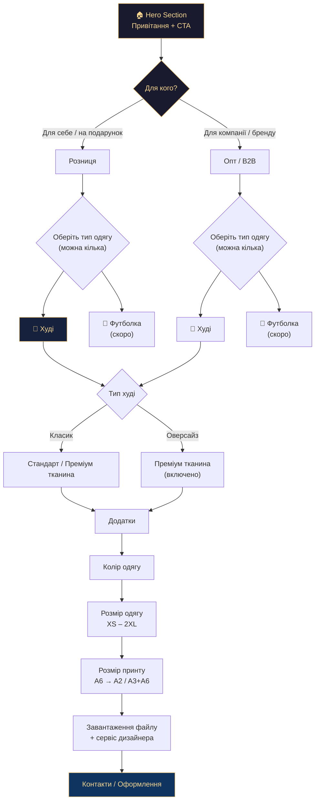
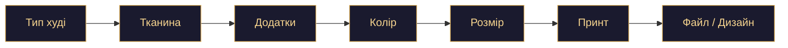
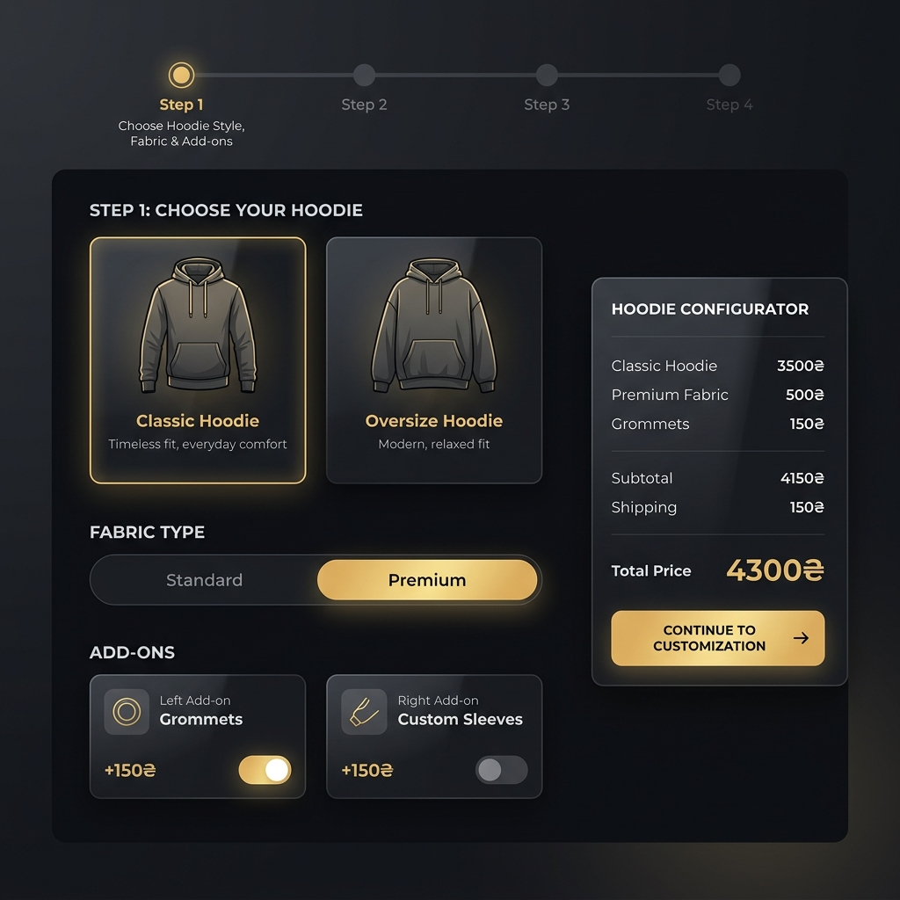
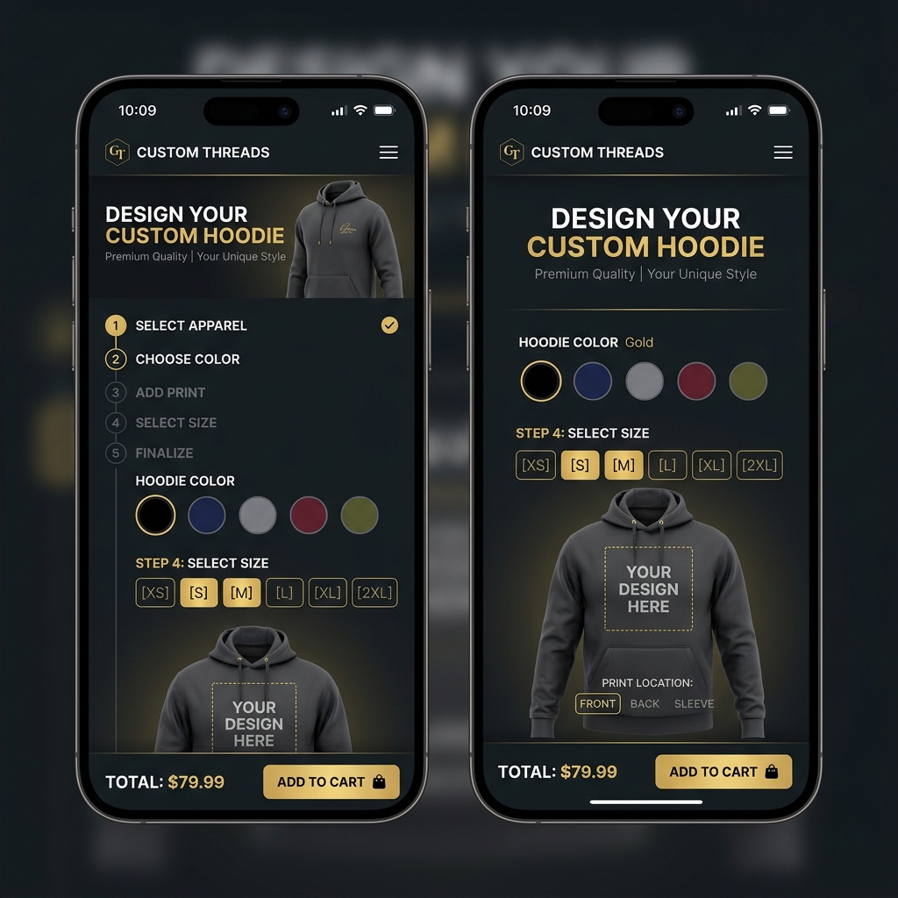

# 🎨 OPUS — Редизайн лендінгу кастомного одягу TwoComms

> **Автор**: Opus Agent  
> **Дата**: 11 квітня 2026  
> **Версія**: 1.0  
> **Статус**: Концепт / Дизайн-документ  

---

## 📋 Зміст

1. [Аналіз поточного стану](#1-аналіз-поточного-стану)
2. [Нова інформаційна архітектура](#2-нова-інформаційна-архітектура)
3. [Хедер та герой-секція](#3-хедер-та-герой-секція)
4. [Розгалужений покроковий візард](#4-розгалужений-покроковий-візард)
5. [Конфігуратор худі (детально)](#5-конфігуратор-худі-детально)
6. [Система ціноутворення](#6-система-ціноутворення)
7. [B2B / Оптовий потік](#7-b2b--оптовий-потік)
8. [Дизайн-система та візуальна мова](#8-дизайн-система-та-візуальна-мова)
9. [WOW-ефекти та анімації](#9-wow-ефекти-та-анімації)
10. [Мобільна версія](#10-мобільна-версія)
11. [Фінальне оформлення та дії](#11-фінальне-оформлення-та-дії)
12. [Технічна реалізація](#12-технічна-реалізація)

---

## 1. Аналіз поточного стану

### 🔴 Критичні проблеми

| # | Проблема | Вплив |
|---|----------|-------|
| 1 | **Перевантаження інформацією** — всі кроки, опції, B2B шкала, зони нанесення, файли і контакти видно одночасно | Користувач лякається обсягом, покидає сторінку |
| 2 | **Правий блок (summary)** висить у sticky без контексту — на мобільному зовсім зникає | Втрачається цінність живого калькулятора |
| 3 | **B2B сегмент** — «Для тиражу, брендування та мерчу» незрозумілий для клієнта, шкала знижок абстрактна | Клієнт не розуміє чому це для нього |
| 4 | **Тексти** — «estimate», «без зайвих кроків», технічна мова | Не клієнтський тон, не продає |
| 5 | **«Свій одяг»** як повноцінний виріб — плутає логіку, ламає калькулятор | Відсутній сенс на цьому рівні |
| 6 | **Неможливо обрати декілька виробів** — тільки один radio button | Обмежує замовлення (хочу худі + футболку) |
| 7 | **Немає конфігурації худі** — класик/оверсайз, тканина, люверси | Весь функціонал спрощений до «виріб + зона» |
| 8 | **Ціни некоректні та немають деталізації** — від 1600 грн «за худі» | Немає прозорості, немає розбивки за розміром принту |
| 9 | **Немає вибору кольору та розміру одягу** як такого | Критично для конфігуратора Custom |
| 10 | **Немає візуалізації розміщення принту** — як на скринах конкурентів | Клієнт не розуміє де буде його принт |

### 🟡 Що працює добре (зберігаємо)

- ✅ Загальна темна палітра з золотим акцентом — преміальний вигляд
- ✅ Покрокова логіка (кроки 1-5) — правильний підхід, потребує рефактору
- ✅ Вибір каналу зв'язку (Telegram / WhatsApp / Телефон) — зручна функція
- ✅ Glassmorphism ефекти на картках — сучасний дизайн
- ✅ Mobile-bar з ціною — фіксована панель знизу на мобільному
- ✅ AJAX-сабміт форми — без перезавантаження сторінки

---

## 2. Нова інформаційна архітектура

### Дерево рішень (User Flow)



### Принцип «Progressive Disclosure»

> Показуємо **тільки той крок, який актуальний зараз**. Кожен попередній крок стискається в компактний «чіп» зверху, щоб завжди було видно де ти, і можна повернутися.

```
┌─────────────────────────────────────────┐
│  ① Для себе  ② Худі  ③ Класик  ④ ...   │  ← breadcrumb / summary chips
├─────────────────────────────────────────┤
│                                         │
│       [ ПОТОЧНИЙ АКТИВНИЙ КРОК ]        │
│                                         │
├─────────────────────────────────────────┤
│  💰 Живий калькулятор: 860₴             │  ← завжди видимий
└─────────────────────────────────────────┘
```

---

## 3. Хедер та герой-секція

### 3.1 Хедер (Header Bar)

Хедер — це перше, що бачить користувач. Він повинен одразу транслювати: **«тут ви можете створити одяг зі своїм дизайном, і ми допоможемо»**.

```
┌──────────────────────────────────────────────────────────────────────┐
│                                                                      │
│  🔶 TwoComms          Каталог   Кастом   Про нас                    │
│                                                                      │
│                  💬 Зв'язатися з менеджером                          │
│                  📞 +380 XX XXX XXXX    ✈️ Telegram                  │
│                                                                      │
└──────────────────────────────────────────────────────────────────────┘
```

**Конкретна реалізація:**
- Логотип TwoComms ліворуч
- Навігація по центру: `Каталог` → `Кастомний одяг` → `Про нас`
- Праворуч: Кнопка «Зв'язатися» з іконкою Telegram + номер телефону
- При скролі хедер стає `backdrop-filter: blur(18px)` — ефект скла

### 3.2 Герой-секція (Hero)

**Концепція**: Розділений hero — ліворуч текст, праворуч 3D-эффект худі з легким золотим свіченням.

```
┌──────────────────────────────────────────────────────────────────────┐
│                                                                      │
│   Кастомний      │                                                  │
│   одяг           │         [ 3D Худі з golden glow ]                │
│   з вашим        │         [ легкий float-анімація  ]               │
│   дизайном       │                                                  │
│                  │                                                  │
│   Створіть унікальний одяг зі своїм                                │
│   принтом — для себе, на подарунок або                              │
│   для корпоративного мерчу вашої команди.                           │
│                                                                      │
│   ┌──────────────────┐  ┌──────────────────┐                        │
│   │ 🎁 Замовити      │  │ 💬 Поговорити з  │                        │
│   │   для себе       │  │   менеджером     │                        │
│   └──────────────────┘  └──────────────────┘                        │
│                                                                      │
│   ✦ DTF друк   ✦ Від 1 шт   ✦ Доставка НП                         │
│                                                                      │
└──────────────────────────────────────────────────────────────────────┘
```

**Текст hero:**

> ### Кастомний одяг з вашим дизайном
> Створіть унікальний одяг зі своїм принтом — для себе, на подарунок або для корпоративного мерчу вашої команди. Готовий макет чи ідея — ми допоможемо втілити.

**Головні аргументи (pill-badges під текстом):**
- `✦ DTF друк преміум якості`
- `✦ Від 1 штуки`
- `✦ Доставка Новою Поштою по всій Україні`

**Дві CTA-кнопки:**
1. `🎁 Замовити для себе` — основна золота кнопка → скрол до конфігуратора
2. `💬 Обговорити з менеджером` — вторинна кнопка → Telegram

### Візуальна концепція Hero


---

## 4. Розгалужений покроковий візард

### 4.1 Крок 0: Вибір сегменту

**Назва секції**: «Для кого замовлення?»

**Текст**: *«Оберіть формат — від цього залежить ціноутворення та додаткові опції»*

```
┌─────────────────────────────────┐  ┌─────────────────────────────────┐
│                                 │  │                                 │
│  🎁 Для себе / на подарунок    │  │  🏢 Для компанії / команди     │
│                                 │  │                                 │
│  Індивідуальне замовлення від   │  │  Мерч для бренду, форма для    │
│  1 штуки. Ваш принт, ваш      │  │  підрозділу, одяг для команди  │
│  стиль, ваша історія.          │  │  або магазину. Знижки від 5 шт.│
│                                 │  │                                 │
│  ✓ Будь-яка кількість          │  │  ✓ Знижка від 5 одиниць       │
│  ✓ Швидке оформлення           │  │  ✓ Єдиний дизайн на тираж     │
│  ✓ Персональний підхід         │  │  ✓ Брендинг і фірмовий стиль  │
│                                 │  │                                 │
└─────────────────────────────────┘  └─────────────────────────────────┘
```

**UX-деталь**: При виборі картка піднімається на 4px, отримує золотий бордер з `glow-shadow`, і з'являється ✅ чекмарка у кутку.

### 4.2 Крок 1: Вибір виробу

**Назва секції**: «Оберіть що замовляєте»

**Текст**: *«Ви можете обрати декілька типів одягу в одному замовленні»*

```
┌──────────────┐  ┌──────────────┐  ┌──────────────┐
│              │  │              │  │              │
│   [худі]     │  │  [футболка]  │  │  [лонгслів]  │
│   іконка     │  │   іконка     │  │   іконка     │
│              │  │              │  │              │
│   Худі       │  │  Футболка    │  │  Лонгслів    │
│   від 860₴   │  │  скоро       │  │  скоро       │
│              │  │  ⌛ coming   │  │  ⌛ coming   │
└──────────────┘  └──────────────┘  └──────────────┘
```

**Головна зміна**: 
- Чекбокси замість radio → можна обрати і худі, і футболку одночасно
- «Свій одяг» — **видалено як окрему опцію**. Замість цього внизу блоку:

> 💡 **Хочете принт на своєму одязі?** Зв'яжіться з менеджером для обговорення деталей, тканини та вартості.  
> [💬 Написати менеджеру →]

- Футболка та лонгслів показуються як «Скоро», з overlay `opacity: 0.5` та бейджем «Coming Soon»
- Кожен обраний виріб отримує свій конфігуратор нижче (tabs або accordion)

### 4.3 Крок 2–N: Конфігуратор виробу (див. Секцію 5)

---

## 5. Конфігуратор худі (детально)

### 5.1 Загальна структура

Після обрання «Худі» відкривається конфігуратор. Він складається з **мінікроків**, які з'являються послідовно:



### 5.2 Мінікрок 2a: Тип худі

```
┌────────────────────────────────────────────────────┐
│  Оберіть тип худі                                  │
│                                                    │
│  ┌──────────────────┐  ┌──────────────────┐        │
│  │    [ілюстрація]  │  │    [ілюстрація]  │        │
│  │     Класик       │  │     Оверсайз     │        │
│  │                  │  │                  │        │
│  │  Класичний крій, │  │  Вільний крій,   │        │
│  │  стандартна або  │  │  преміум тканина │        │
│  │  преміум тканина │  │  включена        │        │
│  │                  │  │                  │        │
│  │  від 860₴       │  │  від 1 050₴      │        │
│  └──────────────────┘  └──────────────────┘        │
│                                                    │
└────────────────────────────────────────────────────┘
```

### 5.3 Мінікрок 2b: Тип тканини

> **Показується ТІЛЬКИ якщо обрано «Класик»!**  
> Для оверсайз тканина завжди преміум — цей крок пропускається.

```
┌────────────────────────────────────────────────────┐
│  Тип тканини                                       │
│                                                    │
│  ┌──────────────────┐  ┌──────────────────┐        │
│  │  Стандарт        │  │  Преміум         │        │
│  │                  │  │                  │        │
│  │  Тришарова       │  │  Підвищена       │        │
│  │  петальна        │  │  щільність,      │        │
│  │  тканина 300     │  │  м'яка фактура   │        │
│  │  г/м²            │  │  360 г/м²        │        │
│  │                  │  │                  │        │
│  │  включено        │  │  + 180₴          │        │
│  └──────────────────┘  └──────────────────┘        │
│                                                    │
└────────────────────────────────────────────────────┘
```

### 5.4 Мінікрок 2c: Додатки (Add-ons)

**Формат**: Toggle switches (перемикачі) в одному рядку.

```
┌────────────────────────────────────────────────────┐
│  Додаткові опції                                   │
│                                                    │
│  ┌─────────────────────────────┬────────┬────────┐ │
│  │ 🔲 Люверси з шнурками      │ +150₴  │ [OFF]  │ │
│  ├─────────────────────────────┼────────┼────────┤ │
│  │ 🔲 Принт на рукаві (1 шт.) │ +150₴  │ [OFF]  │ │
│  └─────────────────────────────┴────────┴────────┘ │
│                                                    │
│  💡 Люверси — металеві кільця для шнурка в         │
│     капюшоні. Додають стильний деталь.             │
│                                                    │
└────────────────────────────────────────────────────┘
```

**UX**: 
- Toggle ON → картка отримує golden border + `+150₴` показується як доданий до суми
- При toggle OFF → повертається стандартний вигляд
- Живий калькулятор внизу оновлюється моментально з м'якою `counter` анімацією

### 5.5 Мінікрок 2d: Колір одягу

```
┌────────────────────────────────────────────────────┐
│  Колір худі                                        │
│                                                    │
│  ⚫ ⚪ 🔵 🔴 🟢 🟡 🟤 🟣 ⬛                      │
│  Чорний  Білий  Синій  ...                         │
│                                                    │
│  [ Обраний колір показує назву зверху ]             │
│                                                    │
│  💡 Якщо потрібний колір не в списку, ми            │
│  підберемо його за запитом.                        │
│                                                    │
└────────────────────────────────────────────────────┘
```

**UX**: 
- Кольори — кружечки 40×40px з `border: 3px solid transparent`
- Обраний колір отримує золотий ring: `border: 3px solid #e2b25b; box-shadow: 0 0 12px rgba(226,178,91,0.35)`
- При hover — плавне збільшення `scale(1.15)` + tooltip з назвою кольору
- Превʼю худі (якщо буде зображення) міняє колір при виборі

### 5.6 Мінікрок 2e: Розмір одягу

```
┌────────────────────────────────────────────────────┐
│  Розмір                                            │
│                                                    │
│  [ XS ] [ S ] [ M ] [ L ] [ XL ] [ 2XL ]          │
│                                                    │
│  📏 Не впевнені в розмірі? Подивіться              │
│     розмірну сітку нижче або запитайте менеджера.  │
│                                                    │
│  ┌──────────────────────────────────────────────┐  │
│  │ Розмірна сітка (collapsible)                 │  │
│  │                                              │  │
│  │   XS   S    M    L    XL   2XL               │  │
│  │  46   48   50   52   54   56   ← обхват      │  │
│  │  64   66   68   70   72   74   ← довжина     │  │
│  └──────────────────────────────────────────────┘  │
│                                                    │
└────────────────────────────────────────────────────┘
```

**UX**: 
- Chip-buttons в один рядок
- Розмірна сітка — collapsible (за замовчуванням згорнута)
- Ціна від розміру **НЕ залежить** (XS до 2XL — однакова ціна)

### 5.7 Мінікрок 2f: Розмір та місце принту

**Це ключова секція — тут відбувається основне ціноутворення!**

#### Вибір зони нанесення (перед/зад)

```
┌────────────────────────────────────────────────────────────────────┐
│  Розмір принту та розташування                                     │
│                                                                    │
│  ┌──────────────────────────────────────────────────────────────┐  │
│  │                                                              │  │
│  │       ПЕРЕД (грудь)              ЗАД (спина)                │  │
│  │                                                              │  │
│  │  ┌────────────────┐        ┌────────────────┐               │  │
│  │  │                │        │                │               │  │
│  │  │   [Зображення  │        │   [Зображення  │               │  │
│  │  │    худі        │        │    худі        │               │  │
│  │  │    перед       │        │    зад         │               │  │
│  │  │    з зоною     │        │    з зоною     │               │  │
│  │  │    принту]     │        │    принту]     │               │  │
│  │  │                │        │                │               │  │
│  │  └────────────────┘        └────────────────┘               │  │
│  │                                                              │  │
│  │  Перед: A6 • A5 • A4                                        │  │
│  │  Зад:   A3 • A2                                             │  │
│  │  Обидві сторони: A3 (зад) + A6 (перед)                      │  │
│  │                                                              │  │
│  └──────────────────────────────────────────────────────────────┘  │
│                                                                    │
└────────────────────────────────────────────────────────────────────┘
```

#### Розміри принтів — таблиця з описом

| Формат | Розмір (см) | Розміщення | Ціна (Класик) | Ціна (Оверсайз) |
|--------|-------------|------------|---------------|------------------|
| **A6** | 10 × 15 | Перед (грудь) | 860₴ | 1 050₴ |
| **A5** | 15 × 21 | Перед (грудь) | 870₴ | 1 060₴ |
| **A4** | 21 × 30 | Перед (грудь) | 890₴ | 1 080₴ |
| **A3** | 30 × 41 | Зад (спина) | 990₴ | 1 180₴ |
| **A2** | 41 × 58 | Зад (спина) | 1 120₴ | 1 310₴ |
| **A3+A6** | Спина + грудь | Перед + зад | 1 050₴ | 1 240₴ |

**Правила:**
- Все що **менше A3** — це **перед** (грудь)
- Від **A3 включно** і більше — це **зад** (спина)
- **A3+A6** — комбо: спина A3 + грудь A6

#### Візуальний вибір формату

```
┌────────────────────────────────────────────────────────────────────┐
│                                                                    │
│   Оберіть розмір принту:                                          │
│                                                                    │
│   ПЕРЕД (грудь):                                                  │
│   ┌────────┐  ┌────────┐  ┌────────┐                              │
│   │   A6   │  │   A5   │  │   A4   │                              │
│   │ 10×15  │  │ 15×21  │  │ 21×30  │                              │
│   │ 860₴   │  │ 870₴   │  │ 890₴   │                              │
│   └────────┘  └────────┘  └────────┘                              │
│                                                                    │
│   ЗАД (спина):                                                    │
│   ┌────────┐  ┌────────┐                                          │
│   │   A3   │  │   A2   │                                          │
│   │ 30×41  │  │ 41×58  │                                          │
│   │ 990₴   │  │ 1120₴  │                                          │
│   └────────┘  └────────┘                                          │
│                                                                    │
│   КОМБО:                                                          │
│   ┌────────────────────────┐                                      │
│   │   A3 + A6              │                                      │
│   │   Спина + грудь        │                                      │
│   │   1 050₴               │                                      │
│   └────────────────────────┘                                      │
│                                                                    │
│   [Зображення худі з візуальною зоною обраного формату]           │
│                                                                    │
└────────────────────────────────────────────────────────────────────┘
```

**WOW-ефект**: При виборі формату зображення худі плавно показує відповідну зону принту з анімацією `clip-path` або `mask`. Зона підсвічується золотим контуром з пульсуючим гlow.

**Візуальні референси** — як на Everfox:

```
┌────────────────────────────────────────────────┐
│                                                │
│      ┌──────────┐                              │
│      │  30 см   │                              │
│      ├──────────┤                              │
│      │          │ 41 см                        │
│      │  ВАШ     │                              │
│      │  ПРИНТ   │                              │
│      │          │                              │
│      └──────────┘                              │
│                                                │
│   Зображення худі зі зоною принту             │
│   з вказаними розмірами в сантиметрах          │
│                                                │
└────────────────────────────────────────────────┘
```

### 5.8 Мінікрок 2g: Завантаження макету та послуга дизайнера

```
┌────────────────────────────────────────────────────────────────────┐
│  Ваш макет                                                        │
│                                                                    │
│  ┌──────────────────────────────────────────┐                      │
│  │  ✅ Файл готовий до друку                │  безкоштовно         │
│  │                                          │                      │
│  │  Файл підготовлений, нічого змінювати    │                      │
│  │  не потрібно. Просто завантажте.         │                      │
│  └──────────────────────────────────────────┘                      │
│                                                                    │
│  ┌──────────────────────────────────────────┐                      │
│  │  🔧 Потрібні невеликі правки             │  + 100₴             │
│  │                                          │                      │
│  │  Автоматичне або ручне виправлення       │                      │
│  │  фону, масштабу, положення. Без          │                      │
│  │  складного редагування (до 15 хв).       │                      │
│  └──────────────────────────────────────────┘                      │
│                                                                    │
│  ┌──────────────────────────────────────────┐                      │
│  │  🎨 Розробка дизайну під принт           │  + 350₴             │
│  │                                          │                      │
│  │  Створення дизайну з нуля за вашим       │                      │
│  │  референсом або ТЗ. Дизайнер підготує    │                      │
│  │  макет під обраний формат.               │                      │
│  └──────────────────────────────────────────┘                      │
│                                                                    │
│  ┌──────────────────────────────────────────┐                      │
│  │  📁 Перетягніть файл сюди або оберіть    │                      │
│  │                                          │                      │
│  │  PNG, JPG, PDF, AI, PSD, SVG | до 50MB   │                      │
│  └──────────────────────────────────────────┘                      │
│                                                                    │
│  💬 Коментар до макету (необов'язково)                             │
│  ┌──────────────────────────────────────────┐                      │
│  │                                          │                      │
│  └──────────────────────────────────────────┘                      │
│                                                                    │
└────────────────────────────────────────────────────────────────────┘
```

**UX-деталі:**
- Drag & drop зона для файлів з візуальним фідбеком (бордер стає золотим при dragover)
- Тумбнейл-превʼю завантаженого файлу
- При виборі «Розробка дизайну» — поле коментаря стає обов'язковим
- При виборі «Потрібні правки» — додається підказка що саме можна поправити

### Концепт конфігуратора (мокап)



---

## 6. Система ціноутворення

### 6.1 Базова ціна (Класик худі)

```
┌─────────────────────────────────────────────────────────┐
│  BASE PRICE = Ціна за принт(формат) + Добавки          │
│                                                         │
│  Формат принту:                                         │
│  ├── A6 (10×15 см, перед) ............... 860₴          │
│  ├── A5 (15×21 см, перед) ............... 870₴          │
│  ├── A4 (21×30 см, перед) ............... 890₴          │
│  ├── A3 (30×41 см, зад) ................ 990₴          │
│  ├── A2 (41×58 см, зад) ................ 1 120₴        │
│  └── A3+A6 (комбо, перед+зад) .......... 1 050₴        │
│                                                         │
│  Добавки:                                               │
│  ├── Преміум тканина (тільки класик) .... +180₴         │
│  ├── Люверси з шнурками ................. +150₴         │
│  ├── Принт на рукаві (1 шт.) ........... +150₴         │
│  │                                                      │
│  Послуга дизайнера:                                     │
│  ├── Файл готовий ........................ 0₴           │
│  ├── Невеликі правки .................... +100₴        │
│  └── Розробка дизайну ................... +350₴        │
│                                                         │
│  TOTAL = BASE + Добавки + Послуга дизайнера             │
└─────────────────────────────────────────────────────────┘
```

### 6.2 Оверсайз худі

```
┌─────────────────────────────────────────────────────────┐
│  OVERSIZE BASE PRICE (вже включає преміум тканину):     │
│                                                         │
│  Формат принту:                                         │
│  ├── A6 (10×15 см, перед) ............... 1 050₴        │
│  ├── A5 (15×21 см, перед) ............... 1 060₴        │
│  ├── A4 (21×30 см, перед) ............... 1 080₴        │
│  ├── A3 (30×41 см, зад) ................ 1 180₴        │
│  ├── A2 (41×58 см, зад) ................ 1 310₴        │
│  └── A3+A6 (комбо, перед+зад) .......... 1 240₴        │
│                                                         │
│  Добавки:                                               │
│  ├── Люверси з шнурками ................. +150₴         │
│  └── Принт на рукаві (1 шт.) ........... +150₴         │
│                                                         │
│  ⚠️ Преміум тканина вже включена в оверсайз            │
│                                                         │
└─────────────────────────────────────────────────────────┘
```

### 6.3 Формула калькулятора

```javascript
// Pseudo-code для калькулятора
function calculatePrice(config) {
  const { type, fabric, printSize, grommets, sleeve, designService, quantity, isB2B } = config;
  
  // Базова ціна за формат принту
  const PRICES = {
    classic: { A6: 860, A5: 870, A4: 890, A3: 990, A2: 1120, 'A3+A6': 1050 },
    oversize: { A6: 1050, A5: 1060, A4: 1080, A3: 1180, A2: 1310, 'A3+A6': 1240 }
  };
  
  let unitPrice = PRICES[type][printSize];
  
  // Преміум тканина (тільки для класик)
  if (type === 'classic' && fabric === 'premium') {
    unitPrice += 180;
  }
  
  // Додатки
  if (grommets) unitPrice += 150;
  if (sleeve) unitPrice += 150;
  
  // Послуга дизайнера (одноразова, не множиться на кількість)
  const DESIGN_PRICES = { ready: 0, adjust: 100, design: 350 };
  const designCost = DESIGN_PRICES[designService];
  
  // B2B знижка: -5₴ за кожні 5 одиниць, починаючи з 5
  let discount = 0;
  if (isB2B && quantity >= 5) {
    discount = Math.floor(quantity / 5) * 5; // -5₴ за кожні 5 шт
  }
  
  const unitPriceAfterDiscount = unitPrice - discount;
  const subtotal = unitPriceAfterDiscount * quantity;
  const total = subtotal + designCost;
  
  return { unitPrice, unitPriceAfterDiscount, discount, designCost, subtotal, total };
}
```

### 6.4 Живий калькулятор (sidebar / bottom bar)

**Desktop** — sticky panel праворуч:

```
┌──────────────────────────────────┐
│  💰 Ваше замовлення              │
│                                  │
│  Класик худі           860₴     │
│  A6 принт (перед)                │
│  + Преміум тканина     +180₴    │
│  + Люверси              +150₴    │
│  ─────────────────────────────── │
│  Ціна за 1 шт.        1 190₴   │
│  × 1 шт.                        │
│  ─────────────────────────────── │
│  Послуга дизайнера      +100₴   │
│  ═══════════════════════════════ │
│  РАЗОМ:               1 290₴    │
│                                  │
│  ┌──────────────────────────────┐│
│  │   🛒 Додати в кошик          ││
│  └──────────────────────────────┘│
│  ┌──────────────────────────────┐│
│  │   💬 Обговорити з менеджером ││
│  └──────────────────────────────┘│
│                                  │
└──────────────────────────────────┘
```

**WOW**: При зміні суми — числа плавно «крутяться» вгору/вниз (counter animation). Кожний доданий елемент з'являється зі `slide-in` анімацією зліва.

---

## 7. B2B / Оптовий потік

### 7.1 Структура B2B секції

Коли обрано «Для компанії / команди», з'являються додаткові поля:

```
┌────────────────────────────────────────────────────────────────────┐
│  Деталі для корпоративного замовлення                              │
│                                                                    │
│  Назва компанії / команди / проєкту                               │
│  ┌───────────────────────────────────────────────┐                 │
│  │                                               │                 │
│  └───────────────────────────────────────────────┘                 │
│                                                                    │
│  Кількість одиниць                                                │
│  ┌───────────────────────────────────────────────┐                 │
│  │  [5]  [10]  [15]  [20]  [25]  [50]  [інше]   │                 │
│  └───────────────────────────────────────────────┘                 │
│                                                                    │
│  ┌──────────────────────────────────────────────────────────────┐  │
│  │  📊 Ваша знижка                                              │  │
│  │                                                              │  │
│  │  Опт починається з 5 одиниць. Знижка -5₴ за кожні 5 шт.     │  │
│  │                                                              │  │
│  │  5 шт  → -5₴/шт    │  25 шт → -25₴/шт  │  75 шт → -75₴/шт │  │
│  │  10 шт → -10₴/шт   │  50 шт → -50₴/шт  │  100 шт → -100₴  │  │
│  │                                                              │  │
│  └──────────────────────────────────────────────────────────────┘  │
│                                                                    │
└────────────────────────────────────────────────────────────────────┘
```

### 7.2 B2B калькулятор — приклад

| Показник | Значення |
|----------|----------|
| Тип худі | Класик |
| Формат принту | A6 |
| Базова ціна | 860₴ |
| Кількість | 20 шт |
| Знижка (20/5 = 4 → 4×5₴ = 20₴) | -20₴/шт |
| Ціна за 1 шт. після знижки | 840₴ |
| Разом за 20 шт. | 16 800₴ |
| + Послуга дизайнера (1 раз) | +350₴ |
| **TOTAL** | **17 150₴** |

### 7.3 Прогресивна шкала знижок

```
┌───────────────────────────────────────────────────────────────┐
│                                                               │
│   ─────●─────────────────────────────────────── 100+ шт      │
│        5     10    20    30    50    75    100                 │
│       -5₴  -10₴  -20₴  -30₴  -50₴  -75₴  -100₴             │
│                                                               │
│   ▲ Ваша знижка: -20₴/шт при 20 одиницях                     │
│                                                               │
└───────────────────────────────────────────────────────────────┘
```

**WOW**: Анімований slider з tooltip, який показує поточну знижку. При зміні кількості — маркер плавно рухається по шкалі.

---

## 8. Дизайн-система та візуальна мова

### 8.1 Палітра кольорів

```css
:root {
  /* Backgrounds */
  --bg-primary: #0c0d12;
  --bg-surface: rgba(16, 18, 24, 0.92);
  --bg-surface-strong: rgba(23, 25, 33, 0.98);
  --bg-card: rgba(12, 14, 20, 0.92);
  --bg-card-hover: rgba(20, 22, 30, 0.96);
  
  /* Golden Accent */
  --accent: #e2b25b;
  --accent-soft: #f7d58f;
  --accent-deep: #b97c2b;
  --accent-glow: rgba(226, 178, 91, 0.15);
  --accent-glow-strong: rgba(226, 178, 91, 0.35);
  
  /* Borders */
  --border: rgba(255, 214, 138, 0.12);
  --border-active: rgba(255, 214, 138, 0.35);
  --border-hover: rgba(255, 214, 138, 0.22);
  
  /* Text */
  --text: #f7f0e6;
  --text-muted: rgba(247, 240, 230, 0.72);
  --text-subtle: rgba(247, 240, 230, 0.56);
  
  /* Functional */
  --success: #8ecfa0;
  --danger: #ffb1a2;
  --info: #7eb8e0;
  
  /* Typography */
  --font-display: 'Inter', system-ui, sans-serif;
  --font-body: 'Inter', system-ui, sans-serif;
}
```

### 8.2 Типографіка

| Елемент | Розмір | Вага | Трекінг |
|---------|--------|------|---------|
| Hero H1 | `clamp(2.5rem, 5vw, 4rem)` | 800 | -0.04em |
| Section H2 | `1.3rem` | 700 | -0.02em |
| Body | `1rem` | 400 | 0 |
| Label | `0.92rem` | 600 | 0 |
| Caption | `0.84rem` | 500 | 0.01em |
| Kicker / Badge | `0.76rem` | 700 | 0.08em |
| Price Large | `clamp(2rem, 3.5vw, 2.8rem)` | 800 | -0.04em |

### 8.3 Компоненти

#### Картка вибору (Choice Card)

```css
.choice-card {
  padding: 1rem 1.2rem;
  border-radius: 20px;
  border: 1px solid var(--border);
  background: var(--bg-card);
  backdrop-filter: blur(8px);
  cursor: pointer;
  transition: all 200ms cubic-bezier(0.4, 0, 0.2, 1);
}

.choice-card:hover {
  transform: translateY(-3px);
  border-color: var(--border-hover);
  box-shadow: 0 12px 32px rgba(0, 0, 0, 0.2);
}

.choice-card.selected {
  border-color: var(--border-active);
  background: linear-gradient(180deg, var(--accent-glow), transparent);
  box-shadow: 0 0 24px var(--accent-glow), 0 12px 32px rgba(0, 0, 0, 0.2);
  transform: translateY(-3px);
}
```

#### Кнопка CTA (Primary)

```css
.btn-primary {
  padding: 0.9rem 1.6rem;
  border: none;
  border-radius: 999px;
  background: linear-gradient(135deg, #f6d48d, #e5b35a 56%, #c67b30);
  color: #26160a;
  font-weight: 800;
  font-size: 0.98rem;
  box-shadow: 0 16px 34px rgba(198, 123, 48, 0.22);
  transition: transform 200ms ease, box-shadow 200ms ease;
}

.btn-primary:hover {
  transform: translateY(-3px);
  box-shadow: 0 20px 42px rgba(198, 123, 48, 0.3);
}
```

#### Toggle Switch

```css
.toggle-switch {
  width: 48px;
  height: 26px;
  border-radius: 13px;
  background: rgba(255, 255, 255, 0.08);
  border: 1px solid rgba(255, 255, 255, 0.12);
  transition: background 200ms ease, border-color 200ms ease;
}

.toggle-switch.active {
  background: linear-gradient(135deg, #e5b35a, #c67b30);
  border-color: var(--accent);
}
```

### 8.4 Округлення та відступи

| Елемент | Border-radius |
|---------|---------------|
| Shell (зовнішня рамка) | `28px` |
| Section card | `22px` |
| Choice card | `20px` |
| Input / Select | `14px` |
| Button | `999px` (pill) |
| Badge / Pill | `999px` |
| Toggle | `13px` |
| Color swatch | `50%` (коло) |
| Size chip | `12px` |

---

## 9. WOW-ефекти та анімації

### 9.1 Перехід між кроками

```css
/* Крок з'являється */
@keyframes stepSlideIn {
  from {
    opacity: 0;
    transform: translateY(24px);
  }
  to {
    opacity: 1;
    transform: translateY(0);
  }
}

.step-enter {
  animation: stepSlideIn 400ms cubic-bezier(0.22, 1, 0.36, 1) forwards;
}

/* Крок стискається в чіп після вибору */
@keyframes stepCollapse {
  from {
    max-height: 500px;
    opacity: 1;
  }
  to {
    max-height: 48px;
    opacity: 0.9;
  }
}
```

### 9.2 Калькулятор — Counter Animation

```css
@keyframes countUp {
  from { transform: translateY(100%); opacity: 0; }
  to   { transform: translateY(0);    opacity: 1; }
}

@keyframes countDown {
  from { transform: translateY(-100%); opacity: 0; }
  to   { transform: translateY(0);     opacity: 1; }
}

.price-digit-enter-up {
  animation: countUp 300ms ease-out;
}

.price-digit-enter-down {
  animation: countDown 300ms ease-out;
}
```

### 9.3 Hero — Hoodie Float Animation

```css
@keyframes floatHoodie {
  0%, 100% { transform: translateY(0) rotate(0deg); }
  25%      { transform: translateY(-8px) rotate(0.5deg); }
  50%      { transform: translateY(-4px) rotate(-0.5deg); }
  75%      { transform: translateY(-10px) rotate(0.3deg); }
}

.hero-hoodie-image {
  animation: floatHoodie 6s ease-in-out infinite;
  filter: drop-shadow(0 20px 40px rgba(226, 178, 91, 0.12));
}
```

### 9.4 Glow Pulse на обраних картках

```css
@keyframes glowPulse {
  0%, 100% { box-shadow: 0 0 18px rgba(226, 178, 91, 0.15); }
  50%      { box-shadow: 0 0 28px rgba(226, 178, 91, 0.28); }
}

.choice-card.selected {
  animation: glowPulse 2.5s ease-in-out infinite;
}
```

### 9.5 Drag & Drop зона

```css
.dropzone {
  border: 2px dashed var(--border);
  border-radius: 18px;
  padding: 2rem;
  text-align: center;
  transition: border-color 200ms ease, background 200ms ease;
}

.dropzone.dragover {
  border-color: var(--accent);
  background: rgba(226, 178, 91, 0.06);
  box-shadow: inset 0 0 30px rgba(226, 178, 91, 0.05);
}
```

### 9.6 Progress bar для кроків

```css
.progress-track {
  height: 4px;
  background: rgba(255, 255, 255, 0.06);
  border-radius: 2px;
  overflow: hidden;
}

.progress-fill {
  height: 100%;
  background: linear-gradient(90deg, var(--accent-deep), var(--accent-soft));
  border-radius: 2px;
  transition: width 500ms cubic-bezier(0.4, 0, 0.2, 1);
}
```

### 9.7 Карусель зображень принту

При виборі кожного формату (A6, A5, ...) плавно з'являється відповідне зображення худі з зоною:

```css
.print-preview-image {
  transition: opacity 400ms ease, transform 400ms ease;
}

.print-preview-image.entering {
  opacity: 0;
  transform: scale(0.95);
}

.print-preview-image.visible {
  opacity: 1;
  transform: scale(1);
}
```

---

## 10. Мобільна версія

### 10.1 Принципи

- **Все вертикальне** — жодних horizontal grids
- **Bottom bar з ціною** — завжди видимий, фіксований знизу
- **Steps — accordion** — кожен крок розгортається/згортається
- **Swipe-friendly** — великі touch targets (мін. 48px)
- **Карусель замість grid** — для вибору кольорів і розмірів swipe-карусель

### 10.2 Mobile Layout

```
┌──────────────────────────┐
│  📱 Header (compact)     │
├──────────────────────────┤
│                          │
│  Hero (compact)          │
│  [Худі image]            │
│  Кастомний одяг          │
│  з вашим дизайном        │
│                          │
│  [🎁 Замовити]            │
│                          │
├──────────────────────────┤
│                          │
│  ① Для себе ✓            │
│  ┌────────────────────┐  │
│  │ ② Худі ✓ ✏️        │  │
│  │ ③ Класик ✓         │  │
│  │ ④ Стандарт ✓       │  │
│  └────────────────────┘  │
│                          │
│  ┌────────────────────┐  │
│  │ ⑤ ДОДАТКИ          │  │
│  │                    │  │
│  │ [OFF] Люверси +150₴│  │
│  │ [OFF] Рукав   +150₴│  │
│  │                    │  │
│  └────────────────────┘  │
│                          │
│  ⑥ Колір                │
│  ⚫ ⚪ 🔵 🔴 🟢 (scroll) │
│                          │
│  ⑦ Розмір               │
│  [XS][S][M][L][XL][2XL] │
│                          │
│  ⑧ Принт: A6   860₴    │
│  [A6][A5][A4]            │
│  [A3][A2][A3+A6]         │
│                          │
│  [Зображення худі]       │
│                          │
│  ⑨ Макет:               │
│  ○ Готовий  ○ Правки     │
│  ○ Дизайн                │
│                          │
│  [📁 Завантажити файл]    │
│                          │
├──────────────────────────┤
│                          │
│ 💰 1 190₴  [🛒 В кошик]  │
│                          │
└──────────────────────────┘
```

### 10.3 Breakpoints

| Breakpoint | Layout |
|------------|--------|
| `> 1200px` | Full desktop: wizard + sticky sidebar |
| `960px – 1200px` | Desktop без sidebar, калькулятор переїжджає вгору |
| `768px – 960px` | Tablet: двоколонкові grids → однаколонкові |
| `< 768px` | Mobile: все в стовпчик, bottom bar, accordion |
| `< 390px` | Small phones: зменшені chip-buttons, compact spacing |

### Мобільна концепція (мокап)



---

## 11. Фінальне оформлення та дії

### 11.1 Дві основні CTA після конфігурації

```
┌────────────────────────────────────────────────────────────────────┐
│                                                                    │
│   Ваше замовлення сконфігуровано! 🎉                               │
│                                                                    │
│   ┌────────────────────────────────────────────────────────────┐   │
│   │                                                            │   │
│   │  🛒 Додати в кошик                                         │   │
│   │                                                            │   │
│   │  Худі класик, A6 принт, стандартна тканина                │   │
│   │  Колір: чорний, Розмір: M, 1 шт.                          │   │
│   │  РАЗОМ: 860₴                                              │   │
│   │                                                            │   │
│   │  [════════════ 🛒 ДОДАТИ В КОШИК ════════════]            │   │
│   │                                                            │   │
│   └────────────────────────────────────────────────────────────┘   │
│                                                                    │
│   ┌────────────────────────────────────────────────────────────┐   │
│   │                                                            │   │
│   │  💬 Замовити через менеджера                                │   │
│   │                                                            │   │
│   │  Оберіть зручний канал зв'язку:                           │   │
│   │                                                            │   │
│   │  ◉ Telegram   ○ WhatsApp   ○ Телефон                      │   │
│   │                                                            │   │
│   │  Ім'я:    [__________________]                             │   │
│   │  Контакт: [@username__________]                            │   │
│   │                                                            │   │
│   │  [═══════ 💬 НАДІСЛАТИ МЕНЕДЖЕРУ ═══════]                 │   │
│   │                                                            │   │
│   └────────────────────────────────────────────────────────────┘   │
│                                                                    │
└────────────────────────────────────────────────────────────────────┘
```

### 11.2 Success State

```
┌────────────────────────────────────────────────────────────────────┐
│                                                                    │
│   ✨ Заявку надіслано!                                            │
│                                                                    │
│   Номер заявки: #TC-2026-0411-042                                 │
│                                                                    │
│   Менеджер зв'яжеться з вами протягом 30 хвилин                  │
│   для погодження макету, строків та оплати.                       │
│                                                                    │
│   [💬 Написати в Telegram]    [🏠 На головну]                      │
│                                                                    │
│   📋 Деталі замовлення:                                           │
│   ├── Худі класик, чорний, M                                     │
│   ├── A6 принт, перед                                             │
│   ├── Стандартна тканина                                          │
│   ├── Послуга: невеликі правки +100₴                              │
│   └── РАЗОМ: 960₴                                                 │
│                                                                    │
└────────────────────────────────────────────────────────────────────┘
```

---

## 12. Технічна реалізація

### 12.1 Архітектура файлів

```
templates/pages/
└── custom_print.html          ← основний шаблон (оновлений)

static/css/
└── custom-configurator.css    ← стилі конфігуратора

static/js/
└── custom-configurator.js     ← вся логіка wizard + калькулятор

static/img/
├── hoodie-classic-front.webp  ← зображення худі перед (класик)
├── hoodie-classic-back.webp   ← зображення худі зад (класик)
├── hoodie-oversize-front.webp ← зображення худі перед (оверсайз)
├── hoodie-oversize-back.webp  ← зображення худі зад (оверсайз)
├── print-zone-a6.svg          ← накладка зони принту A6
├── print-zone-a5.svg          ← накладка зони принту A5
├── print-zone-a4.svg          ← накладка зони принту A4
├── print-zone-a3.svg          ← накладка зони принту A3
├── print-zone-a2.svg          ← накладка зони принту A2
└── print-zone-a3a6.svg        ← накладка зони принту A3+A6
```

### 12.2 Стан (State Machine)

```javascript
const configuratorState = {
  // Глобальний рівень
  segment: null,        // 'personal' | 'b2b'
  
  // За кожний виріб
  items: [
    {
      productType: 'hoodie',
      hoodieType: null,     // 'classic' | 'oversize'
      fabricType: null,      // 'standard' | 'premium' (тільки для classic)
      addons: {
        grommets: false,     // люверси з шнурками
        sleeve: false,       // принт на рукаві
      },
      color: null,           // 'black' | 'white' | ...
      size: null,            // 'XS' | 'S' | 'M' | 'L' | 'XL' | '2XL'
      printSize: null,       // 'A6' | 'A5' | 'A4' | 'A3' | 'A2' | 'A3+A6'
      designService: null,   // 'ready' | 'adjust' | 'design'
      file: null,            // File object
      comment: '',
    }
  ],
  
  // B2B додатково
  b2b: {
    companyName: '',
    quantity: 5,
  },
  
  // Контакти
  contact: {
    channel: 'telegram',
    name: '',
    value: '',
  },
  
  // Обчислювані
  get currentStep() { /* ... */ },
  get totalPrice() { /* ... */ },
};
```

### 12.3 Ключові технічні рішення

1. **Vanilla JS** — без фреймворків, як і зараз
2. **CSS Custom Properties** — для теми
3. **IntersectionObserver** — для анімацій при скролі
4. **requestAnimationFrame** — для counter animation
5. **FormData API** — для AJAX submit як і зараз
6. **Drag & Drop API** — для завантаження файлів

### 12.4 Міграційний план

| Фаза | Що робимо | Оцінка |
|------|-----------|--------|
| 1 | Новий HTML-каркас з прогресивним визардом | 4-6 годин |
| 2 | CSS дизайн-система та компоненти | 3-4 години |
| 3 | JS state machine та логіка кроків | 4-6 годин |
| 4 | Калькулятор з новими цінами | 2-3 години |
| 5 | Візуалізація принту (зображення) | 2-3 години |
| 6 | B2B логіка та знижки | 2-3 години |
| 7 | Mobile адаптація | 3-4 години |
| 8 | WOW-ефекти та polish | 2-3 години |
| 9 | Тестування та фікс | 2-3 години |
| **TOTAL** | | **24-35 годин** |

---

## 📊 Порівняння: Зараз vs. Нове

| Параметр | Зараз | Нове |
|----------|-------|------|
| Кроків видно одночасно | Всі 5 | 1 активний + чіпи |
| Вибір декількох виробів | ❌ Radio | ✅ Checkbox |
| Конфігурація худі | ❌ Немає | ✅ Тип + тканина + допи |
| Кольори одягу | ❌ Немає | ✅ Swatch picker |
| Розміри одягу | Текстовий ввод | ✅ Chip buttons |
| Розмір принту | Абстрактний формат | ✅ A6-A2 з візуалізацією |
| Ціни | Абстрактні «від» | ✅ Детальна розбивка |
| Калькулятор | Працює частково | ✅ Живий, з анімацією |
| B2B знижки | Процентна шкала | ✅ -5₴/кожні 5 шт |
| Послуга дизайнера | 0/300/500₴ | ✅ 0/100/350₴ |
| Мобільна версія | Базова | ✅ Повноцінна, bottom bar |
| Свій одяг | Ламає калькулятор | ✅ Посилання на менеджера |
| Анімації | Мінімальні | ✅ Counter, float, glow |
| Drag & Drop | ❌ Немає | ✅ Для файлів |

---

## 🎯 Ключові метрики успіху

1. **Зменшення bounce rate** — менше інформаційного перевантаження
2. **Збільшення конверсії** — прогресивне розкриття зменшує «страх» великої форми
3. **Збільшення AOV** — додаткові опції (преміум, люверси, рукав) стимулюють upsell
4. **Зменшення навантаження на менеджерів** — більше деталей передається автоматично
5. **Збільшення B2B конверсій** — зрозуміла шкала знижок, професійний тон

---

> **Наступні кроки:**
> 1. Затвердити цей дизайн-документ
> 2. Підготувати зображення худі (перед/зад) для візуалізації зон принту
> 3. Почати розробку нового конфігуратора
> 4. Тестування на реальних користувачах
