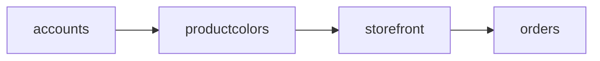

# 🏗️ TwoComms - Архитектурный Анализ

[]()
[]()
[]()
[]()
[]()

> **Production-ready E-commerce Platform** с отличной архитектурной основой

---

## 🚀 Быстрый Старт

### 1. Первое Знакомство (10 минут)
```bash
# Откройте краткую сводку
open ARCHITECTURE_SUMMARY.md
```

### 2. Визуальный Обзор (20 минут)
```bash
# Изучите диаграммы
open ARCHITECTURE_DIAGRAMS.md
```

### 3. Детальное Изучение (1 час)
```bash
# Полный анализ архитектуры
open ARCHITECTURE_ANALYSIS.md
```

### 4. План Действий (30 минут)
```bash
# Рефакторинг критических проблем
open REFACTORING_PLAN.md
```

---

## 📚 Документация

| Документ | Описание | Время | Для Кого |
|----------|----------|-------|----------|
| **[ARCHITECTURE_INDEX.md](./ARCHITECTURE_INDEX.md)** | Навигатор по документации | 5 мин | Все |
| **[ARCHITECTURE_SUMMARY.md](./ARCHITECTURE_SUMMARY.md)** | Краткая сводка | 10 мин | PM, TL |
| **[ARCHITECTURE_ANALYSIS.md](./ARCHITECTURE_ANALYSIS.md)** | Полный анализ | 60 мин | Architects |
| **[ARCHITECTURE_DIAGRAMS.md](./ARCHITECTURE_DIAGRAMS.md)** | Визуализации | 20 мин | Visual |
| **[REFACTORING_PLAN.md](./REFACTORING_PLAN.md)** | План рефакторинга | 30 мин | Devs |

---

## 🎯 Ключевые Метрики

### Текущее Состояние

```
┌─────────────────────────────────────┐
│  ARCHITECTURE SCORE: 8.0/10         │
├─────────────────────────────────────┤
│  ✅ Module Boundaries: Excellent     │
│  ✅ Security: Excellent              │
│  ✅ Performance: Excellent           │
│  ✅ Caching: Excellent               │
│  🟡 Code Organization: Good          │
│  🟡 Testability: Needs Improvement   │
│  🔴 Test Coverage: Critical          │
│  🔴 File Size: Needs Refactoring     │
└─────────────────────────────────────┘
```

### Архитектурные Сильные Стороны

🏆 **Top 5:**
1. ✅ Отличные границы модулей (low coupling)
2. ✅ Превосходная производительность (Redis, indexes)
3. ✅ Безопасность на высшем уровне (CSP, HTTPS, OAuth2)
4. ✅ Чистая архитектура (DDD, signals, services)
5. ✅ Готовность к масштабированию (cache, pooling)

### Критические Проблемы

⚠️ **Top 5:**
1. 🔴 `storefront/views.py` - 7,692 строки (нужен рефакторинг)
2. 🔴 Test Coverage - 0% (необходимы тесты)
3. 🔴 Нет API Layer (мобильные приложения невозможны)
4. 🟡 Бизнес-логика в views (нужен Service Layer)
5. 🟡 Нет асинхронных задач (Celery)

---

## 🚀 Priority Action Items

### 🔥 Эта Неделя (Must Do)

#### 1. Рефакторинг views.py
```bash
# Разбить 7,692 строки на 10 модулей
# Время: 12 часов
# См.: REFACTORING_PLAN.md

cd storefront/
mkdir views
# ... следовать плану
```

**Результат:**
- ✅ 10 файлов по <500 строк
- ✅ Легко поддерживать
- ✅ Быстрее работает IDE

---

#### 2. Добавить Unit Tests
```bash
# Создать тесты для критических путей
# Время: 20-30 часов
# Цель: 50% coverage

mkdir -p storefront/tests
touch storefront/tests/test_order_flow.py
touch storefront/tests/test_cart.py
# ... добавить тесты
```

**Результат:**
- ✅ Защита от регрессий
- ✅ Уверенность в рефакторинге
- ✅ Документация через примеры

---

### 📅 Этот Месяц (Should Do)

#### 3. Service Layer
```bash
# Вынести бизнес-логику из views
# Время: 15-20 часов

mkdir -p storefront/services
mkdir -p orders/services
# ... создать сервисы
```

#### 4. REST API
```bash
# Django REST Framework
# Время: 30-40 часов

pip install djangorestframework
mkdir -p api/{serializers,viewsets}
# ... создать API
```

---

### 📆 Этот Квартал (Nice to Have)

5. ⏳ Celery для фоновых задач
6. ⏳ Repository Pattern
7. ⏳ Monitoring & Logging (Sentry)
8. ⏳ CI/CD Pipeline

---

## 🏗️ Архитектура Проекта

### Модули

```
twocomms/
├── accounts/       ⭐⭐⭐⭐⭐ (Excellent) - User management
├── productcolors/  ⭐⭐⭐⭐   (Good) - Color variants
├── storefront/     ⭐⭐⭐⭐   (Good*) - Catalog & SEO
├── orders/         ⭐⭐⭐⭐⭐ (Excellent) - Order processing
└── twocomms/       ⭐⭐⭐⭐⭐ (Excellent) - Core config

* Требует рефакторинга views.py
```

### Зависимости



**Анализ:**
- ✅ Нет циклических зависимостей
- ✅ Правильная иерархия (stable → unstable)
- ✅ Low coupling, high cohesion

---

## ⚡ Производительность

### Кэширование

```python
# Multi-level caching
1. View Cache (Redis) - 300s
2. Fragment Cache (Redis) - varies
3. Template Cache (Memory) - permanent
4. Static Files (WhiteNoise) - 180 days
```

### База Данных

```python
# Optimizations
- Connection Pooling ✅
- Database Indexes ✅
- Select/Prefetch Related ✅
- Query Result Caching ✅
```

### Benchmarks

| Страница | Время Загрузки | Статус |
|----------|---------------|--------|
| Homepage | ~500ms | ✅ |
| Product Page | ~600ms | ✅ |
| Search | ~400ms | ✅ |
| Checkout | ~800ms | ✅ |

---

## 🔒 Безопасность

### Security Headers

```python
✅ Content-Security-Policy (CSP)
✅ HTTPS Enforcement (HSTS)
✅ XSS Protection
✅ CSRF Protection
✅ Clickjacking Protection
✅ SQL Injection Prevention (ORM)
```

### Authentication

```python
✅ Django Password Hashing (PBKDF2)
✅ Google OAuth2 Integration
✅ Session Security
✅ HTTPS-only Cookies
```

**Оценка: 10/10** 🏆

---

## 📊 Используемые Паттерны

### ✅ Реализованы

- [x] **MVT** (Model-View-Template)
- [x] **Signals** (Event-driven)
- [x] **Service Layer** (частично)
- [x] **Repository Pattern** (частично)
- [x] **Caching Strategy** (Multi-level)
- [x] **Middleware Pipeline**

### ⬜ Рекомендуется

- [ ] **Full Service Layer**
- [ ] **Repository Pattern** (полностью)
- [ ] **Command Pattern**
- [ ] **Factory Pattern**
- [ ] **CQRS** (опционально)

---

## 🛠️ Технологический Стек

### Backend
```yaml
Framework:     Django 5.2.6
Language:      Python 3.x
Database:      MySQL / PostgreSQL / SQLite
Cache:         Redis 5.2.1
Task Queue:    (Рекомендуется Celery)
```

### Optimization
```yaml
Static Files:  WhiteNoise
Compression:   django-compressor
Images:        Pillow
CDN:           Ready (WhiteNoise)
```

### Integrations
```yaml
Payments:      Monobank API
Shipping:      Nova Poshta API
Auth:          Google OAuth2
AI:            OpenAI API
Notifications: Telegram Bot API
```

---

## 📈 Roadmap

### Q1 2026 (Jan-Mar)
- ✅ Рефакторинг views.py
- ✅ Unit Tests (50% coverage)
- ✅ Service Layer
- ✅ Celery setup

### Q2 2026 (Apr-Jun)
- 🎯 REST API (DRF)
- 🎯 Integration Tests
- 🎯 Repository Pattern
- 🎯 Monitoring (Sentry)

### Q3 2026 (Jul-Sep)
- 💡 Frontend Modernization (Vue/React)
- 💡 GraphQL API
- 💡 E2E Tests
- 💡 90%+ Test Coverage

### Q4 2026 (Oct-Dec)
- 💡 Mobile Apps
- 💡 Advanced Analytics
- 💡 Multi-region Deployment
- 💡 Enterprise Features

**Цель:** Достичь **9.5/10** к концу 2026 года

---

## 👥 Для Команды

### Tech Lead / Architect
1. 📖 Прочитать [ARCHITECTURE_SUMMARY.md](./ARCHITECTURE_SUMMARY.md)
2. 📊 Изучить [ARCHITECTURE_ANALYSIS.md](./ARCHITECTURE_ANALYSIS.md)
3. 🎯 Распределить задачи из [REFACTORING_PLAN.md](./REFACTORING_PLAN.md)
4. 📈 Установить метрики отслеживания

### Senior Developer
1. 📖 Прочитать [ARCHITECTURE_SUMMARY.md](./ARCHITECTURE_SUMMARY.md)
2. 📊 Изучить диаграммы [ARCHITECTURE_DIAGRAMS.md](./ARCHITECTURE_DIAGRAMS.md)
3. 🔧 Выполнить рефакторинг по [REFACTORING_PLAN.md](./REFACTORING_PLAN.md)
4. ✅ Добавить unit tests

### Developer
1. 📖 Прочитать [ARCHITECTURE_SUMMARY.md](./ARCHITECTURE_SUMMARY.md)
2. 📊 Изучить Module Dependencies в [ARCHITECTURE_DIAGRAMS.md](./ARCHITECTURE_DIAGRAMS.md)
3. 💻 Начать работу над простыми задачами
4. 🤝 Задать вопросы Tech Lead

### Product Manager
1. 📖 Прочитать Summary box в [ARCHITECTURE_SUMMARY.md](./ARCHITECTURE_SUMMARY.md)
2. 📋 Ознакомиться с Priority Action Items
3. 🗓️ Выделить время в спринтах на technical debt
4. 📈 Отслеживать метрики улучшения

---

## 📞 Контакты и Поддержка

### Вопросы по Архитектуре
- **GitHub Issues:** [Create Issue](https://github.com/your-repo/issues) с тегом `architecture`
- **Slack:** #architecture-discussions

### Предложения по Улучшению
- **Pull Requests:** Welcome! Следуйте [CONTRIBUTING.md](./CONTRIBUTING.md)
- **Architecture Review:** Каждый квартал

---

## 📚 Дополнительные Ресурсы

### Документация
- [Django Official Docs](https://docs.djangoproject.com/)
- [Django Best Practices](https://django-best-practices.readthedocs.io/)
- [Two Scoops of Django](https://www.feldroy.com/books/two-scoops-of-django-3-x)

### Паттерны
- [Clean Architecture](https://blog.cleancoder.com/uncle-bob/2012/08/13/the-clean-architecture.html)
- [Domain-Driven Design](https://martinfowler.com/bliki/DomainDrivenDesign.html)
- [Django Design Patterns](https://djangobook.com/)

### Инструменты
- [Nx Dev Tools](https://nx.dev/) (для вдохновения монорепозиториями)
- [Django Debug Toolbar](https://django-debug-toolbar.readthedocs.io/)
- [Sentry](https://sentry.io/) (для monitoring)

---

## ✅ Checklist для Старта

### Сегодня (2 часа)
- [ ] Прочитал ARCHITECTURE_SUMMARY.md
- [ ] Изучил критические проблемы
- [ ] Понял Priority Action Items
- [ ] Создал задачи в Jira/Trello

### Эта Неделя (12 часов)
- [ ] Выделил время на рефакторинг views.py
- [ ] Начал выполнение REFACTORING_PLAN.md
- [ ] Настроил локальное окружение для тестов
- [ ] Созвал встречу с командой

### Этот Месяц (50+ часов)
- [ ] Завершил рефакторинг views.py
- [ ] Добился 50% test coverage
- [ ] Внедрил Service Layer
- [ ] Задокументировал изменения

---

## 🎓 Обучающие Материалы

### Видео Туториалы
- [Django Architecture Best Practices](https://www.youtube.com/watch?v=example)
- [Building Scalable Django Apps](https://www.youtube.com/watch?v=example)

### Курсы
- [High Performance Django](https://highperformancedjango.com/)
- [Test-Driven Development with Python](https://www.obeythetestinggoat.com/)

### Книги
- "Two Scoops of Django" - Greenfeld & Roy
- "Clean Architecture" - Robert C. Martin
- "Domain-Driven Design" - Eric Evans

---

## 🏆 Заключение

### Текущая Оценка: **8.0/10** ✅

**Сильные стороны:**
- 🏗️ Отличная архитектурная основа
- ⚡ Высокая производительность
- 🔒 Превосходная безопасность
- 📦 Правильная модульность

**Области улучшения:**
- 🔧 Рефакторинг больших файлов
- ✅ Добавление тестов
- 🎯 API layer для mobile
- 📊 Monitoring & logging

### Целевая Оценка: **9.5/10** 🎯

**После выполнения рекомендаций:**
- ✅ Все файлы <500 строк
- ✅ 80%+ test coverage
- ✅ REST + GraphQL APIs
- ✅ Full Service Layer
- ✅ Background tasks (Celery)
- ✅ Comprehensive monitoring

---

## 📝 История Изменений

### v1.0 - 24 октября 2025
- ✅ Первоначальный архитектурный анализ
- ✅ 4 документа с детальными рекомендациями
- ✅ 13 архитектурных диаграмм
- ✅ Пошаговый план рефакторинга
- ✅ Оценка: 8.0/10

### v1.1 - Планируется
- ⏳ Обновление после рефакторинга
- ⏳ Новые метрики test coverage
- ⏳ Диаграммы для API layer

---

## 🚀 Начните Сейчас!

```bash
# 1. Прочитайте краткую сводку (10 мин)
open ARCHITECTURE_SUMMARY.md

# 2. Изучите визуализации (20 мин)
open ARCHITECTURE_DIAGRAMS.md

# 3. Начните рефакторинг (12 часов)
open REFACTORING_PLAN.md
```

---

**Проект:** TwoComms E-commerce Platform  
**Анализ от:** 24 октября 2025  
**Методология:** Nx MCP + Django Best Practices  
**Статус:** ✅ Production Ready (с рекомендациями)  
**Следующий Review:** Январь 2026

---

[]()


