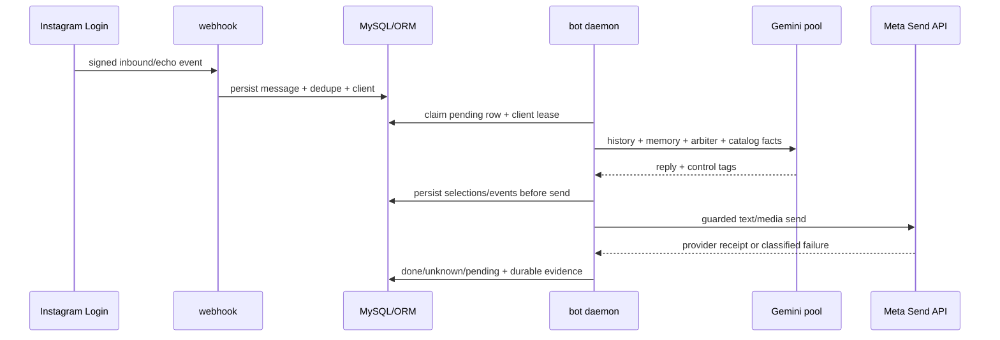

# 01_SYSTEM_MAP — карта Instagram-бота и management-контура

> Состояние карты: сверено с `main`/production code `17f5b672` на 2026-08-05.
> Секреты и PII намеренно не записываются. Источник требований —
> `instagram_bot_audit_prompt_package/04_SYSTEM_ARCHITECTURE_AND_CODE.md`.

## Границы системы

| Контур | Точка входа | Владелец состояния | Выход |
|---|---|---|---|
| Instagram Login webhook | `management.bot_webhook` → `handle_webhook_payload` | `InstagramBotMessage`, `IgClient`, dedupe/epoch | durable inbound row |
| Inbox refresh/polling | `services.ig_inbox_refresh`, daemon maintenance | cursor/run leases | новые inbound/echo rows |
| Ответ клиенту | `run_instagram_bot` → `process_pending` → `instagram_bot` | message status/send state, client lease | Gemini/deterministic reply, Meta receipt |
| Контекст AI | `gemini_generate` → `assemble_system_instruction` | prompt revision, client memory, funnel arbiter | customer-facing text + control tags |
| Добивка | `bot_followups.process_due_followups` | `IgFollowUpTask`, immutable event facts, absolute policy timeline, delivery state, lease, provider receipt | event-driven continuation and provider-evidenced delivery FSM current on `17f5b672` |
| Checkout/payment | hosted IG checkout, `bot_orders`, Monobank webhook/backstop | `IgDeal`, `IgDealItem`, `IgPaymentProjection` | one purchase/order truth |
| Fulfillment | order assignment, `ig_order_fulfillment`, shipment journal | assignment/shipment lifecycle | TTN and post-sale event |
| CRM/UI | `bot_views`, `bot.html`, admin APIs | `IgClient` projections and UI filters | operator action/ownership |

## Message sequence

## Commerce sequence

## State and ownership rules

1. `ig_client_state.resolve_client_state` is the read arbiter for customer-facing
   state; `ig_funnel_fsm.apply_stage` is the stage mutation boundary.
2. Customer replies, follow-ups and fulfillment events use client/permission
   leases. `manager_takeover`, `bot_paused`, hidden, opt-out and service cases
   are fail-closed guards.
3. `IgDeal`/`IgPaymentProjection` are payment truth. A manual confirmation can
   inform CRM buyer presentation but cannot create a provider-paid order.
4. `ProductColorVariant` plus fit/size/option resolution is the price boundary;
   `Product.final_price` is not a safe substitute for a selected variant.
5. Production is MariaDB/MySQL. Local SQLite is useful for fast unit tests only;
   migration/constraint acceptance requires production-like verification.
6. Payment review, deal, attribution and order references are ownership edges
   only when they describe the same commercial cycle. Links copied onto a
   superseded review are audit references and must not merge its episode into
   the canonical fulfilled episode.

## Known gaps intentionally visible

- Funnel transition/drop-off event analytics is implemented by `IMP-058`.
- Superseded invoice polling is implemented by `IMP-089` with a bounded
  per-invoice lifecycle and terminal markers.
- White product variant data is still `F-DATA-016` / `IMP-095`.
- Verified semantic revisions and inventory policy foundation are production
  `IMP-081 PARTIAL`; runtime/admin consumers and disposable MariaDB tests remain.
- Price-aware typed graph/candidate foundation and exact variant-specific prompt
  price/size parity are deployed as `IMP-082/083 PARTIAL` on `0ad694bc`;
  durable runtime commerce session, stale candidate binding, full topology and
  relaxed alternatives remain open.
- F-CAT-007 is fixed/verified by `e44d1440`/`0ad694bc`: product 110's prompt
  contract now binds thermo `variant_id=81`, 1450 грн and oversize sizes XS/M,
  without the false product-wide size row.
- Follow-up delivery is provider-evidenced and reviewable on `434428ad`:
  receipt-committed recovery cannot resend or downgrade finalized `SENT`.
  Policy continuation is materialized from exact immutable events by `IMP-103`
  and migration `0143`.
- Imported role provenance is still `F-DATA-015` / `IMP-096`.
