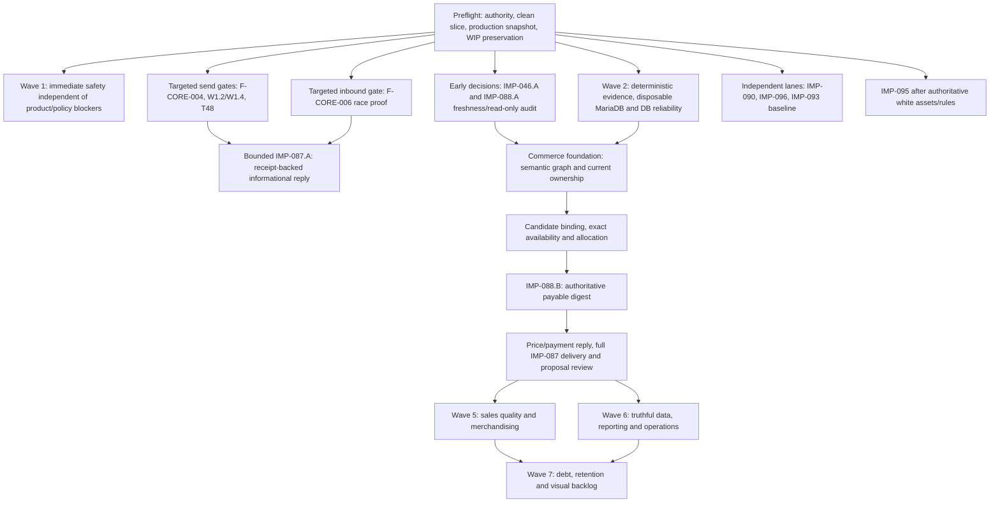

# 14_IMPLEMENT2 — канонический план продолжения Instagram-бота

> **Для исполнения:** использовать `superpowers:executing-plans` и проходить
> один independently deployable slice с review checkpoint за раз.
>
> **Для следующего агента:** это активный execution handoff после
> `19f5ef70`. Полный неранжированный остаток находится в
> `13_UNCLOSED_FINDINGS_RAW.md`; этот файл задаёт topological order,
> зависимости, exact acceptance и правила обновления реестров.
>
> Выполнять не «по номеру любой ценой», а по зависимостям. BLOCKED-пункт
> останавливает только своих dependents. Независимые safety-задачи продолжаются.

## 1. Каноническая иерархия документов

| Роль | Источник истины |
|---|---|
| Точка входа и текущая сводка | `docs/instagram_bot_audit/00_PROGRESS.md` |
| Активный порядок продолжения | этот `14_IMPLEMENT2.md` |
| Полный незакрытый inventory без приоритизации | `13_UNCLOSED_FINDINGS_RAW.md` |
| Историческая/status matrix всех 105 `IMP-*`, 187 `F-*`, 51 `IMPR-*` | `07_IMPLEMENTATION_PLAN.md` |
| Подробная причина и evidence finding | `03_FINDINGS_REGISTER.md` |
| Подробное improvement rationale | `05_IMPROVEMENTS_REGISTER.md` |
| Acceptance scenarios | `06_TEST_MATRIX.md` |
| Verified completion/deploy evidence | `08_COMPLETION_LOG.md`, `09_DEPLOYMENT_LOG.md` |
| Внешние решения и блокеры | `10_OPEN_QUESTIONS_AND_BLOCKERS.md` |
| Ветки, worktree, WIP и superseded sources | `12_SOURCE_RECONCILIATION.md` |
| Emergent Implement2 findings | `15_IMPLEMENT2_EMERGENT_FINDINGS.md` |

После каждого shipped slice обновить все затронутые источники. Нельзя менять
только этот файл и оставлять противоречащую галочку в `07`, старый blocker в
`10` или потерянный WIP в `12`.

## 2. Проверенный pre-handoff runtime snapshot — 2026-08-07

- До публикации этого docs-only handoff local `main` = `origin/main` =
  production = `19f5ef70f20e1b3d5da5975786359fe8c7e06df4`; local divergence
  0/0. Публикующий commit может продвинуть Git SHA без runtime-code diff.
- Production `manage.py check`: 0 issues. Migrations through
  `management.0146` applied. Daemon `running/alive`; active transport remains
  `instagram_login`; pending analysis and notification queues = 0.
- Tracked production tree clean. Untracked server files are not release proof.
- Read-only production status has 18 terminal failed analysis jobs. Seventeen
  are historical `trigger=reconcile` Gemini failures. Job `292`, client `310`,
  `trigger=manager_message`, `attempts=5`, ended with
  `stale_lease_retry_exhausted`; this is new `F-AI-018` under `IMP-044`.
- Root worktree is intentionally dirty. Relevant local change
  `twocomms/management/tests_ig_commerce_state.py` and the separate
  `ig-commerce-durable-state` WIP must not be silently staged, reset or lost.

| Реестр | Verified state |
|---|---|
| Implementation | 105 total: 81 DONE, 14 OPEN, 10 PARTIAL; 24 unchecked |
| Finding matrix / handoff | 187 total: 143 checked, 32 OPEN, 1 BLOCKED, 11 PARTIAL; 44 unchecked after Wave 3 |
| Improvements | 51 total: 17 DONE, 12 OPEN, 21 PARTIAL, 1 REFRAMED; 34 unchecked |
| Acceptance | 51 total: 40 GREEN, 11 PARTIAL (including SQLite GREEN plus a narrow disposable MariaDB checkout gate for `T41`); `T51` is GREEN regression guard |
| Documentation conflicts | `DOC-001`, `DOC-002`, `DOC-003`, `DOC-004`, `DOC-005`, `DOC-006`, `DOC-007`, `DOC-008` reconciled by the 2026-08-07 handoff |

Historical test totals such as 2675/2877/2897 prove only their named
checkpoint. A new slice records its own command, database engine, count, skips,
failures and rollback state.

### 2.1 Database reality — обязательный контракт для следующего агента

| Среда | Роль | Что разрешено / что она доказывает |
|---|---|---|
| Local SQLite | быстрый RED/GREEN, pure/domain/unit tests, no-network regressions | Не доказывает MariaDB locks, `select_for_update`, concurrent uniqueness, `varchar(max_length)`, trigger/migration/JSON/collation behavior или production data shape. Отсутствие локальных rows ничего не говорит о реальных клиентах. |
| Disposable MariaDB/MySQL | destructive migration, lock/race, constraint, rollback and max-length acceptance | Создаётся отдельно от production; только test credentials/schema. Это обязательный технический gate для DB-sensitive closure. |
| Production `qlknpodo_MySQL_DB` | главный источник реальных переписок, клиентов, товаров, сделок, оплат, очередей и фактической data shape | Read-only discovery/evidence до изменения; controlled migrate/deploy после verified code. Не использовать как fixture DB и не создавать synthetic customer/payment/Meta/ad rows. |

Следствия:

1. Любая гипотеза о количестве, пустоте таблицы, текущих статусах, реальных
   сообщениях или связи customer→deal→payment проверяется на production
   read-only через ORM/SQL с минимальным выводом PII.
2. Реализация проектируется под MariaDB/MySQL semantics с самого начала.
   SQLite-green — быстрый сигнал, не acceptance и не причина ставить `[x]`.
3. Для locks/races проверять deterministic lock ordering, transaction boundary,
   uniqueness/NULL behavior, rollback residue and deadlock/retry behavior на
   disposable MariaDB.
4. Для migrations проверять forward migration, rollback/compatibility fixture,
   длины строк, indexes/constraints и существующие append-only triggers. Нельзя
   считать, что SQLite автоматически воспроизводит production DDL.
5. Production rollout начинается с backup/health/current SHA/migration state,
   выполняет только запланированные migrations и завершается read-only
   reconciliation. Реальные переписки и платежи не копируются в тесты и не
   изменяются ради доказательства.
6. Если local и production data расходятся, для business conclusion приоритет
   имеет production. Для safety proof приоритет имеет reproducible disposable
   MariaDB test плюс production read-only confirmation, а не ручная запись в
   live DB.

## 3. Непереговорные правила

1. `[x]` requires code reachable from `main`, focused and adjacent tests,
   relevant MariaDB/browser evidence, push, production pull/deploy and exact
   server SHA/health proof.
2. `PARTIAL` remains `[ ]`. A branch, local test, screenshot or agent report is
   not completion evidence.
3. `BLOCKED` requires blocker, owner, dependent IDs and next evidence. It does
   not block unrelated work.
4. `REFRAMED` and `REJECTED` are valid terminal outcomes only with rationale
   and a replacement ID or explicit statement that no implementation follows.
5. Production DB is read-only evidence, never a concurrency fixture. Do not
   send synthetic customer, Meta, payment or ad events without authorization.
6. Imported role/backfill truth comes only from provider message ID or outgoing
   registry. Text similarity is never evidence.
7. Ambiguous delivery is never blind-resend. Require provider receipt or
   audited manager resolution.
8. Every customer-facing slice preserves opt-out, manager takeover, pause,
   Meta 24-hour window, payment/stock fail-closed guards and localization.
9. `IMP-045` exception policy applies to every touched domain now; do not add a
   new silent catch while waiting for the final cleanup wave.
10. Old W9/follow-up/Meta worktrees are requirement sources, not merge bases.
11. **Project deployment protocol:** publish the scoped commit to GitHub
    `main`, then deploy only with the documented SSH `git pull` against
    `/home/qlknpodo/TWC/TwoComms_Site/twocomms` using the Python 3.14 virtualenv.
    Do not invoke `deploy.sh`, `scripts/deploy_release.py`, SCP package
    installation, source builds, or another release wrapper unless the user
    explicitly authorizes it. Keep the SSH password out of files and logs;
    provide it through the caller environment. Verify the exact server SHA and
    runtime over SSH after the pull.

## 4. Dependency graph



Feature gates are edges, not a global stop: white-product assets block only
`IMP-095`; ad source blocks only attribution/CAPI claims; retention policy
blocks only `IMP-091`; checkout build/remove blocks only its dependent branch.
Narrow `IMP-087.A` does not wait for Gemini lease work or the full MariaDB wave.
`IMP-088.A` may run before exact availability; price/availability/payment speech
must wait for `IMP-088.B`, after which full `IMP-087` can use that digest. Baseline
`IMP-060`, `IMP-090`, `IMP-096` and truthful `IMP-093` work are independent of
full commerce completion. `IMP-095` waits only for authoritative white assets/
rules and its own 1090–1450 acceptance, not for every commerce task.

## 5. Universal preflight for every slice

- [ ] **P0.1 Scope and Git.** Start from fresh `origin/main` in a clean
  `codex/*` worktree. Record `HEAD`, `git status --short`, intended files and
  unrelated local WIP. Never stage the root commerce test accidentally.
- [ ] **P0.2 Current truth.** Re-read the relevant rows in `13`, current code,
  tests and reachable history. For any claim about conversations, products,
  payments, queues or table usage, run a minimal-PII read-only production
  MariaDB snapshot; never infer production state from empty local SQLite.
- [ ] **P0.3 RED contract.** Add focused failing test first and retain the
  failure reason in the evidence note. A test that is green before the change
  does not prove the new behavior.
- [ ] **P0.4 Evidence ledger.** Record exact command, settings, DB engine, test
  count/skips/failures, rollback result and network policy.
- [ ] **P0.5 Stable local baseline (`IMP-094.A`).** Before domain work, run the
  cwd-independent mandatory no-network suite from its documented directory,
  isolate mutable global state and classify any pre-existing red/flaky test.
  Repair a baseline blocker as its own slice; do not carry an unexplained red
  suite into feature work. Verify dependency lock/installed versions and make
  required install failures fail closed; the repeated non-fatal `cffi` wheel
  failure from deploy `f327ac36` is open evidence. SQLite here is only fast
  structural evidence. Emergent `F-DEPLOY-001…004` additionally require
  built-wheel hash provenance, selector-secret redaction, owned
  maintenance-lease cleanup and legacy deploy-wrapper retirement.
- [ ] **P0.6 Release boundary.** Commit only one independently deployable
  slice, push, integrate into `main`, deploy, verify exact SHA, migrations,
  daemon heartbeat, dangerous queues and persisted DB/API evidence.

Default structural gate from the Django app directory:

```bash
python manage.py check
python manage.py makemigrations --check --dry-run
python -m compileall -q management
git diff --check
```

For UI changes add real browser QA at the stated breakpoints, console check and
horizontal-overflow check. For data/concurrency changes add the disposable
MariaDB command; SQLite is only a fast local layer.

## 6. WIP recovery gate — do before writing replacement code

### WIP-087: preserved narrow durable-reply slice

Worktree:
`/Users/zainllw0w/.config/superpowers/worktrees/site/ig-commerce-durable-state`

Files:

- `twocomms/management/services/ig_commerce_state.py`
- `twocomms/management/services/instagram_bot.py`
- `twocomms/management/tests_ig_commerce_state.py`
- `twocomms/management/services/ig_commerce_replies.py` (new)
- `twocomms/management/tests_ig_commerce_delivery.py` (new)

Fresh recorded evidence: 101 tests plus Django check, migration drift,
compileall and `git diff --check`. This evidence is useful but not shipment:
the files are uncommitted/unpushed/undeployed. Worktree HEAD equals the
`19f5ef70` handoff baseline, but must still be compared with fresh `origin/main`
at execution time.

- [x] Compare patch against current `origin/main`; do not copy by file overwrite.
- [x] Reconcile the two relevant root-worktree tests with the WIP tests.
- [x] Preserve the safety boundary from
  `docs/plans/2026-08-06-ig-commerce-durable-reply-delivery.md`: one short
  deterministic text, no price/stock/payment/manager promise.
- [x] Run an independent code review before integration.
- [x] Local branch is 14 ahead / 1 behind `origin/codex/ig-commerce-durable-state`;
  preserve both histories and rebase/cherry-pick patch-unique work deliberately.
- [x] Re-run focused and adjacent tests on current base, then release through
  Wave 3 below. General `IMP-087` remains PARTIAL; its bounded `IMP-087.A`
  slice is now deployed.

### Other preserved sources

| Source | Status / required action |
|---|---|
| `codex/ig-bot-w4-completion` paginator | SUPERSEDED by W7; do not integrate. |
| `codex/ig-followup-policies` | `IMP-102/103` requirements already reimplemented; old migration/code not mergeable. |
| `codex/ig-crm-master-audit` | Old-base Meta/analysis source; re-audit current code/live transport before using any requirement. |
| assisted-checkout 390px diff | Preserve as `GAP-CHECKOUT-UX-001`; reproduce on current main. |
| `codex-management-bot-statistics-visuals` code WIP | Modified `bot_views.py`, `ig_funnel_analytics.py`, `bot.html` and tests, plus untracked plan/test file; volatile tracked diff, inspect with fresh `git diff --stat`. Review event-time semantics and rebase on current main; do not rewrite or mark done. |
| dirty `codex-management-bot-live-visuals` | Older detached/conflicted planning source. Current live-visual code is in main; preserve only unique planning evidence manually. |
| `codex/instagram-assisted-checkout-pre-split` | Historical requirement source; compare patch-unique material only, never cherry-pick wholesale. |
| `codex/ig-lease-docs` | Documentation superseded by current `00/07/13/14`. |

## 7. Independent decision and infrastructure gates

- [ ] **G-INFRA / BLOCKER-INFRA-001.** Provision isolated disposable MariaDB
  and test credentials with create/drop only in the test schema. Required by
  `IMP-044`, `IMP-081`, `IMP-084`, `IMP-086`, `IMP-088`, `IMP-094`,
  `IMP-100` and any `IMP-046` migration branch **only for DB-sensitive DONE
  acceptance**; pure/read-only audit, parser/cache logic and browser UI continue.
- [ ] **G-CHECKOUT.** Re-audit current call graph and read-only production
  counts before choosing BUILD or REMOVE for the alleged empty checkout domain.
  Current main already has proposal, TTL token, reservation and hosted checkout
  paths, so the old premise cannot be accepted without proof. `F-DATA-001`
  belongs to `IMP-046.A`, not `IMP-081`.
- [ ] **G-EPOCH.** Owner chooses epoch policy for multi-chunk replies only
  after delivered-chunk evidence exists. Agent may not invent security/UX
  semantics for `F-CORE-005`.
- [ ] **G-PII.** Technical minimization can ship immediately; retention period,
  reviewer access and operator policy need a written owner decision.
- [ ] **G-ADS / BLOCKER-POLICY-001.** Obtain real click-to-message attribution
  source and CAPI policy. This blocks `F-DATA-004`/`IMP-043`/`T03`; CAPI
  `F-DATA-003`/`F-PAY-008`/`T08` additionally require consent and stable-event
  policy. Missing fields are reported as unknown, not parsed from imagination.
- [ ] **G-WHITE / BLOCKER-DATA-001.** Obtain authoritative white images,
  fit/size/default rules for product 110 before `IMP-095`.
- [ ] **G-RETENTION / BLOCKER-POLICY-002.** Decide discounts, preorder,
  reactivation segments, consent and measurement before `IMP-091`,
  `IMPR-FEAT-008…011`, `T20` and `T21`.

## 8. Wave 1 — immediate safety independent of product/policy blockers

These slices do not wait for white assets, attribution or retention policy.

### W1.1 Webhook availability — `F-CORE-004`, `IMP-098.A`

**Start files:** `twocomms/management/services/ig_maintenance.py`,
`twocomms/management/services/instagram_bot.py`, relevant webhook/daemon tests.

- [x] Replace blocking `flock` only for HTTP pause/takeover/opt-out transition
  paths with non-blocking or bounded retry, maximum one second. Preserve the
  customer-send serialization lock.
- [x] RED/green cross-process test: another process holds the lock; webhook
  responds within one second, persists a durable recovery action and applies
  the transition exactly once after contention clears.
- [x] Acceptance: no duplicate processing, no send through the permission
  boundary, bounded elapsed time and actionable telemetry without message/PII.

  **Closed 2026-08-08:** `c61913ff` is deployed on production through the
  ordinary SSH `git pull` path. Migration
  `management.0147_ig_permission_transition_job` remains applied; production
  runs MariaDB 11.4.12/InnoDB. A disposable production-DB contention probe
  locked a synthetic `IgClient` row: explicit opt-out ingress returned in
  45.2 ms, staged the source without a blocking client FK, persisted
  `pending/database_busy`, and made reply permission fail closed. After lock
  release, recovery processed the transition once (`1`, replay `0`), bound the
  source, applied opt-out, and kept the epoch stable; cleanup left zero probe
  client/message/job rows. Focused permission and manager-echo regressions
  passed 11/11 executable tests (four MariaDB-only tests skipped on SQLite).
  Production reports `running`, one daemon, and zero
  pending/processing/failed permission transitions.

### W1.2 Delivered-chunk evidence first — `F-CORE-005`, `IMP-098.B1`

- [x] Ship after or together with W1.4 technical PII minimization: full reply
  evidence is stored in the restricted audit boundary, while alerts are
  redacted/minimum-necessary.
- [x] Persist exact original reply text, planned chunk count, confirmed chunk
  receipts/provider IDs/count and failure boundary.
- [x] Create one actionable, idempotent manager alert on partial delivery.
- [ ] Do not change epoch policy yet. That is `G-EPOCH` + W2.5.

  **Closed 2026-08-08:** Source commit `4ccac72e` is on `origin/main` and the
  production checkout. Migration `management.0148_ig_reply_delivery_evidence`
  is applied against production MariaDB `11.4.12-MariaDB-cll-lve` (InnoDB).
  The focused local gate passed `5/5` tests, `manage.py check`, migration
  drift and scoped compile checks. A disposable production-DB probe (no Meta
  or Telegram transport) persisted the full restricted original, `planned=2`,
  `delivered=1`, provider ID `meta-probe-1` and boundary
  `chunk:2:unknown`; two identical alert calls produced exactly one
  `partial_delivery` row whose text/metadata contained no original marker.
  Cleanup left zero synthetic clients/messages/notifications and zero pending
  or processing message rows. Production `/healthz/` and `/bot/health/` are
  `200/ok`; daemon `running`, `dangerous_backlog=0`. The broader W1.4 reviewer
  boundary and epoch-policy work remain separate open items.

### W1.3 Secrets and secure defaults — `IMP-061`, `IMP-101`

- [ ] `F-SEC-010`: remove token from our diagnostic URLs, redact server logs
  where compatible with Meta GET verification, rotate token and prove
  resubscription.
- [x] `F-SEC-001`: move account IDs, allowed senders and debug reply from model
  defaults to explicit singleton config; test fresh install, empty whitelist
  semantics and operator warning.

  **Closed 2026-08-08:** Model defaults for account IDs, allowlist and legacy
  trigger/reply are empty, so a fresh install cannot silently bind to a real
  Instagram account or send a repository-provided debug reply. The status API
  exposes only redacted warning codes and the overview renders operator-safe
  text for missing account configuration, restricted allowlists, open empty
  allowlists and incomplete legacy trigger mode. Focused tests passed `6/6`,
  migration drift and `manage.py check` passed. Production read-only MariaDB
  proof: `11.4.12-MariaDB-cll-lve`, migration `0149` applied, both account IDs
  configured, legacy fields explicitly configured, `allowlist_entries=0`,
  `allow_all=true`, warnings `sender_allowlist_open`, bot state `running` and
  daemon online. No Meta/Telegram send or synthetic production rows were used.

**Start files/tests:** `twocomms/management/models.py`,
`twocomms/management/bot_views.py`, `tests_ig_webhook_security.py`,
`tests_ig_audit_fixes.py`.

### W1.4 PII technical boundary — `F-SEC-004`, `F-SEC-009`, `IMP-098.D`

- [x] Redacted/sandbox reviewer view and minimum necessary Telegram/operator
  payload.
  Source commit `71498170` moved reviewer telemetry to the closed allowlist
  `state/running/daemon_online/pending`, blocks reviewer stats before business
  queries, returns an empty client sandbox and omits the stats UI. Typed
  Telegram/operator formatters now accept only local IDs, bounded machine
  codes, counts/status/amount and internal CRM links; payment-review evidence
  remains inside restricted CRM state and is no longer copied into notification
  `media` or delivered via `sendPhoto`. The Instagram checkout path no longer
  calls the legacy order notifier that exposed customer, delivery, item and
  provider-invoice details.

  Verification on 2026-08-08: two independent final reviews reported no
  blockers; the focused W1.4 gate passed `144/144`, `manage.py check`, migration
  drift, compile and `git diff --check`. Production runs `71498170` on MariaDB
  `11.4.12`; `/healthz/` and `/bot/health/` return `200/ok`, bot state is
  `running`, `dangerous_backlog=0`, `notification_unresolved=0`. Live reviewer
  proof returned stats `403` with zero business-table queries, allowlisted
  status only, empty clients/log and no stats DOM, while admin status/stats
  remained `200`. A mocked-transport production-DB probe preserved receipt
  evidence in restricted CRM, found no name/phone/email/IGSID/provider invoice/
  receipt URL or `media` in the notification payload, called `sendMessage` once
  and `sendPhoto` zero times; cleanup left zero synthetic client, notification,
  review and auth rows.
- [ ] Separate technical minimization from owner-controlled retention/access.
- [ ] Acceptance: no live PII in demo/reviewer path; policy-dependent residue
  remains explicitly BLOCKED under `G-PII`.

### W1.5 Analysis cannot mutate operations — `F-SCORE-010`, `IMP-098.E`

- [x] Inventory every analysis writer to episode/history/payment/order fields.
- [x] Allow operational mutation only through an owned, idempotent event
  contract; failed/skipped analysis must leave operational state unchanged.

  **Closed 2026-08-08:** source commit `c3543832` is on `origin/main` and the
  production checkout. Gemini/rules analysis now publishes an immutable
  `IgConversationAnalysisEvent`; only its owned consumer may materialize a
  repeat episode, with evidence/fingerprint/payment/permission revalidation,
  durable evidence-based idempotency and bounded retry. The focused local gate
  passed `139/139`; Django check, migration check, compile and diff checks were
  clean; an independent review approved the final retry telemetry contract.
  Production MariaDB `11.4.12-MariaDB-cll-lve` applied migration
  `management.0150`. A provider-free production-DB probe proved publication is
  operationally inert, owned exactly-once materialization, cross-model replay
  dedupe, preserved client stage, fail-closed newer-inbound/hidden/blocked/
  opt-out guards, retry followed by terminal failure on attempt five, and full
  rollback after an injected post-write exception. Cleanup left zero synthetic
  clients/events/snapshots/episodes/sessions/deals/payments/messages and
  restored both append-only episode-event triggers. Final production evidence:
  exact SHA `c3543832`, one daemon, event total/pending `0/0`, `/healthz/` and
  `/bot/health/` `ok`, dangerous backlog `0`.

### W1.6 Structured control safety before more bot delivery — `IMP-028.A`

This safety slice precedes generic customer-facing commerce expansion.

- [x] `F-AI-010`: typed/validated structured control boundary over legacy tags;
  invalid/unknown controls fail closed and never leak into customer text.
- [x] `F-AI-011`: adversarial prompt-injection tests prove customer text cannot
  override payment, stock, consent or manager authority.
- [x] `F-CTX-003`: remove the duplicate legacy payment protocol instead of
  merely masking it with prompt priority.

**Closed 2026-08-10.** `05d2cef4`/`ec6febcc`/`0c536e0a`/`796028ba` introduced
the typed immutable response contract, Gemini JSON schema, fail-closed legacy
adapter and application-owned authority gates. Review-fix `130cd920` added
obfuscated/truncated control sanitization, common UA/RU/EN authority wording,
negation-scoped matching and migration `0152_harden_ig_stage_prompt` without
rewriting already-applied `0151`. Fresh combined gate: 240/240; Django check,
migration drift, compileall and diff check passed. Production is exactly
`130cd920`, migration `0152=[X]`, the existing stored prompt receives the
hard-stage guard through runtime assembly, legacy bracket protocol is absent,
`/healthz/` and `/bot/health/` return `200/ok`, dangerous backlog is `0`, and
all read-only parser/authority probes passed without customer/provider events.

**Start files/tests:** `twocomms/management/services/instagram_bot.py`,
`twocomms/management/models.py`, `tests_ig_agentic_dialog.py`,
`tests_ig_live_reply_priority.py`, `tests_ig_audit_fixes.py`.

### W1.7 Historical attachment hardening — `IMP-060`

- [x] Historical/imported attachment URLs are metadata only and are never
  re-downloaded; live webhook bytes continue through the owned media path.
- [x] Add typed media phase/error telemetry before provider analysis so
  `F-AI-018` can distinguish a media stall from Gemini/provider timeout.
- [x] This independent hardening does not reopen the fixed historical
  `F-DATA-011` incident and does not wait for commerce completion.

  **Closed 2026-08-12:** code from `214ae4b9` is reachable from current
  `origin/main`/production through merge `b9bab236`; follow-up
  `codex/ig-implement2-w17-followup` adds the historical-provenance guard in
  payment vision plus regressions. Fresh W1.7 gate: `162/162` focused tests;
  `manage.py check`, migration drift, compile and diff checks are required at
  release. Production MariaDB read-only proof shows migration `0153` applied,
  2,522 messages / 337 webhook rows, 29 structured attachment rows, all
  persisted attachment media `historical_import` + `metadata_only`, no
  `live_webhook`/`owned` rows, and zero `media_capture_eligible` rows. This
  dataset has no post-migration live analysis, so telemetry behavior is proven
  by the focused failure/ordering regressions but not by a synthetic live
  production event. `F-AI-018` remains open under `IMP-044` for the broader
  provider/process/lease attempt telemetry contract.

## 9. Wave 2 — deterministic evidence and DB-dependent reliability

### W2.0 bounded release-boundary slice — `F-DEPLOY-001` manifest provenance

**Shipped 2026-08-13:** `c72ecf11` adds a fail-closed regular-file check for
`releases/wheelhouse/<target>/manifest.sha256`. A manifest symlink could
otherwise point outside the immutable target while its external JSON and
listed artifact hashes still passed validation. The builder already rejected
such symlinks; the production orchestrator now enforces the same boundary.

Fresh local release gate: `python -m unittest tests.test_deploy_release
tests.test_release_wheelhouse tests.test_release_workflow
tests.test_deploy_entrypoint_contract` returned `105/105`; compileall and
`git diff --check` passed. The RED regression first accepted a valid external
manifest through a symlink, then passed after the guard and proves no staged
worktree is created.

The commit is on `origin/main` and production after the required SSH
`git pull --ff-only`; server SHA is
`c72ecf1160e48ba6a4d3c97c802e6f0d3c9d22dd`. Production MariaDB is MariaDB
`11.4.12-MariaDB-cll-lve`; migrations through `management.0153` are applied,
migration drift is clean, and bot health is `200/ok` with fresh heartbeat and
zero dangerous/pending/recovery queues.
The immutable deploy was intentionally not bypassed: the target-bound
wheelhouse for `c72ecf11` was absent, so the retired release wrapper rejected
the target before maintenance/switch with `immutable wheelhouse target must be
a real directory`. Active venv/static paths still point to an older release, so
`F-DEPLOY-001` and current-SHA `F-DEPLOY-003` remain OPEN.

**Primary tests/services:**

- `twocomms/management/tests_ig_conversation_analysis_jobs.py`
- `twocomms/management/tests_ig_webhook_security.py`
- `twocomms/management/tests_ig_live_reply_priority.py`
- `twocomms/management/services/bot_conversation_analysis.py`
- `twocomms/management/services/instagram_bot.py`
- the dedicated disposable-MariaDB settings/runner created by `IMP-094`

### W2.0 Canonical release boundary findings — `IMP-094`, `F-DEPLOY-001…004`

These findings were discovered while implementing Wave 0 and are owned here;
`15_IMPLEMENT2_EMERGENT_FINDINGS.md` is evidence/history, not a second plan.

- [ ] **`F-DEPLOY-001` immutable built-wheel provenance.** A pinned builder
  rebuilds the exact lock-verified `http-ece` sdist reproducibly, verifies
  wheel metadata/source provenance, records the wheel hash in the install
  requirements and a sorted target-SHA manifest, then proves a clean
  `--no-index --only-binary :all: --require-hashes` install. Production must
  fail closed on any target, manifest or artifact mismatch and must never
  source-build during maintenance.
- [ ] **`F-DEPLOY-002` selector-secret boundary.** The orchestrator uses only
  fixed CloudLinux `start`/`stop` calls, never selector/environment dumps, and
  writes only allowlisted sanitized release evidence. Verify the deployed
  evidence contains no credentials or raw command output; credential rotation
  remains an external operator action if any previously captured secret could
  have escaped the approved boundary.
- [ ] **`F-DEPLOY-003` owned maintenance and bounded rollback.** Activation has
  an authenticated owned lease handshake; every pre-switch failure cleans only
  its own lease; incomplete symlink/checkout/Passenger rollback retains the
  lease; tracked drift is checked immediately before rollback mutation; all
  subprocesses are bounded; evidence records allowlisted failure phase,
  rollback-needed/result and retained-lease state. Prove success and injected
  rollback failures, deploy exact SHA, and verify daemon/queue health.
  Additional production evidence on 2026-08-14: `manage.py check` emitted a
  fail-safe warning that `CACHE/manifest.json` is older than current static
  sources, so offline compression is disabled until an approved static refresh.
  The mandated deployment path is git-pull-only, so no compress/restart command
  was run and this freshness defect remains open rather than being hidden.
- [ ] **`F-DEPLOY-004` legacy entry-point retirement.** Record a fresh read-only
  production crontab/path/operator-usage boundary, route the sole supported
  executable through the exact target-SHA orchestrator, and make every retired
  wrapper fail closed. Contract tests reject stale hosts/interpreters,
  destructive Git operations, runtime migration generation, overlays,
  password tooling, in-place installs and unbounded process restarts.

### W2.1 Close residual local reliability debt after preflight — `IMP-094.A`

- [x] P0.5 bounded local slice is complete: it now has a cwd-independent/no-network baseline runner. The manager-
  echo scheduling failure was root-caused: `_apply_claimed_job` swallowed the
  analysis-queue exception after applying takeover state, while `_handle_echo`
  staged its message/job outside one transaction. The fix propagates the
  failure and wraps `_handle_echo` in `transaction.atomic`, so the webhook
  returns `503` and rolls back message/job/client side effects. Focused
  regression `WebhookEndpointSecurityTests.test_signed_manager_echo_returns_retry_without_partial_message_when_scheduling_fails`
  is green; the mandatory gate is **207 tests, 0 failures, 0 errors, 0
  skipped**, repeated from the repository root, `twocomms/`, and `/tmp`.
  Telephony is separately **62/62 OK**; `F-DEBT-007` is therefore retained as
  an unresolved order/global-state investigation rather than changed blindly.
- [x] `T40`: production MariaDB rollback-fixture contract passed on `c09c4ab97`
  under the owned maintenance lease. It proved delivery transitions, mid-fixture
  rollback, payment-review callback race and false-media suppression with mocked
  transport; no fixture residue or `AUTO_INCREMENT` drift remained. This closes
  only the fixture boundary; the full immutable deploy/rollback gate remains
  under `IMP-094` and `F-DEPLOY-001/003`.
- [ ] `T41` остаётся PARTIAL: SQLite suite GREEN и narrow disposable MariaDB
  checkout-concurrency gate GREEN; полный parity matrix остаётся открыт.

**Task 6A closeout (2026-08-14):** the
disposable gate is now implemented as a cwd-independent runner in
`scripts/run_mariadb_gate.py`. It validates the real Django entrypoint at
`twocomms/manage.py`, accepts the implemented `lifecycle` and narrow
`checkout-concurrency` suites, generates
an isolated `test_twocomms_ig_<token>` schema and `twc_ig_<token>` user, checks
`MariaDB 11.4`, sanitizes both Django and native-server child environments,
forces native binaries to ignore system/user option files with a first
`--no-defaults` argument, rejects configured production hosts/users, proves the
generated namespace is absent before claiming cleanup ownership, and verifies
user/schema cleanup before emitting success evidence. Cleanup failures are
retained together with the primary failure; namespace collisions are never
dropped, and an invalid MariaDB identity is propagated unchanged.

The GitHub Actions service is pinned to
`mariadb:11.4.12@sha256:67873d30a17f6a9c331f06363b2fa15f38abca415529966d67c84f87f82439fe`
with `healthcheck.sh --connect --innodb_initialized`, Python 3.14, a 30-minute
job timeout, push/PR path filters and an always-uploaded sanitized evidence
artifact. The workflow runs the runner/workflow contracts and then
`python scripts/run_mariadb_gate.py --server-mode external --suite lifecycle`
and the dedicated checkout-concurrency gate.

Fresh local evidence on current `origin/main` (`04b8b241`) is **23/23
runner/workflow contract tests OK**, including the all-host collision check,
gate-owned-user cleanup guard and native startup/cleanup failure boundary;
`compileall` and `git diff --check` are clean. The settings contract could not
run in the host Python because Django is not installed; this is an environment
limitation, not MariaDB acceptance. The first CI run exposed a real runner
boundary: the subprocess-only settings contract inherited Django
`SimpleTestCase` but was intentionally invoked with bare `unittest`, so Django
required an unrelated global settings module before its first assertion. Commit
`a7f3a11b2` switches only that contract to `unittest.TestCase`; it does not
connect it to production or alter the disposable DB profile.

GitHub Actions run `31749311564` on `a7f3a11b2` is GREEN: the pinned service
reported `11.4.12-MariaDB-ubu2404`, runner/workflow contracts were **23/23**,
the disposable settings contracts were **9/9**, and the lifecycle gate applied
the MariaDB test profile to a generated schema/user and emitted
`cleanup=verified`. Its sanitized evidence artifact is retained by CI. The
scoped commits `d054edf0e` and `a7f3a11b2` were pushed to `main` and pulled on
production exclusively through the project SSH `git pull` path; server
`HEAD == origin/main == a7f3a11b25c6821c46b3cf13052a458dc40f7de2`.
Production `manage.py check` is clean and the read-only bot snapshot reports
`state=running`, `daemon_online=True`, `pending=0`, and an empty `last_error`.

This closes **Task 6A only**. `T41`, `G-INFRA`, `F-TEST-002` and `IMP-094`
remain open until their separate MariaDB suites and acceptance evidence exist;
future Tasks 6B–6F are not advertised or claimed.

**T41 checkout-concurrency follow-up (2026-08-14):** the first CI run of the
new MariaDB checkout gate (`31752952661`) reached the concurrency assertion,
then failed during Django `TransactionTestCase` teardown. The test setup
materializes an `IgCommercialEpisodeEvent`; migration `0106` deliberately
installs a MariaDB `BEFORE DELETE` append-only trigger, while Django 5.2's
default MySQL flush passes `reset_sequences=False` and therefore issues
`DELETE`. The resulting errno `1644` was a test-cleanup defect, not a checkout
locking failure.

The scoped fix keeps the production trigger unchanged and overrides
`_fixture_teardown()` only on
`IgCheckoutProposalConcurrencyTests`, preserving Django's mirror,
`available_apps`, serialized-rollback and post-migrate behavior while passing
`reset_sequences=True`. MariaDB then uses `TRUNCATE` for this class, so the
append-only event journal remains protected and cleanup succeeds. Fresh CI
evidence on sanitized SHA `8f4459f689ebe20b1b4cdda51b1e88c11cddc11b` is GitHub
Actions run `31761170448`: its runner/workflow and settings contract steps,
lifecycle and checkout-concurrency are GREEN. The fresh local runner/workflow
packet is **29/29**. The exact sanitized artifact lines are:

`MariaDB gate passed: mode=external suite=lifecycle
version=11.4.12-MariaDB-ubu2404 database=test_twocomms_ig_0d322be43f2f
cleanup=verified`

`MariaDB gate passed: mode=external suite=checkout-concurrency
version=11.4.12-MariaDB-ubu2404 database=test_twocomms_ig_f6383867aa07
cleanup=verified`

The follow-up strict allowlist was independently RED/green checked against
free-form test/subtest/result lines and dynamic child, cleanup and CLI fallback
exception labels; the output keeps only fixed categories and numeric MariaDB
errno. Artifact `mariadb-gate-evidence` (`9204756023`) has digest
`sha256:12ce607d8a867317d1f4b502e0a657d465333fffb8108d9ade877129ae0570ce`.
The current Mac host has neither `mariadbd` nor `mariadb-install-db`, so no
native local MariaDB claim is made.

This closes the teardown defect only. It does not close the broader `T41`
MariaDB race/constraint matrix, `G-INFRA`, `F-TEST-002` or `IMP-094`; those
remain open until their separately scoped acceptance evidence exists.

**T41 main/prod release proof (2026-08-14):** the complete seven-commit slice
and this evidence record are reachable from current `main` at
`9ed640b06c7324f610330d2d9b40fd3cd0e8c2b0`. Manual GitHub Actions run
`31762702125` checked out that exact SHA and passed runner/workflow and
disposable-settings contracts, lifecycle, and checkout-concurrency on pinned
MariaDB `11.4.12-MariaDB-ubu2404`. Artifact `mariadb-gate-evidence`
(`9205282515`, digest
`sha256:2598b0fc7e9acbfcc7a1d641c48a0f16d048cdf546ba151ba7b916cd0c2bab06`)
contains the exact allowlisted lifecycle and checkout-concurrency lines, each
with `cleanup=verified`.

The prescribed SSH `git pull` was executed and returned `Already up to date`.
Read-only production evidence then showed
`HEAD == origin/main == 9ed640b06c7324f610330d2d9b40fd3cd0e8c2b0`, clean
`manage.py check`, and bot `state=running`, `running=True`,
`daemon_online=True`, `provider_transport=instagram_login`, zero pending or
pending analysis work, zero failed/unknown/dead-letter notification rows, and
no recorded error. This is release
proof for the narrow slice only; the T41 parity matrix and `IMP-094` remain
open.

### W2.1 closeout — authoritative order lifecycle and delivery truth

**Status:** IMPLEMENTED / RELEASE GATE PENDING. This is the current release
candidate and the mandatory lifecycle prerequisite for `IMP-106`; it does not
implement follow-state lookup, a follow CTA or coupon issuance.

- Lifecycle events now require one current order attribution, checkout
  proposal, confirmed payment projection and current assignment/version before
  materialization. Payment reversal, assignment replacement, tracking-number
  replacement and carrier-delivery revocation cancel only the affected
  generation; restored truth creates a new deterministic generation instead of
  reviving stale evidence or stealing another client's open episode.
- The customer message snapshot and local outbox marker are persisted before
  Meta I/O. Provider receipts are checkpointed before later fallible work;
  expired leases, partial delivery, provider exceptions and success without a
  valid receipt fail closed to ambiguity/review without automatic resend.
- Legacy `IgOrderCustomerEvent` delivery now hands off to the canonical
  lifecycle for assisted-checkout orders, retains all accepted chunk IDs in
  `delivery_provider_message_ids`, and keeps the first exact provider ID in the
  widened 255-character compatibility field. Numeric and overlong receipt IDs
  are rejected in lifecycle, follow-up and AI-recovery boundaries instead of
  being string-coerced or truncated into false `SENT` evidence.
- Order-channel projection is monotonic by lifecycle stage, event identity and
  event revision, so an older payment/TTN snapshot cannot overwrite a newer
  delivery state. Shared Nova Poshta fulfillment truth is used by live sync,
  reconciliation and analytics rather than free-form status text.
- Immutable delivery facts use order identity plus canonical UTC authoritative
  delivery time. A carrier success-code change at the same timestamp does not
  duplicate the fact; a changed authoritative timestamp creates a new revision.
  Funnel analytics counts only the latest fact whose timestamp still matches
  current carrier truth, excluding stale legacy delivery evidence.
- Delivered copy no longer promises an unowned automatic 10% reward. Existing
  UGC reward behavior remains behind its server-owned proof/claim boundary; the
  separate `IMP-106` coupon policy must be accepted before any new incentive is
  generated or sent.

**Read-only production preflight (before release):** production was at
`f81195895e5e7477c893ea87f6dfb277b4c82eeb` on MariaDB `11.4.12`. Exactly one
legacy `ig-delivered:<order_id>` fact was present; its order had no structured
`tracking_status_code`, `tracking_provider_event_at` or `tracking_terminal_at`,
and the historical fact came from `shipment_status_updated`. Generic episode
fulfillment sync is intentionally not used for this row: it would reopen a
roughly 20-day-old closed episode, set `open_slot=1` and make it current. The
release therefore applies a provenance-aware analytics filter without mutating
that production episode. No Meta send or synthetic production row was created.

**Fresh post-rebase local proof:** independent review found no Critical issues
and four Important boundaries, all covered by RED/GREEN regressions: strict
follow-up receipt validation, strict AI-recovery receipt validation, exact
multi-chunk fulfillment receipt persistence, and current storefront lifecycle/
inventory fixtures. The reproducible ten-module affected gate is `369/369`;
follow-up/recovery is `57/57`; the full assisted-checkout storefront
module is `41/41`. Django check under `test_settings`, migration drift,
compileall and `git diff --check` are clean. The missing local compression
manifest/staticfiles warnings are unchanged environment warnings, not test
failures; production check remains mandatory after the approved SSH pull.

- [ ] Release acceptance: commit and push the rebased SHA, pass the exact-SHA
  disposable MariaDB lifecycle gate including migration `0156`, integrate the
  verified SHA into `main`, deploy only through the approved SSH `git pull`,
  then record production SHA, migration, daemon/provider/queue health and the
  final no-send read-only lifecycle evidence.

### W2.1A Next queued release — intelligent Instagram follow-state and lifecycle CTA — `IMP-106`

**Status:** QUEUED but BLOCKED on the Meta capability contract after the T41
main/production closeout. The release gate, approved SSH-only `git pull`, and
read-only production evidence are recorded above. This is a commercial
follow-up policy, not a background message campaign: it must never turn a
missing or failed provider lookup into `not_following`, and it must not create
a perpetual cron that scans all customers.

**Capability preflight (2026-08-14, refreshed):** Context7's current official
Meta documentation now explicitly documents the Instagram Login User Profile
API at `GET https://graph.instagram.com/v25.0/<IGSID>` with
`is_user_follow_business` and `is_business_follow_user` fields. The documented
contract requires `instagram_business_basic` and
`instagram_business_manage_messages`; a profile lookup is available for an
Instagram-scoped ID obtained from messaging and requires the customer's
consent boundary (message, icebreaker or persistent-menu interaction). A
blocked app-user cannot be treated as a negative follow result. The same
documentation confirms `/debug_token` requires a correctly matched app access
token or developer user token.

Production is configured for `instagram_login` with a token, but no explicit
`IG_APP_ID`; the runtime intentionally reports token permission and account
access as `unknown`. A read-only self-account `/me` call succeeded, while
`/debug_token` returned Meta code 190/HTTP 401 under the attempted
authorizations, so the live app/token identity, scopes and per-user field
capability are still not proven. Until a correctly matched identity/token is
supplied and the endpoint is re-audited against a real IGSID without sending
anything, follow state must remain `unknown`, no follow-specific CTA may fire,
and no model or profile inference may label a customer `not_following`.

- [ ] **Capability contract first.** Reconcile the live Graph API version,
  token type, Instagram account ID, app subscription, scopes and the documented
  User Profile endpoint against the current official Meta contract. Prove the
  `is_user_follow_business` and `is_business_follow_user` fields for the
  deployed transport and token, including consent/blocked/403/timeout
  semantics, rate limits and cache behavior. Do not substitute aggregate
  follower counts, customer text, profile guesses or model inference. If the
  per-user fields are not authorized for this app/token, retain `unknown` and
  suppress every follow CTA.
- [ ] **Durable, auditable state.** Add a single owned follow-state record or
  fields linked to the Instagram client: `following`, `not_following`, or
  `unknown`; source/capability version; checked-at; expiry; error code; and
  `first_observed_following_at` only when an observation becomes positive.
  It is not a claim of the actual historical follow date. Preserve opt-out,
  blocked and Meta-window boundaries; restrict manager views to minimum
  necessary status metadata.
- [ ] **Demand-driven refresh and decision policy.** Resolve/refresh only at
  inbound or commercial decision points, with cache TTL, retry backoff and
  per-client cooldown: accepted paid order, authoritative delivery/collection,
  an explicit qualified hesitation, or a model turn that needs the fact. A
  transport/API failure remains `unknown`; it must suppress follow CTA rather
  than treating the customer as unfollowed. No periodic all-client polling and
  no lookup for unrelated factual replies.
- [ ] **Authoritative commerce lifecycle.** Trace the production source of
  truth from `Order`/payment through a persisted tracking number and authoritative
  Nova Poshta delivery or collection status into an owned
  `IgOrderShipment`/`IgLifecycleEvent`-style idempotent event. A label-created,
  estimated or stale tracking status is not proof that the order was received.
  Tie the CTA eligibility and duplicate suppression to that durable event,
  never a free-form agent claim.
- [ ] **Non-spam, episode-aware CTA selection.** Persist decision evidence and
  enforce at most one follow ask for a commercial episode/cooldown. Never ask
  uninterested, opted-out, blocked, negative, already-following or `unknown`
  customers. Prefer a short optional sentence embedded in an existing truthful
  order/delivery thank-you over a second message. For genuinely interested
  price/hesitation contexts, permit one delayed, relevant invitation only when
  evidence supports it; a promise to follow without observed state is not a
  reason to repeatedly ask.
- [ ] **Generated voice behind server-owned guardrails.** The model may choose
  warm Ukrainian phrasing, variation and restrained emoji from structured
  customer context; it receives the follow state, stage, consent and allowed
  offer facts, but never decides eligibility. Validate output for one CTA,
  no fabricated follow status, discount, delivery, urgency or manager promise.
  Provide deterministic safe fallback/omit behavior, record the decision and
  prevent same-copy repetition without falsely impersonating a human.
- [ ] **Offer/coupon policy before any 10% promise.** Do not promise or invent
  a discount until a separate server-owned 10% policy defines eligibility,
  stacking, expiry, use limit, order/customer binding, fraud controls,
  idempotent generation and delivery receipt. Only a confirmed collected-order
  event may unlock an approved coupon; replay or duplicate delivery events
  must reuse the same entitlement and must not create another code.
- [ ] **Minimal manager UX.** Add a compact accessible status dot/badge in the
  conversation header or customer identity area: following / not following /
  unknown with non-sensitive source and last-checked time in a tooltip/detail.
  It must not add a large control, distract from message work, or imply that
  `unknown` is negative. Include loading/error/stale state and preserve the
  existing responsive/accessibility contract.
- [ ] **Proof before release.** Add focused RED/green tests for API capability
  denial, timeout-to-unknown, TTL/cooldown, no-provider-call for unrelated
  turns, episode dedupe, opt-out/Meta window, paid/shipped/collected lifecycle
  truth, coupon idempotency, copy guardrails and badge rendering. Run the
  required disposable MariaDB race/migration tests, a manager browser matrix,
  a mocked Meta contract test without live customer events, independent review,
  then commit, push, SSH-only `git pull`, and record deployed SHA plus
  read-only production evidence. No live follow/discount probing that alters
  customer or advertising data merely to close this checkbox.

### W2.2 Disposable MariaDB — `IMP-094` second half

- [ ] Provision `G-INFRA`; cover locks, uniqueness, constraints, varchar/max
  length, migrations and rollback cleanup.
- [ ] Record exact engine/version, schema name, command and cleanup result.
- [ ] Never point this command at `qlknpodo_MySQL_DB`.

### W2.3 Synthetic inbound idempotency — `F-CORE-006`, `IMP-098.C`

- [x] Mandatory deterministic dedupe identity when Meta `mid` is absent uses
  sender, provider timestamp, normalized text and stable attachment identity.
- [x] MariaDB race test: two equal inbound attempts create one processing path
  and at most one customer reply.
- [x] Regression: identical normalized text sent later, or with different
  attachment identity, is a new inbound rather than a false duplicate.

**Wave 3 evidence:** implemented and deployed in `7ad632de` with migration
`0154_synthetic_inbound_event_key`; the disposable native MariaDB 11.4 race
produced exactly one inbound row (`outcomes=[False, True]`), and production
SHA/migration/health proof is recorded below. This bounded closure does not
close the unrelated Gemini/lease items in Wave 2.

### W2.4 Gemini key/lease reliability — `IMP-044`

**Findings:** `F-AI-003`, `F-AI-004`, `F-AI-013`, `F-DATA-012`, `F-AI-018`.

**Start files/tests:** `twocomms/management/services/bot_conversation_analysis.py`,
`twocomms/management/services/instagram_bot.py`, settings/model admin code,
`tests_ig_conversation_analysis_jobs.py`, `tests_ig_live_reply_priority.py`.

- [ ] Acquire/release atomic key lease in real generation path and release in
  `finally`; add bounded jitter and shared model allowlist/UI options.
- [ ] Derive current key health; do not expose stale `last_status` as truth.
- [ ] For `F-AI-018`, persist enough typed telemetry to distinguish provider
  timeout/hang, daemon/worker loss and ordinary lease expiry: phase,
  alias/model, attempt start/end, effective deadline and daemon heartbeat.
- [ ] Current analysis lease is 180 seconds and management deadline is 75
  seconds. Provider deadline must fit inside the lease or the lease must be
  safely renewed. Five stale leases must not end as an opaque string.
- [ ] MariaDB competition/reclaim tests; failed analysis must not mutate
  operational state and must not block live customer reply delivery.

### W2.5 Chosen epoch policy — `F-CORE-005`, `IMP-098.B2`

After `G-EPOCH`, implement only the chosen policy: validate before first chunk
or between chunks. Test manager takeover/pause race, partial receipts and one
terminal recovery action.

## 10. Wave 3 — bounded `IMP-087.A` release

Goal: ship the preserved safe informational slice without falsely closing full
candidate/checkout delivery.

Gate: P0.1–P0.6, WIP review, targeted `F-CORE-004` bounded-transition closure,
`F-CORE-006` synthetic inbound dedupe/race proof, W1.2/W1.4 receipt-alert/PII
contract and GREEN `T48` send-boundary regressions. This narrow slice does
**not** wait for unrelated `IMP-044`, `G-EPOCH`, all remaining Wave 2 work or
full commerce completion because it emits no price/stock/payment promise.

- [x] Port/rebase the WIP files through review, not file overwrite. **Release evidence (2026-08-13):** selectively integrated on current `origin/main` as `7ad632de`, with follow-up `ade00668`; scoped diff only, with no SEO or unrelated WIP files. Fresh focused gate `143/143 OK`; `makemigrations --check --dry-run` reports `No changes detected`; `compileall` and `git diff --check` are clean. Independent review found and closed receipt-ID validation, zero-receipt ambiguity and mid-less ingress fail-closed gaps before release.
- [x] Pure builder may emit only one short text for accepted trusted product
  reference, explicit clarification or stale numeric candidate rejection.
- [x] No price, availability, payment URL, discount, reservation or manager
  promise may be generated by this slice.
- [x] Persist reply before send. Require nonblank provider message ID for
  `SENT`; any ambiguous/partial/exception outcome becomes `UNKNOWN`/review.
- [x] Replay and stale reclaim make zero duplicate provider sends.
- [x] Confirmed delivery writes exactly one local MODEL row and bypasses the
  generic Gemini path; non-handled turns continue existing behavior.

**MariaDB 11.4 pre-deploy proof (disposable only, 2026-08-13):** native
`11.4.12-MariaDB` ran on loopback port `33329` with schema
`test_twocomms_ig_w3` and a dedicated non-production user. The full migration
graph applied through `management.0154_synthetic_inbound_event_key`; the new
`synthetic_event_key` unique column and existing durable/append-only triggers
were confirmed by `SHOW CREATE TABLE`/`SHOW TRIGGERS`. A two-connection ingress
race produced exactly one inbound row (`outcomes=[False, True]`, one SHA-256
key). A malformed receipt smoke produced `UNKNOWN`, one reconciliation review,
and no replay (`calls=[1]`). Django `TestCase` on MariaDB is intentionally not
used as acceptance because existing append-only triggers reject generic flush;
the standalone proof uses a clean disposable schema and never targets
production.

**Wave 3 production closeout (2026-08-13):** commits `7ad632de` and
follow-up `ade00668` were pushed to
`main` and pulled with `git pull --ff-only origin main`. Production
`HEAD == origin/main == 7ad632dec2808e8fbe036c75da848d68c41987d2`; migration
`management.0154_synthetic_inbound_event_key` is applied, `manage.py check` is
clean and migration drift reports `No changes detected`. Read-only
`status_snapshot()` reports one live daemon with a fresh DB/daemon heartbeat,
`last_error=''`, `pending=0`, `notification_pending=0`, `analysis_pending=0`
and `analysis_failed=18` historical terminal rows. `/bot/health/` and
`/healthz/` both returned HTTP 200. No production customer, provider,
payment or synthetic test event was created. This closes only `IMP-087.A`;
candidate anchoring, burst coalescing, reconciliation consumer and manager UI
remain open under full `IMP-087 PARTIAL`.

**Post-deploy review follow-up:** the direct durable API still classified a
transport claim of `state='sent'` with no receipt list as `PARTIAL`. A focused
RED reproduced that exact ambiguity; the follow-up now makes zero validated
provider IDs `UNKNOWN`/review while preserving `PARTIAL` only for a genuine
multi-part subset with at least one validated receipt. The expanded gate is
`143/143 OK`; follow-up `ade00668` is deployed and recorded in `08/09`.

**Focused command:**

```bash
python manage.py test --settings=test_settings \
  management.tests_ig_commerce_delivery \
  management.tests_ig_commerce_state \
  management.tests_ig_agentic_dialog
```

**Status rule:** after deploy, record `IMP-087.A DONE` as evidence inside the
still-unchecked `IMP-087 PARTIAL`. Candidate anchoring, burst coalescing,
reconciliation consumer and manager UI remain open.

## 11. Wave 4 — commercial truth from selection to payment

**Primary services/UI:**

- `twocomms/management/services/ig_commerce_state.py`
- `twocomms/management/services/ig_commerce_turns.py`
- `twocomms/management/services/ig_catalog_graph.py`
- `twocomms/management/services/ig_catalog_candidates.py`
- `twocomms/management/services/ig_inventory.py`
- `twocomms/management/services/ig_checkout.py`
- `twocomms/management/services/ig_checkout_readiness.py`
- `twocomms/management/services/bot_orders.py`
- `twocomms/management/services/instagram_bot.py`
- `twocomms/management/bot_views.py`
- `twocomms/management/templates/management/bot.html`
- `twocomms/storefront/views/ig_checkout.py`
- `twocomms/storefront/views/manual_orders.py`

**Primary regression suites:**

- `management.tests_ig_commerce_state`
- `management.tests_ig_commerce_turns`
- `management.tests_ig_checkout_models`
- `management.tests_ig_checkout_service`
- `management.tests_ig_checkout_reconciliation`
- `management.tests_ig_inventory_allocations`
- `management.tests_ig_catalog_intelligence`
- `storefront.tests.test_ig_checkout_view`
- `storefront.tests.test_ig_checkout_access`

### W4.0 `IMP-046.A` — early checkout-domain decision/re-audit

- [ ] Trace proposal, TTL token, reservation, hosted checkout, order creation
  and reconciliation from current main:
  `services/bot_orders.py`, `services/ig_checkout.py`,
  `storefront/views/ig_checkout.py`, `storefront/views/manual_orders.py`.
- [ ] Read-only production counts and recent rows; no synthetic checkout.
- [ ] Resolve `G-CHECKOUT`. `F-DATA-001` closes only through `IMP-046.A` with
  either supported BUILD proof or migration/rollback-backed REMOVE proof.
- [ ] Split `F-DATA-010`: **A** correct current session/proposal/deal/order
  ownership now; **B** audit/cleanup or explicit exclusion of historical empty
  episodes later. Finding closes only after A+B.

### W4.1 Semantic and graph truth — `IMP-081`, `IMP-082`

- [ ] `IMP-081`: runtime/admin consumer reads the authoritative semantic and
  inventory revision; preserve append-only triggers and policy ownership.
- [ ] `IMP-082`: complete print/blank/media/canonical-link topology and one
  configuration identity across catalog, session and checkout.
- [ ] `F-DATA-001` is not closed here. `T44` remains partial until current
  consumer and MariaDB proof exist.

**Improvements:** `IMPR-CAT-004`, part of `IMPR-FEAT-001`, `IMPR-INV-001`.

### W4.2 Parser, candidate and stale binding — `IMP-085`, `IMP-083`

- [ ] `IMP-085`: preserve customer edit ordering and turn facts through the
  real selection/reply consumer. Parser ordering is distinct from later reply
  burst coalescing.
- [ ] `IMP-083`: bind candidate to durable session revision; revalidate before
  send; relaxed alternatives only after hard constraints.
- [ ] No old candidate survives a URL/product/color/fit/size correction.

**Acceptance:** `T04`, `T38`, `T45`; `IMPR-FEAT-001/003`.

### W4.3 Exact availability and allocation review — `IMP-084`, `IMP-086`

- [ ] Readiness/alternative consumer uses exact variant/fit/size/quantity.
- [ ] Preserve `F-CAT-004` contracts: quantity-aware `VariantSizeRule`, zero
  stock does not infer dropship availability, shortage creates durable signal,
  and `missing_fields` survives until explicitly answered.
- [ ] MariaDB lock/constraint races prove last-unit and paid commitment safety.
- [ ] Build the allocation/overbook manager queue for `IMP-086` only.

**Acceptance:** `T47`; `IMPR-FEAT-002/003/004`, `IMPR-INV-001`.

### W4.4 Explicit checkout/payment identity tasks

- [ ] **`F-PAY-002` PARTIAL.** Reserve, TTL and bot/share access-token foundation
  already exists. On BUILD, prove production reachability and one supported
  proposal→reservation→hosted checkout→order flow. On REMOVE, prove the
  replacement customer path before deleting anything.
- [ ] **`F-PAY-003` PARTIAL.** Current commercial materialization uses
  `ig-deal:{deal.pk}`. Remove/migrate or explicitly contain legacy
  `ig-episode:*` paths; two deals in one episode remain distinct and replay of
  one proposal does not duplicate an order.
- [ ] **`F-PAY-006` PARTIAL.** Share token/access checks exist. Prove end-to-end
  payer/recipient identity: authorization, expiry, payment binding, order
  buyer/recipient fields and manager evidence.

**Improvements:** `IMPR-FEAT-005/014/015`.

### W4.5 Full `IMP-087` after the narrow slice

Price/availability/payment-bearing delivery starts only after `088.B` supplies
the authoritative current payable digest. Informational `IMP-087.A` remains
independent and must not be widened while this dependency is missing.

- [ ] **087.B Candidate anchoring:** reply/outbox references exact candidate,
  session revision and selection digest.
- [ ] **087.C Burst coalescing:** a bounded edit burst creates one final reply;
  already receipted text is never withdrawn or duplicated.
- [ ] **087.D Reconciliation:** provider receipt/read-back or audited manager
  resolution moves `UNKNOWN` to a terminal state idempotently.
- [ ] **087.E Delivery-review UI:** separate queue, reason, action, terminal
  state and audit trail; no allocation or proposal action is mixed into it.
- [ ] **087.F Authoritative commerce reply delivery:** only after `IMP-083`,
  `IMP-084`, `IMP-086`, `088.B` and relevant `F-PAY-002/006` acceptance may
  the outbox carry price, availability or payment URL. Persist the exact payable
  digest/candidate revision used and revalidate immediately before send.

### W4.6 Split `IMP-088` into verifiable slices

Existing proposal digest/API code is a foundation, so `IMP-088` is
`PARTIAL / requires current proof`, not greenfield.

- [ ] **088.A Early cache freshness/read-only audit:** may run after W4.0,
  before full exact-availability delivery. Add invalidation/versioning for
  catalog/option facts, report stale/duplicate state read-only and cover
  `IMPR-CAT-006`.
- [ ] **088.B Authoritative payable digest:** after exact availability, produce
  one current idempotent digest over exact
  configuration, quantity, price, availability and TTL.
- [ ] **088.C Proposal/catalog review UI:** its own reason/actions/terminals.
- [ ] **088.D Evidence-only backfill:** consume the earlier 088.A report;
  mutate only stale/duplicate rows with evidence and rollback.
- [ ] **088.E Unified MariaDB proof and deploy:** races, constraints, cache
  invalidation, replay and production read-only verification.

### Three manager-review queues must remain distinct

| Carrier | Queue meaning | Minimum owner actions | Terminal examples |
|---|---|---|---|
| `IMP-086` | allocation/overbook/paid capacity | allocate, reject, choose compatible stock, refund/escalate | resolved allocation, rejected, refunded |
| `IMP-087` | ambiguous customer delivery | confirm provider delivery, send approved recovery, close without resend | delivered, recovery sent, no-send closed |
| `IMP-088` | stale/ambiguous proposal or catalog | refresh proposal, approve current digest, cancel proposal | approved current, superseded, cancelled |

Every queue needs unique idempotency key, reason code, actor, timestamp and
auditable terminal state.

## 12. Wave 5 — sales quality and authoritative merchandising

### W5.1 Sales playbooks — `IMP-028.B`

First create golden conversations; then implement:

- [ ] `F-AI-009`: remove remaining prompt contradictions.
- [ ] `F-AI-012`, `F-CTX-001`: intent-aware context budget with required
  business facts and measured token ceiling.
- [ ] `IMPR-SALES-001…011`: size recommendation, reactive-only exchange,
  one contextual upsell, expensive/think/no-size handling, one question,
  non-pressure, truthful scarcity and concrete close.
- [ ] `IMPR-TXT-006`: versioned FAQ for safe delivery, tracking and reactive
  exchange.

`F-AI-010/011` and `F-CTX-003` are closed by W1.6; do not reopen or defer those
safety boundaries during copywriting work.

### W5.2 White 1090 variant — `IMP-095`, `F-DATA-016`

Only after `G-WHITE`: create a real `ProductColorVariant` for product 110 with
authoritative images, fit/size/default rules. Browser-test PDP, bot catalog,
proposal and checkout across exact 1090–1450 configurations. Never reuse the
thermo image or manufacture missing sellability data. This slice depends on
authoritative white assets/rules and the already-shipped price authority guard,
not on completion of every W4 commerce task.

### W5.3 Model-authored follow-up — `IMP-090`, `IMPR-FUP-013`

Model may compose only from verified facts. Deterministic trigger, opt-out,
Meta window, payment/stock recheck and local fallback remain final authority.
Provider/AI failure cannot lose or duplicate the durable task.
This bounded composition slice may run after the relevant `IMP-044` AI
reliability/timeout gate and its named factual guards; it does not wait for the
full commerce chain.

## 13. Wave 6 — truthful data, reporting and operations

**Primary code/tests:** `twocomms/management/bot_views.py`,
`twocomms/management/templates/management/bot.html`, lifecycle/import services,
`management.tests_ig_funnel_analytics`, `management.tests_ig_sales_automation`,
`management.tests_ig_inbox_refresh`, analytics/Meta contract tests and real
browser QA for any changed dashboard surface.

### W6.1 Role provenance — `IMP-096`, `F-DATA-015`

Read-only report, dry-run evidence-only backfill and apply only unambiguous
provider/outgoing-registry rows. Report unknowns; never classify by text.
The read-only report and dry-run are an independent baseline slice.

### W6.2 Attribution and actor truth — `IMP-043`

- [ ] `F-SCORE-014`: bot-only, manager-assisted and manager-created reader/UI.
- [ ] `F-DATA-004`, `T03`: show truthful `source unknown` until `G-ADS` supplies
  real attribution. This blocked portion stays visible without blocking actor
  separation.

### W6.3 Lifecycle and CAPI are separate contracts

- [ ] `F-DATA-002`: trace every `IgLifecycleEvent` producer and consumer through
  one real flow; prove event ownership, dedupe and terminal consumption.
- [ ] `F-DATA-003`, `F-PAY-008`, `T08`: only after policy/source approval,
  serialize CAPI with stable business `event_id`, consent and replay proof.
- [ ] No live ad test events merely to make a checkbox green.

### W6.4 Data cleanup with one owner per meaning

- [ ] `F-DATA-009`: separate manager observations from sales analytics.
- [ ] `F-DATA-010.B`: explain/audit historical empty commercial episodes after
  W4.0 current ownership is correct.
- [ ] `F-SCORE-012`: either define producers/consumers for five signal types or
  remove them with migration and rollback evidence.

### W6.5 Operator value — `IMP-092`, `IMP-100`

- [ ] `IMP-092`, `IMPR-FEAT-012/013`: fact-based manager priority and honest
  after-hours behavior, preserving opt-out and Meta window.
- [ ] `IMP-100`, `IMPR-OPS-002`: bounded UI-log dedupe with count/last-seen;
  preserve full rotating incident evidence; MariaDB race/retention proof.

### W6.6 Truthful analytics UX — `IMP-093`

Use both `docs/plans/2026-08-05-management-bot-visual-selection-final.md` and
the preserved code WIP
`/Users/zainllw0w/.config/superpowers/worktrees/site/codex-management-bot-statistics-visuals/docs/plans/2026-08-07-management-bot-statistics-visuals.md`
as requirement sources. The worktree also contains modified implementation and
tests plus two untracked files; its diff is volatile, and neither the plan nor
dirty code proves shipment.

- [ ] `F-SCORE-007`: separately define satisfaction, service-risk and
  repeat-potential with numerator, denominator and unknown state.
- [ ] `IMPR-UX-002/004/005`: current-episode sparkline, unified evidence
  timeline and KPI groups.
- [ ] API includes schema version, generated-at/freshness, Kyiv period bounds,
  persisted message totals and stable existing keys.
- [ ] Period funnels, loss and conversion use event-time facts inside the
  requested window; never reconstruct history from mutable current `stage` or
  `lost_reason`.
- [ ] Sparse/empty data renders zero/unknown honestly; no synthetic trends,
  percentages or deltas.
- [ ] UI preserves last successful data on refresh error, exposes stale/error/
  retry state and works at 1440/768/375/320 px with reduced motion.

Baseline data contract/API tests can be reviewed and shipped independently of
full commerce completion; proposal/payment-specific panels retain their own
dependencies.

## 14. Wave 7 — debt, retention and visual releases

### W7.1 Architecture cleanup — `IMP-045`, `IMP-046.B`

- [ ] `IMP-045`, `F-DEBT-004`: classify every silent exception by domain;
  retry, escalate or intentionally log. Work in small domain commits.
- [ ] `IMP-046.A` decision was made in W4.0. Here execute only `IMP-046.B`:
  separately audit `F-DEBT-001`, `F-DEBT-002`, `F-DEBT-003`, `F-OPS-002` and
  the true `F-UX-011` residue. Assignments/provider live status are active;
  delete only proven unused `log_items`, CSS selectors and dead entry points.
- [ ] Do not delete `IgLifecycleEvent` as generic cleanup; it has an active
  verification path under W6.3.

### W7.2 Retention — `IMP-091`

After `G-RETENTION`, implement reactivation, two-step satisfaction→review/UGC,
loyalty and preorder as separate opt-in slices:

- [ ] `IMPR-FEAT-008/009/010/011` each has audience, consent, offer, terminal,
  opt-out and measurement.
- [ ] `T20` covers the two-step received/UGC boundary.
- [ ] `T21` remains staff/manual evidence unless policy explicitly authorizes
  promotion automation.

### W7.3 Existing UX gaps

- [ ] **`GAP-CHECKOUT-UX-001`.** Reproduce the preserved 390px breakpoint
  issue on current main at 320/375/390. Implement scoped CSS/test or mark
  terminal REJECTED with evidence.
- [ ] **`GAP-UX-001`.** Add stable loading/action feedback and skeletons with
  `prefers-reduced-motion`; no decorative motion in place of state.

### W7.4 Supplemental visual backlog

Full definitions:
`docs/audits/2026-08-05-management-bot-visual-improvements.md`.
Status/release ledger:
`docs/plans/2026-08-05-management-bot-visual-selection-final.md`.

Implement one cohesive release at a time with backend fact, contract tests,
browser matrix, accessibility/reduced-motion check and deployed SHA.

- [ ] **NEXT RELEASE:** 2, 3, 4, 8, 12, 14, 15, 16, 17, 20, 22, 23, 25, 27,
  30, 32, 33, 37, 38, 39, 42, 45, 47, 48, 50, 53, 54, 56, 57, 59, 61, 62,
  63, 65, 66, 68, 70, 71, 72, 73, 74, 75, 76, 77, 79, 80, 83, 85, 86, 87,
  89, 90, 96, 97, 98.
- [ ] **AFTER BASELINE:** 1, 5, 6, 7, 9, 10, 11, 19, 21, 24, 26, 28, 29,
  31, 34, 35, 36, 41, 43, 44, 46, 49, 52, 55, 58, 60, 64, 67, 69, 78, 81,
  84, 88, 91, 92, 93, 94, 95, 99, 100.
- [ ] **DEFERRED UNTIL MEASURED:** 18, 40, 51, 82.
- **REJECTED:** 13, sound alerts, forced auto-open, fake countdowns,
  decorative particles and unproven delivery claims.

## 15. Exact coverage map

| Plan area | Required unresolved IDs |
|---|---|
| Preflight/gates | `BLOCKER-INFRA-001`, `BLOCKER-DATA-001`, `BLOCKER-POLICY-001`, `BLOCKER-POLICY-002`; `RULE-BRANCH-001`, `RULE-DATA-001`, `RULE-SEND-001`; resolved `DOC-001`, `DOC-002`, `DOC-003`, `DOC-004`, `DOC-005`, `DOC-006`, `DOC-007`, `DOC-008` |
| Wave 1 | unresolved `F-CORE-004/005`, `F-SEC-001/004/009/010`, `F-SCORE-010`; `IMP-061`, `IMP-098`, `IMP-101`; resolved W1.6 `F-AI-010/011`, `F-CTX-003`, `IMP-028.A` and W1.7 `IMP-060` |
| Wave 2 | `F-AI-003/004/013/018`, `F-DATA-012`, `F-TEST-002`, `F-DEBT-006/007`, `F-DEPLOY-001/002/003/004`; `IMP-044`, `IMP-094`, `IMP-106`; `T40`, `T41` |
| Wave 3 | narrow `IMP-087.A`; full `IMP-087` remains PARTIAL |
| Wave 4 | `F-CAT-004`, `F-DATA-001`, `F-DATA-010.A`, `F-PAY-002`, `F-PAY-003`, `F-PAY-006`; `IMP-046.A`, `IMP-081`, `IMP-082`, `IMP-083`, `IMP-084`, `IMP-085`, `IMP-086`, `IMP-087`, `IMP-088`; `IMPR-CAT-002`, `IMPR-CAT-004`, `IMPR-CAT-006`, `IMPR-FEAT-001`, `IMPR-FEAT-002`, `IMPR-FEAT-003`, `IMPR-FEAT-004`, `IMPR-FEAT-005`, `IMPR-FEAT-014`, `IMPR-FEAT-015`, `IMPR-INV-001`; `T04`, `T38`, `T44`, `T45`, `T47`; GREEN guard `T51` |
| Wave 5 | `F-AI-009`, `F-AI-012`, `F-CTX-001`, `F-DATA-016`; `IMP-028.B`, `IMP-090`, `IMP-095`; `IMPR-SALES-001`, `IMPR-SALES-002`, `IMPR-SALES-003`, `IMPR-SALES-004`, `IMPR-SALES-005`, `IMPR-SALES-006`, `IMPR-SALES-007`, `IMPR-SALES-008`, `IMPR-SALES-009`, `IMPR-SALES-010`, `IMPR-SALES-011`, `IMPR-TXT-006`, `IMPR-FUP-013` |
| Wave 6 | `F-DATA-002`, `F-DATA-003`, `F-DATA-004`, `F-DATA-009`, `F-DATA-010.B`, `F-DATA-015`, `F-PAY-008`, `F-SCORE-007`, `F-SCORE-012`, `F-SCORE-014`; `IMP-043`, `IMP-092`, `IMP-093`, `IMP-096`, `IMP-100`; `IMPR-FEAT-012`, `IMPR-FEAT-013`, `IMPR-OPS-002`, `IMPR-UX-002`, `IMPR-UX-004`, `IMPR-UX-005`; `T03`, `T08` |
| Wave 7 | `F-DEBT-001`, `F-DEBT-002`, `F-DEBT-003`, `F-DEBT-004`, `F-OPS-002`, `F-UX-011`; `IMP-045`, `IMP-046.B`, `IMP-091`; `IMPR-FEAT-008`, `IMPR-FEAT-009`, `IMPR-FEAT-010`, `IMPR-FEAT-011`; `T20`, `T21`; `GAP-UX-001`, `GAP-CHECKOUT-UX-001`; all visual numbers |

`F-DATA-010` appears twice by design: A fixes ownership for new work; B audits
or excludes historical empty episodes. It closes only after both. No other
finding may have two uncoordinated owners.

## 16. Release and documentation closure protocol

For each checkbox:

1. Confirm it is still open in current code/data.
2. Name owner, source of truth, negative case and fail-closed behavior.
3. Write and run focused RED.
4. Implement the smallest compatible slice.
5. Run focused green, adjacent regressions, structural gate and diff check.
6. Run disposable MariaDB or browser matrix when relevant.
7. Independent review for payment, stock, delivery, migrations and PII.
8. Commit scoped files, push/integrate `main`, deploy and verify exact server
   SHA, migrations, daemon and persisted evidence.
9. Update `00`, relevant `03/05/06`, `07`, `08`, `09`, `10`, `12`, `13` and
   this file. Mark `[x]` only now.

### Production topology and command boundary

- Git root: `/home/qlknpodo/TWC/TwoComms_Site`
- Django app: `/home/qlknpodo/TWC/TwoComms_Site/twocomms`
- Venv:
  `/home/qlknpodo/virtualenv/TWC/TwoComms_Site/twocomms/3.14/bin/activate`
- Branch: `main`; pull must be fast-forward compatible.
- Deployment is SSH-only: do not invoke `deploy.sh`, `scripts/deploy_release.py`,
  SCP installation or another release wrapper for this project.

Command shape after a scoped commit has been pushed to GitHub `main` (the
password stays in the caller environment and never enters docs or shell
history):

```bash
SSHPASS="$TWOCOMMS_DEPLOY_PASSWORD" sshpass -e ssh \\
  -o StrictHostKeyChecking=no qlknpodo@195.191.25.63 \\
  "bash -lc 'source /home/qlknpodo/virtualenv/TWC/TwoComms_Site/twocomms/3.14/bin/activate && cd /home/qlknpodo/TWC/TwoComms_Site/twocomms && git pull'"
```

Then use separate SSH read-only checks, when required by the slice, to record
the exact deployed SHA and runtime evidence. Never write SSH/DB/API secrets into
audit files, commit messages, test output or Telegram diagnostics.

## 17. Definition of completion

This plan is complete only when every raw item is one of:

- `[x]` with release evidence;
- visibly `BLOCKED` with owner and dependent IDs;
- terminal `REFRAMED`/`REJECTED` with rationale and replacement/no-action
  decision.

The final audit must mechanically prove:

- every unchecked `IMP-*`, `F-*`, `IMPR-*`, blocker, rule, gap and unfinished
  `T*` from `13` appears here;
- all referenced paths exist or are explicitly worktree-only;
- counts match `07` and `00`;
- `git diff --check` is clean;
- local `main`, `origin/main` and production release state are explicitly
  reconciled rather than inferred from an old checkpoint.
