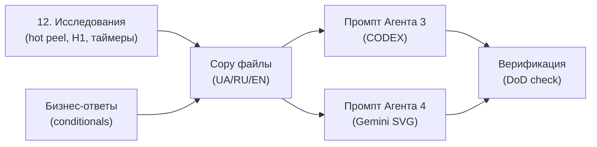
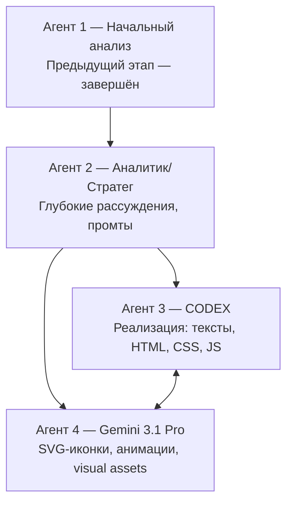

# 🧠 Комплексный аналитический документ для ИИ-агента (глубокий анализ + направления + промты)

**Версия:** 2.0  
**Дата:** 24 февраля 2026  
**Назначение:** Этот файл передаётся ИИ-агенту, который проводит глубокие рассуждения, создаёт/исправляет промты и формирует файлы для последующих агентов-исполнителей.  
**Источники:** ITER2 (7 файлов), Creative Ideas Reports V1/V2 (56 идей), Effects.MD (Aceternity UI), Performance Audit, обратная связь владельца проекта (12 пунктов).

---

## 🔴 СЕКЦИЯ 0: КАК ИСПОЛЬЗОВАТЬ ЭТОТ ДОКУМЕНТ (прочитай первым)

### Твоя роль
Ты — **Агент 2 (Стратег/Аналитик)**. Ты проводишь глубокий анализ, создаёшь и улучшаешь промпты, и формируешь пакет файлов для двух исполняющих агентов. Ты **НЕ ПИШЕШЬ КОД** — ты пишешь точные инструкции для тех, кто будет писать код.

### Язык документа
Этот документ написан на **русском** для удобства чтения. Однако:
- Все OUTPUT-тексты для сайта должны быть на **3 языках**: UA (основной), RU, EN
- UA — мастер-версия, RU и EN — переводы с UA
- Примеры UI-текстов в этом документе даны преимущественно на UA

### Что ты получаешь (INPUT)

| # | Файл | Путь (относительно корня проекта) | Назначение |
|---|------|------|------------|
| 1 | ITER2_00_README.md | `twocomms/Ideas/itr3/ITER2_00_README.md` | Обзор итерации |
| 2 | ITER2_01_DECISIONS.md | `twocomms/Ideas/itr3/ITER2_01_DECISIONS.md` | Решения и приоритеты P0/P1/P2 |
| 3 | ITER2_02_COPY_UA.md | `twocomms/Ideas/itr3/ITER2_02_COPY_UA.md` | Финальные тексты UA (429 строк) |
| 4 | ITER2_03_COPY_RU.md | `twocomms/Ideas/itr3/ITER2_03_COPY_RU.md` | Финальные тексты RU (395 строк) |
| 5 | ITER2_04_COPY_EN.md | `twocomms/Ideas/itr3/ITER2_04_COPY_EN.md` | Финальные тексты EN (362 строк) |
| 6 | ITER2_05_UI_MICROPACK.md | `twocomms/Ideas/itr3/ITER2_05_UI_MICROPACK.md` | UI-анимации и визуал (97 строк) |
| 7 | ITER2_06_PROMPT_AGENT3_IMPLEMENT.md | `twocomms/Ideas/itr3/ITER2_06_PROMPT_AGENT3_IMPLEMENT.md` | Промпт для CODEX (87 строк) |
| 8 | ЭТА ДОКУМЕНТАЦИЯ | `twocomms/Ideas/itr3/ITER2_RESEARCH_DIRECTIONS_FOR_AGENT.md` | Твоё техзадание |
| 9 | Creative_Ideas_Report_V2.md | `twocomms/Ideas/ids2/Creative_Ideas_Report_V2.md` | 56 идей для сайта |
| 10 | ITER2_DEEP_ANALYSIS.md | `twocomms/Ideas/itr3/ITER2_DEEP_ANALYSIS.md` | Первичный глубокий анализ пакета ITER2 |

### Что ты должен произвести (OUTPUT)

| # | Файл | Описание |
|---|------|----------|
| 1 | **ITER3_02_COPY_UA.md** | Улучшенные тексты UA (все исправления из этого документа) |
| 2 | **ITER3_03_COPY_RU.md** | Улучшенные тексты RU (синхронно с UA) |
| 3 | **ITER3_04_COPY_EN.md** | Улучшенные тексты EN (заполнить пробелы K2, K3) |
| 4 | **ITER3_05_UI_MICROPACK.md** | Улучшенный микропак (performance budgets, CSS examples) |
| 5 | **ITER3_06_PROMPT_AGENT3.md** | Улучшенный промпт для CODEX (скоуп, git, порядок) |
| 6 | **ITER3_07_PROMPT_AGENT4_GEMINI.md** | **НОВЫЙ** — промпт для Gemini 3.1 (SVG-иконки) |
| 7 | **ITER3_08_BUSINESS_ANSWERS.md** | **НОВЫЙ** — разрешённые conditionals |
| 8 | **ITER3_01_DECISIONS.md** | Обновлённые решения (с учётом исследований) |
| 9 | Файлы исследований | По темам из раздела 12 (hot peel, H1, таймеры и т.д.) |

### Приоритет выполнения



**Порядок:**
1. **Сначала** — разреши conditionals (раздел 10.5) и проведи исследования (раздел 12)
2. **Затем** — обнови copy файлы с учётом результатов
3. **Параллельно** — создай промпты для Агентов 3 и 4
4. **В конце** — проверь всё по DoD (раздел 23)

---

## Оглавление

1. [Контекст проекта и архитектура агентов](#1-контекст)
2. [Обратная связь владельца — 12 ключевых точек](#2-обратная-связь)
3. [Глубокий анализ Hero-секции](#3-hero-анализ)
4. [Терминология: исследование лучших формулировок](#4-терминология)
5. [Стабильное электричество — новый месседж](#5-электричество)
6. [Multi Step Loader — текущий vs желаемый](#6-loader)
7. [4-й ИИ-агент (Gemini 3.1) — SVG-иконки и визуал](#7-агент-4)
8. [Синхронизация Агент 3 (CODEX) ↔ Агент 4 (Gemini)](#8-синхронизация)
9. [Скоуп ограничения — только DTF-субдомен](#9-скоуп)
10. [Исправления промпта ITER2_06](#10-исправления-промпта)
11. [Пропущенные идеи V2 для интеграции](#11-пропущенные-v2)
12. [Темы для дополнительного глубокого исследования](#12-темы-исследований)
13. [Полная таблица: рекомендации + статус](#13-таблица)

### Дополнение (расширенные разделы)

14. [CTA-тексты: глубокий психологический анализ](#14-cta)
15. [Rotator: стратегия контента](#15-rotator)
16. [Hero на мобилке: layout specifics](#16-mobile-hero)
17. [FAQ: улучшение формата](#17-faq)
18. [Post-submit экран: Peak-End Rule](#18-post-submit)
19. [Mobile Dock: детальная спецификация](#19-dock)
20. [EN-версия: список пробелов](#20-en-gaps)
21. [Cache invalidation](#21-cache)
22. [Расширенный список V2 идей](#22-v2-extended)
23. [Улучшенный Definition of Done](#23-dod)
24. [Справочник психологических принципов](#24-principles)
25. [Multi Step Loader: примеры CSS](#25-loader-css)
26. [Инструкции для Агента 2: итоговый чек-лист](#26-checklist)

---

## 1. Контекст проекта и архитектура агентов {#1-контекст}

### 1.1. О проекте
- **Сайт:** dtf.twocomms.shop — DTF-печать на плёнке 60 см
- **Стек:** Django (Python backend) + vanilla JS + CSS, без React/Next.js
- **Хостинг:** shared hosting, без Redis
- **Языки:** UA (основной), RU, EN (все для украинской аудитории)
- **Целевая аудитория:** владельцы термопрессов, дизайнеры, мелкие производства — люди, которые **уже знают что такое DTF** и ищут надёжного поставщика плёнки
- **Источник трафика:** Instagram (основной), прямой поиск Google
- **Текущая итерация:** ITER2 — замена текстов, удаление жаргона, UI-микропак, без изменения архитектуры

### 1.2. Архитектура агентов



| Агент | Роль | Что делает | Что НЕ делает |
|-------|------|-----------|---------------|
| **Агент 2** (получатель этого документа) | Стратег/Аналитик | Глубокий анализ, создание/улучшение промтов, формулировки, исследования | Не пишет код |
| **Агент 3** (CODEX) | Исполнитель-бэкенд | Замена текстов, HTML-шаблоны, CSS, JS, Django templates | Не создаёт SVG-иконки |
| **Агент 4** (Gemini 3.1) | Исполнитель-визуал | Анимированные SVG-иконки, визуальные эффекты, фронтенд-декор | Не трогает бэкенд и логику |

### 1.3. Файлы ITER2 (itr3/)

> [!IMPORTANT]
> Все файлы ITER2 находятся в директории `twocomms/Ideas/itr3/`. Файлы Creative Ideas — в `twocomms/Ideas/ids2/`. Код сайта — в `twocomms/dtf/`.

| Файл | Содержание | Строк |
| ITER2_01_DECISIONS.md | Решения P0/P1/P2 | 98 |
| ITER2_02_COPY_UA.md | Финальные тексты UA | 429 |
| ITER2_03_COPY_RU.md | Финальные тексты RU | 395 |
| ITER2_04_COPY_EN.md | Финальные тексты EN | 362 |
| ITER2_05_UI_MICROPACK.md | Анимации и визуал | 97 |
| ITER2_06_PROMPT_AGENT3_IMPLEMENT.md | Промпт для CODEX | 87 |

### 1.4. Структура copy-файлов (секция → страница)

Все 3 copy-файла (UA/RU/EN) имеют одинаковую структуру (секции A–O), каждая секция = одна страница сайта:

| Секция | Страница | URL | Содержание |
|--------|----------|-----|------------|
| **A** | Глобально | (весь сайт) | Тон, словарь терминов, навигация, rotator, CTA-патерны, footer |
| **B** | Головна | `/` | Hero (H1, subtitle, CTA, price card), преимущества, процесс |
| **C** | Ціни | `/price/` | H1, описание, карточки цен, калькулятор |
| **D** | Замовити | `/order/` | H1, форма заказа, шаги загрузки, post-submit |
| **E** | Вимоги | `/requirements/` | H1, формат/DPI/белый шар/размеры/блок помощи |
| **F** | Якість | `/quality/` | H1, описание качества, кейсы |
| **G** | FAQ | `/faq/` | 6 вопросов на «языке клиента» |
| **H** | Шаблони | `/templates/` | H1, скачивание шаблонов |
| **I** | Кейси/Галерея | `/gallery/` | H1, gallery placeholder |
| **J** | Конструктор | `/constructor/app/` | H1, stepper, микротексты |
| **K** | Системні тексти | (формы, loader) | Статусы, валидация, плейсхолдеры, post-submit |
| **L** | Оплата і доставка | `/payment-delivery/` | Способы оплаты, условия НП |
| **M** | Повернення | `/returns/` | Политика возврата |
| **N** | Конфіденційність | `/privacy/` | Privacy policy |
| **O** | Публічна оферта | `/terms/` | Оферта |

> [!WARNING]
> Секции J, L, M, N, O помечены «якщо є» — страница может не существовать на текущем сайте. Агент 3 (CODEX) должен проверить наличие перед правкой.

### 1.5. Карта URL сайта dtf.twocomms.shop

| URL | Статус | Шаблон Django |
|-----|--------|---------------|
| `/` | ✅ Есть | `dtf/templates/dtf/index.html` (или home) |
| `/price/` | ✅ Есть | `dtf/templates/dtf/pricing.html` |
| `/order/` | ✅ Есть | `dtf/templates/dtf/order.html` |
| `/requirements/` | ✅ Есть | `dtf/templates/dtf/requirements.html` |
| `/quality/` | ✅ Есть | `dtf/templates/dtf/quality.html` |
| `/faq/` | ✅ Есть | `dtf/templates/dtf/faq.html` |
| `/templates/` | ✅ Есть | `dtf/templates/dtf/templates_page.html` |
| `/gallery/` | ✅ Есть | `dtf/templates/dtf/gallery.html` |
| `/constructor/app/` | ✅ Есть | `dtf/templates/dtf/constructor_app.html` |
| `/payment-delivery/` | ❓ Проверить | — |
| `/returns/` | ❓ Проверить | — |
| `/privacy/` | ❓ Проверить | — |
| `/terms/` | ❓ Проверить | — |

### 1.6. Техническая архитектура (критично для Агента 3)

**Система эффектов (DTF.registerEffect):**
Все UI-эффекты на сайте регистрируются через единый паттерн:
```javascript
if (DTF.registerEffect) {
  DTF.registerEffect('effect-name', 'CSS-selector', initFunction);
}
```

Уже зарегистрированные эффекты (12+):
`bg-beams`, `dotted-glow`, `encrypted-text`, `pointer-highlight`, `compare`, `stateful-button`, `tracing-beam`, `infinite-cards`, `sparkles`, `floating-dock`, `multi-step-loader`, `vanish-input`, `text-generate`, `speed-text`.

**Новые эффекты для ITER2** (лампочка, сканирование файла, CTA pulse, TG glow) должны использовать этот же паттерн.

**Файловая структура для эффектов:**
- JS: `dtf/static/dtf/js/components/` — один файл на эффект
- CSS: `dtf/static/dtf/css/components/` — стили эффектов
- Bundle: `effects-bundle.js` — собранная версия всех эффектов

**CTA-кнопки (текущий CSS):**
- Primary: `.btn-primary` (оранжевый фон)
- Secondary: `.btn-outline` или `.btn-secondary`
- Text link: обычный `<a>` со стрелкой

---

## 2. Обратная связь владельца — 12 ключевых точек {#2-обратная-связь}

> [!IMPORTANT]
> Эти пункты — **прямые указания владельца проекта**. Они имеют **приоритет** над любыми аналитическими рекомендациями.

### ✅ Принятые без изменений

| # | Тема | Решение владельца | Действие для агента |
|---|------|-------------------|---------------------|
| 1 | A/B-тесты | НЕ проводить на старте — мало трафика | Убрать все упоминания A/B-тестов из промпта. Оставить только before/after метрики через Lighthouse |
| 2 | Английские DTF-термины в Украине | В Украине НИКТО не говорит hot peel, gang sheet, preflight | Убрать рекомендацию о «двойных формулировках» для SEO. Украинские эквиваленты — единственные |
| 3 | Ценовой якорь | Согласен — «від 280 грн/м» лучше диапазона | Обязательная замена в copy-файлах |
| 11 | Откат через CODEX | Можно через встроенный откат CODEX | Добавить git-инструкции в промпт, но без сложной стратегии |
| 12 | Скоуп = только DTF | Замены ТОЛЬКО на субдомене DTF, не касаться остальных сайтов и движка | Добавить жёсткое ограничение в промпт агента |

### ⚠️ Требуют дополнительного исследования

| # | Тема | Позиция владельца | Что нужно исследовать |
|---|------|-------------------|----------------------|
| 4 | Термин «зняття одразу» | Нужно глубокое исследование какой термин лучше | Проанализировать варианты: зняття одразу, гаряче зняття, зняття одигар, и др. Может быть, оставить «hot peel» как дополнительный |
| 5 | Таймеры отправки («2 год до відправки») | Нужно глубокое исследование — стоит ли показывать | Проанализировать: психологический эффект таймеров без fake urgency, когда реальный schedule |
| 6 | H1 и DTF-аудитория | Кто заказывает DTF — уже знает. Новичков вести на конструктор | Исследовать: оптимальный H1 для DTF-осведомлённой аудитории. Отдельная стратегия для новичков |
| 8 | Multi Step Loader | Хочет более красивую анимацию как в Aceternity Effects | Детальный план апгрейда визуала loader'а (см. раздел 6) |

### 🔧 Конкретные указания для реализации

| # | Тема | Указание | Реализация |
|---|------|----------|------------|
| 7 | Hero-секция | Сделать ОЧЕНЬ детальный анализ расположения элементов | См. раздел 3 — полный покомпонентный разбор |
| 9 | Электричество / генератор | НЕТ генератора, но НЕТ проблем со светом. Конкуренты имеют проблемы | Переформулировать с «є генератор» на «стабільне виробництво» (см. раздел 5) |
| 10 | SVG-иконки | Делает НЕ CODEX, а 4-й агент (Gemini 3.1). Иконки анимированные | Создать отдельный промпт для Агента 4 (см. раздел 7) |

---

## 3. Глубокий анализ Hero-секции (покомпонентный разбор) {#3-hero-анализ}

### 3.1. Текущая структура Hero (по ITER2_02_COPY_UA.md)

```
┌──────────────────────────────────────────────────────────────────────┐
│ ROTATOR BAR: «60 см · від 280 грн/м · НП» ↔ «Перевірка файлу...»  │ ← элемент 1
├──────────────────────────────────────────────────────────────────────┤
│                                                                      │
│  EYEBROW: DTF‑друк 60 см · перевірка файлу · відправка НП          │ ← элемент 2
│                                                                      │
│  H1: DTF‑друк на плівці 60 см — чистий край                        │ ← элемент 3
│      і яскраві кольори                                              │
│                                                                      │
│  SUBTITLE: Надішліть файл (PNG/PDF) — ми перевіримо,               │ ← элемент 4
│  підготуємо до друку та відправимо Новою Поштою.                   │
│                                                                      │
│  ✅ MICRO-LINE: Перед друком погоджуємо нюанси — без сюрпризів.     │ ← элемент 5
│                                                                      │
│  [████ Замовити друк ████]  [ Безкоштовний тест ]                   │ ← элемент 6+7
│                                                                      │
│  Написати в Telegram →                                              │ ← элемент 8
│                                                                      │
│  мелко: Можна одним файлом або кількома...                          │ ← элемент 9
│                                                │                     │
│                                    ┌───────────┴──────────┐         │
│                                    │ PRICE CARD           │         │ ← элемент 10
│                                    │ від 280 грн/м        │         │
│                                    │ [badge][badge][badge] │         │
│                                    │ Відправка НП          │         │
│                                    └──────────────────────┘         │
│                                                                      │
└──────────────────────────────────────────────────────────────────────┘
```

**Итого: 10 информационных элементов** на одном экране.

### 3.2. Проблемы и аргументация

#### Проблема A: Превышение Miller's Law (7±2)

**Miller's Law** (G.A. Miller, 1956, Psychological Review): рабочая память одновременно удерживает 7±2 «чанков» информации. При 10 элементах на Hero — холодный посетитель не может обработать ВСЁ за первый скан (3–5 секунд по данным NNG).

**Научное подтверждение:** Laws of UX > Cognitive Load — «When incoming information exceeds available mental capacity, users struggle, tasks become difficult, details are missed, and users feel overwhelmed.»

#### Проблема B: Дублирование информации Eyebrow ↔ Rotator ↔ H1

| Факт | Eyebrow | H1 | Rotator |
|------|---------|----|---------|
| DTF-друк | ✅ | ✅ | ✅ |
| 60 см | ✅ | ✅ | ✅ |
| Перевірка файлу | ✅ | — | ✅ |
| Відправка НП | ✅ | — | ✅ |

Один и тот же факт «DTF 60 см» повторяется в 3 из 10 элементов. Это **intrinsic redundancy** — не добавляет информации, только загружает когнитивный канал.

#### Проблема C: 4 action-элемента создают конфликт по Hick's Law

Hick-Hyman: RT = a + b·log₂(n). При n=4 (CTA Primary + Secondary + Text link + small text) — решение замедляется. Для холодного трафика оптимально n ≤ 3.

«Small text» (элемент 9) — «Можна одним файлом або кількома» — это **техническая деталь** о процессе загрузки. Она НЕ помогает принять решение «заказать ли?», а отвечает на вопрос «КАК заказать?», который возникает ПОСЛЕ решения.

### 3.3. Предложенная оптимизация: от 10 к 7 элементам

```
┌──────────────────────────────────────────────────────────────────────┐
│ ROTATOR BAR: 3–4 уникальные фразы (НЕ дублируют H1)               │ ← элемент 1
├──────────────────────────────────────────────────────────────────────┤
│                                                                      │
│  ← LEFT COLUMN                       │  RIGHT COLUMN →              │
│                                       │                              │
│  H1: DTF‑друк без браку —            │  ┌──────────────────┐       │
│  чистий край і яскраві               │  │ від 280 грн/м    │       │ ← элемент 5
│  кольори                   ← эл. 2   │  │ [badge] [badge]  │       │
│                                       │  │ ✅ Перевіряємо   │       │
│  SUBTITLE: Надішліть файл —          │  │ файл до друку    │       │
│  ми перевіримо і відправимо ← эл. 3  │  └──────────────────┘       │
│  Новою Поштою.                        │                              │
│                                       │                              │
│  [████ Замовити друк ████]           │                              │
│  [ Безкоштовний тест ]     ← эл. 4   │                              │
│  Запитати в Telegram →                │                              │
│                                       │                              │
└──────────────────────────────────────────────────────────────────────┘
```

**Изменения:**

| Что | Было | Стало | Почему |
|-----|------|-------|--------|
| Eyebrow | Отдельный элемент | ❌ Убрано | Дублирует H1 и rotator |
| Micro-line | Между subtitle и CTA | Внутри price card | Контекст: цена + гарантия = «value + trust» bundle |
| Small text | Под CTA отдельно | ❌ Убрано | Техническая деталь → на страницу /order/ |
| 3 бейджа | 3 бейджа на карточке | 2 бейджа ← эл. 5 | Снижение визуального шума |
| CTA | 3 CTA + small text (4 action) | 3 CTA (без small text) | Hick's Law: n=3 → оптимальный порядок |

**Группировка по Gestalt Proximity:**

| Группа | Элементы | Функция |
|--------|----------|---------|
| **A — Идентификация** | H1 + Subtitle | «Что это и что я получу?» |
| **B — Действие** | Primary + Secondary + Text link | «Что мне сделать?» |
| **C — Ценность + Доверие** | Price card + micro-line | «Сколько стоит? Точно всё ок?» |
| **D — Обновление** | Rotator (top bar) | Второстепенная информация, не конкурирует |

> [!IMPORTANT]
> **Для Агента 2:** Проведи дополнительный анализ — если убирать eyebrow, не теряется ли SEO (eyebrow может содержать ключевые слова для Google). Если eyebrow важен для SEO — можно оставить его визуально скрытым (sr-only) или объединить с subtitle.

### 3.4. H1 — исследование формулировок

**Контекст от владельца:** DTF-аудитория уже знает что такое DTF. Их боли:
- Принт может отклеиваться
- Нечёткие края
- Плохой белый слой
- Долгая доставка
- Непредсказуемое качество

**Предлагаемые варианты H1 для исследования агентом:**

| # | Вариант | Фокус | Аргумент |
|---|---------|-------|----------|
| A | `DTF‑друк на плівці 60 см — чистий край і яскраві кольори` | Качество результата | Текущий ITER2. Описательный, SEO-strong. |
| B | `DTF‑друк без браку — чистий край і щільний колір` | Anti-pain (без брака) | Владелец одобрил как «в принципі не поганий». Прямо отвечает на боль «принт отклеивается». |
| C | `DTF‑друк 60 см — тримається, не тріскається, не вигоряє` | Triple anti-pain | Три конкретных обещания. Сильная конструкция, но длинная. |
| D | `Якісний DTF‑друк на плівці 60 см — перевірка файлу до друку` | Качество + процесс | Комбинация результата и сервиса. SEO-strong (якісний DTF друк). |

> [!TIP]
> **Направление для исследования:** Агент 2 должен провести глубокий анализ украинских DTF-форумов и Telegram-каналов, чтобы определить топ-3 формулировки, которые РЕАЛЬНО используют клиенты типографий при поиске.

---

## 4. Терминология: исследование лучших формулировок {#4-терминология}

### 4.1. Hot peel → ?

**Контекст:** В Украине НИКТО из целевой аудитории не говорит «hot peel» по-английски (подтверждено владельцем). Нужен понятный украинский термин.

**Варианты для исследования:**

| Термин | Плюсы | Минусы |
|--------|-------|--------|
| Зняття одразу | Понятно без контекста | Не устоявшийся, 0 результатов Google |
| Гаряче зняття | Прямой перевод, интуитивный | Может звучать технически |
| Зняття "на гарячу" | Разговорный, естественный | Кавычки в UI могут быть спорными |
| Швидке зняття | Фокус на скорости | Теряется смысл «горячего» процесса |

> [!IMPORTANT]
> **Задание для Агента 2:** Проведи лингвистический анализ: какой из терминов лучше всего передаёт суть процесса для человека, который знает что такое термопресс, но не использует английские термины. Протести на «тесте 5 секунд»: если человек впервые видит термин — поймёт ли за 5 секунд?

### 4.2. Другие термины, требующие исследования

| Английский | Текущий ITER2 | Нужно проверить |
|-----------|--------------|-----------------|
| Cold peel | Зняття після охолодження | Естественность формулировки |
| Gang sheet | Лист (60 см) | Достаточно ли «лист» без уточнения? |
| Мат / глянцеві поверхні (матовые) | Не раскрыто в ITER2 | Владелец упомянул — нужно добавить описание |

---

## 5. Стабильное электричество — новый месседж {#5-электричество}

### 5.1. Факты

- У TwoComms **НЕТ генератора**
- У TwoComms **НЕТ проблем с электричеством** (стабильное подключение)
- Многие **конкуренты ИМЕЮТ проблемы** со светом → задержки, срывы сроков
- Это **конкурентное преимущество**, которое нужно донести

### 5.2. Варианты формулировок

| # | Вариант (UA) | Вариант (RU) | Тон | Анализ |
|---|-------------|-------------|-----|--------|
| 1 | `Стабільне виробництво — друкуємо без зупинок` | `Стабильное производство — печатаем без остановок` | Нейтральный, профессиональный | ✅ Рекомендуемый: не врёт, не упоминает генератор, фокус на результате — «без зупинок» |
| 2 | `Безперебійний друк — завжди в роботі` | `Бесперебойная печать — всегда работаем` | Уверенный | Хорошо, но «завжди» — обещание, которое трудно гарантировать |
| 3 | `Друкуємо щодня без пауз` | `Печатаем каждый день без пауз` | Простой, человечный | Хорошо для ротатора, но не как основной месседж |

### 5.3. Иконка для этого месседжа

**Поскольку генератора нет**, иконка лампочки НЕ означает «у нас есть генератор». Вместо этого:

- **Визуальная идея:** лампочка, которая **горит стабильно** (не мигает) с мягкими лучами света. Символизирует стабильность и надёжность.
- **Альтернатива:** иконка ⚡ с ✅ (молния + галочка = «со светом всё ок»)
- **Реализация:** Анимированная SVG-иконка — создаёт **4-й агент (Gemini 3.1)**

> [!TIP]
> **Для ротатора:** Фраза «Стабільне виробництво — друкуємо без зупинок» + анимированная иконка стабильной лампочки = сильный trust signal для украинской аудитории, где перебои со светом — реальная проблема у конкурентов.

---

## 6. Multi Step Loader — текущий vs желаемый {#6-loader}

### 6.1. Текущая реализация (анализ кода)

**Файл:** `dtf/static/dtf/js/components/multi-step-loader.js` (304 строки, vanilla JS)

**Особенности:**
- 6 шагов проверки: формат, DPI, размер, прозрачность, тонкие линии, результат
- Unicode-иконки: ✓ (ok), ⚠ (warn), ✗ (fail), ↻ (loading), • (pending)
- I18N: все лейблы на 3 языках (uk/ru/en)
- Анимация: translateY(8px) → 0, opacity fade, 220ms, stagger 110ms
- Реальный backend preflight через fetch API
- Используется на `/order/` и `/constructor/`
- Поддерживает `prefers-reduced-motion` через ctx.reducedMotion

**Вердикт:** Функционально ОТЛИЧНО (реальный backend, мультиязычный), визуально УСТАРЕВШИЙ.

### 6.2. Aceternity Multi Step Loader (из Effects.MD)

**Особенности:**
- React + Framer Motion (motion/react)
- Full-screen модальный оверлей
- Пошаговая анимация с checkmark
- Auto-advance каждые 2000ms
- Красивые spring-анимации

**НЕ подходит напрямую** — React-зависимость, модальный паттерн (у нас inline).

### 6.3. План апгрейда (для Агента 3 + Агента 4)

**Сохранить:** inline checklist (все шаги видны одновременно — лучший UX по Nielsen «visibility of system status»)

**Улучшить:**

| Элемент | Было | Стало | Кто делает |
|---------|------|-------|-----------|
| Иконки | Unicode ✓⚠✗↻• | Анимированные SVG (draw, pulse, shake, spin) | **Агент 4 (Gemini)** |
| Цветовые переходы | Мгновенная смена CSS-класса | `transition: color 300ms, background 300ms` | **Агент 3 (CODEX)** |
| Активный шаг | Нет подсветки | Мягкий `background: rgba(accent, 0.05)` пульс | **Агент 3** |
| Сканирующая линия | Нет | Тонкая линия сверху вниз по списку шагов (CSS animation) | **Агент 3** |
| Checkmark draw | Мгновенное появление | SVG stroke-dashoffset animation 250ms | **Агент 4** |
| Прогресс-бар | Нет | Тонкая полоска вверху блока (% завершённых шагов) | **Агент 3** |

**Технические ограничения:**
- Без React/Framer Motion — только vanilla JS + CSS
- SVG-иконки — inline (не external), чтобы анимировать stroke
- Только `transform` и `opacity` для анимаций (composite-only)
- Суммарный размер JS для апгрейда: < 2KB gzipped
- `prefers-reduced-motion` — все анимации отключаются

> [!IMPORTANT]
> **Для Агента 2:** Включи в промпт Агента 3 конкретные CSS-классы и data-атрибуты для SVG-иконок, чтобы Агент 4 мог создать SVG, совместимые с HTML-структурой Агента 3.

---

## 7. 4-й ИИ-агент (Gemini 3.1) — SVG-иконки и визуал {#7-агент-4}

### 7.1. Что должен создать Агент 4

**Набор анимированных SVG-иконок (8–10 штук):**

| # | Иконка | Назначение | Анимация | Размер |
|---|--------|-----------|----------|--------|
| 1 | ✅ Checkmark | Статус OK в loader и статусах | Stroke draw 250ms при появлении | 24×24 |
| 2 | ⚠️ Warning triangle | Статус WARN | Gentle pulse glow 600ms, 2 раза | 24×24 |
| 3 | ❌ Error cross | Статус FAIL | Subtle shake 300ms | 24×24 |
| 4 | ↻ Loading spinner | Статус LOADING | Infinite rotation 1.2s linear | 24×24 |
| 5 | 💡 Lightbulb (жёлтая) | «Стабільне виробництво» | Мягкое свечение с лучами, 6-8s interval | 32×32 |
| 6 | 📄 File document | Загрузка файла | Нет (статичная) | 24×24 |
| 7 | 📦 Package | Отправка/доставка | Нет (статичная) | 24×24 |
| 8 | 💬 Chat bubble | Telegram/контакт | Одноразовый glow 400ms | 24×24 |
| 9 | 🎨 Palette/droplet | Качество цвета | Нет (статичная) | 24×24 |
| 10 | ✂️ Scissors/cut | Резка/зняття | Нет (статичная) | 24×24 |

### 7.2. Технические требования для Агента 4

```
ТЕХНИЧЕСКИЕ ТРЕБОВАНИЯ К SVG:
1. Формат: inline SVG (не внешние файлы)
2. ViewBox: 0 0 24 24 (или 0 0 32 32 для крупных)
3. Stroke: currentColor (берёт цвет от родительского элемента)
4. Fill: none (контурный стиль, rounded linecap)
5. Stroke-width: 1.5–2px
6. Цвета через CSS custom properties:
   --icon-ok: #22c55e
   --icon-warn: #eab308
   --icon-fail: #ef4444
   --icon-loading: #3b82f6
   --icon-default: #6b7280
7. Анимации: CSS @keyframes (НЕ SMIL, SMIL deprecated)
8. prefers-reduced-motion: отключать ВСЕ анимации
9. Без JavaScript — только CSS-анимации
10. Лампочка: тёплый жёлтый (#fbbf24), мелкие лучи-полоски от центра
```

### 7.3. Шаблон промпта для Агента 4

> [!IMPORTANT]
> **Агент 2 должен создать полный промпт** для Gemini 3.1 на основе этой секции. Промпт должен содержать:
> - Текущую цветовую палитру сайта (из CSS variables)
> - Примеры текущего стиля (скриншоты или описания)
> - Точный список иконок из таблицы 7.1
> - Все технические требования из 7.2
> - Инструкции по интеграции с Django templates
> - Примеры размещения (в каких HTML-контейнерах должны быть иконки)

---

## 8. Синхронизация Агент 3 (CODEX) ↔ Агент 4 (Gemini) {#8-синхронизация}

### 8.1. Контракт синхронизации

```
SHARED CONTRACT:

1. NAMING CONVENTION:
   SVG ID: icon-{name} (icon-check, icon-warn, icon-fail, icon-loading, icon-lightbulb...)
   CSS class: .dtf-icon-{name}
   Animation class: .dtf-icon-animate (добавляется JS для запуска анимации)

2. HTML STRUCTURE (Агент 3 создаёт контейнеры):
   <span class="dtf-icon dtf-icon-check dtf-icon-animate" aria-hidden="true">
     <!-- SVG от Агента 4 вставляется сюда -->
   </span>

3. CSS VARIABLES (общие):
   --dtf-icon-size: 24px;
   --dtf-icon-stroke: 1.5;
   --dtf-icon-color-ok: #22c55e;
   --dtf-icon-color-warn: #eab308;
   --dtf-icon-color-fail: #ef4444;
   --dtf-icon-color-loading: #3b82f6;

4. FILE LOCATION:
   SVG файлы: dtf/static/dtf/icons/ (или inline в templates)
   CSS анимации: dtf/static/dtf/css/components/icon-animations.css

5. ПОРЯДОК РАБОТЫ:
   Шаг 1: Агент 3 создаёт HTML-контейнеры с data-icon="check" и т.д.
   Шаг 2: Агент 4 создаёт SVG + CSS файлы
   Шаг 3: Агент 3 интегрирует SVG в templates
```

### 8.2. Точки потенциального конфликта

| Конфликт | Решение |
|----------|---------|
| Агент 3 использует Unicode, Агент 4 ещё не готов | Агент 3 делает fallback: Unicode → SVG (если SVG нет — показывает Unicode) |
| Размер иконок не совпадает с layout | Контракт фиксирует 24×24 и 32×32 — оба агента используют |
| CSS-анимации конфликтуют | Все icon-анимации в отдельном файле `icon-animations.css` |

---

## 9. Скоуп ограничения — только DTF-субдомен {#9-скоуп}

> [!CAUTION]
> **Критическое ограничение скоупа:**
>
> Все изменения ITER2 затрагивают ТОЛЬКО:
> - `dtf/templates/dtf/` — HTML-шаблоны DTF
> - `dtf/static/dtf/` — CSS, JS, images DTF
> - `dtf/` Django app — views, urls, models ТОЛЬКО если нужно для текстов
> - Файлы локализации ТОЛЬКО для DTF
>
> **ЗАПРЕЩЕНО трогать:**
> - Корневой движок TwoComms (twocomms/)
> - Другие поддомены/сайты
> - Общие shared-компоненты (если не специфичны для DTF)
> - settings.py, manage.py, wsgi.py
> - Миграции базы данных
> - Серверную конфигурацию

Это ограничение должно быть в **первой строке** промпта Агента 3.

---

## 10. Исправления промпта ITER2_06 (для Агента 3) {#10-исправления-промпта}

### 10.1. Добавить в начало (ПЕРЕД секцией 0)

```markdown
## СКОУП И БЕЗОПАСНОСТЬ

**СКОУП:** Все изменения — ТОЛЬКО в Django app `dtf/` и его static/templates.
НЕ трогать: корневой TwoComms, другие субдомены, миграции, settings.py.

**GIT:** Перед началом работы создай ветку `iter2-copy-update`.
Все коммиты — в эту ветку. По завершении — сообщи для ревью.

**НЕ МЕНЯТЬ:**
- Python backend-код (*.py) кроме views если нужно для текстов
- Database models и migrations
- CSS class names и JS variable names (только СОДЕРЖИМОЕ текстов)
- Admin interface
- API contracts
```

### 10.2. Исправить P0.1 (глобальная замена)

**Было:** «Найди и замени по всему проекту (шаблоны, локализации, компоненты, JS-строки)»

**Стало:**
```markdown
P0.1: Замена терминов ТОЛЬКО в:
- dtf/templates/dtf/**/*.html (шаблоны)
- dtf/static/dtf/js/**/*.js (ТОЛЬКО текстовые строки, НЕ имена переменных)
- dtf/locale/ (файлы локализации, если есть)
- НЕ трогать *.py файлы, CSS, миграции
```

### 10.3. Добавить порядок исполнения

```markdown
ПОРЯДОК ВЫПОЛНЕНИЯ:
1️⃣ P0.2 + P0.3 — Вставить новые тексты Hero и Rotator (из COPY файлов)
2️⃣ P0.1 — Глобальная зачистка старых терминов (ripgrep-check)
3️⃣ P0.4 — Mobile dock (независимо)
4️⃣ P0.5 — FAQ/Requirements (тексты из COPY)
5️⃣ P0.6 — UI анимации (на уже обновлённый контент)
6️⃣ Интеграция SVG-иконок от Агента 4 (если готовы)
```

### 10.4. Расширить тест-план

Добавить ширины: `320 / 360 / 390 / 414 / 768 / 1024`

### 10.5. Убрать нерешённые conditional

Все `(якщо це правда; якщо ні — прибрати)` заменить на конкретные ответы.

**Полный список нерешённых conditionals из copy-файлов:**

| # | Файл | Строка | Conditional | РЕШЕНИЕ ВЛАДЕЛЬЦА |
|---|------|--------|-------------|-------------------|
| 1 | UA:A4 ст.41 | `Є генератор — працюємо без пауз` | `(якщо це правда; якщо ні — прибрати)` | ❌ Генератора НЕТ. Заменить на «Стабільне виробництво — друкуємо без зупинок» (см. раздел 5) |
| 2 | UA:I ст.275 | Placeholder-карточки в галерее | `(Якщо є placeholder-карточки)` | Проверить наличие на сайте. Если есть — пометить DEMO |
| 3 | UA:J ст.326 | Страница конструктора | `(якщо є)` | ✅ Конструктор ЕСТЬ на сайте (`/constructor/app/`) |
| 4 | UA:L ст.369 | Страница оплаты и доставки | `(якщо є)` | ❓ Проверить наличие |
| 5 | UA:M ст.386 | Страница возвратов | `(якщо є)` | ❓ Проверить наличие |
| 6 | UA:N ст.397 | Страница конфиденциальности | `(якщо є)` | ❓ Проверить наличие |
| 7 | UA:O ст.417 | Страница оферты | `(якщо є)` | ❓ Проверить наличие |

> [!IMPORTANT]
> **Для Агента 2:** Пункты 4–7 (❓) требуют проверки от Агента 3 (CODEX) — существуют ли эти страницы на сайте. Включи в промпт Агента 3 задачу: `проверь наличие /payment-delivery/, /returns/, /privacy/, /terms/ и сообщи`. Если страницы не существуют — тексты для них пока НЕ применять.

### 10.6. Пропущенные P0-элементы в текущем промпте

Текущий `ITER2_06_PROMPT_AGENT3_IMPLEMENT.md` НЕ упоминает следующие P0-задачи из `ITER2_01_DECISIONS.md`:

| # | P0-задача | Из DECISIONS | Статус в промпте |
|---|-----------|-------------|------------------|
| 1 | **Навигация**: `Конструктор` → `Зібрати макет 60 см` | Секция 1.1 + Copy UA:A3 | ❌ Не упомянуто |
| 2 | **White layer**: «білий шар під контролем» vs «контроль білого = задача клиента» | Секция 1.6 | ❌ Упомянуто в P0.5 вскользь |
| 3 | **Footer trust**: `Працюємо чесно: файл перевіряємо, нюанси погоджуємо до друку.` | Copy UA:A6 | ❌ Не упомянуто |
| 4 | **Demo-маркировка**: пометить placeholder-карточки как `DEMO / оновлюємо` | DECISIONS п.8 | ❌ Не упомянуто |
| 5 | **«Файл не в розмірі»**: блок-подсказка на /requirements/ | Секция 1.7 | ⚠️ Упомянуто в P0.5 но без акцента |

> [!CAUTION]
> **Для Агента 2:** Все 5 пунктов выше ОБЯЗАТЕЛЬНО добавить в обновлённый промпт Агента 3. Особенно навигация (пункт 1) — это конкретный find-replace в header/menu.

---

## 11. Пропущенные идеи V2 для интеграции {#11-пропущенные-v2}

### 11.1. ОБЯЗАТЕЛЬНО добавить в P0

| V2 # | Идея | Сложность | Ожидаемый рост |
|------|------|-----------|----------------|
| **[11]** | TG deep-link с pre-filled текстом | Минимальная (просто URL) | +14–24% к диалогам |

**Реализация:** Заменить все `https://t.me/USERNAME` на:
```
https://t.me/USERNAME?text=Привіт!%20Хочу%20дізнатися%20про%20DTF-друк%2060%20см
```

### 11.2. Рекомендовать для P1

| V2 # | Идея | Аргумент |
|------|------|----------|
| [12] | Inline-валидация форм | Стандарт UX, снижает отказы |
| [15] | Контрастный аудит | Критично для OLED |
| [29] | Trust-блок «Як працюємо чесно» | Для pre-launch трафика |

---

## 12. Темы для дополнительного глубокого исследования {#12-темы-исследований}

> [!IMPORTANT]
> Следующие темы требуют отдельного глубокого исследования **Агентом 2** перед финализацией промптов. Каждая тема — это отдельный аналитический блок.

### 12.1. Лучший украинский термин для hot peel

**Задача:** Определить какой из 4+ вариантов («зняття одразу», «гаряче зняття», «зняття на гарячу», «швидке зняття») наиболее понятен целевой аудитории в Украине.
**Метод:** Лингвистический анализ + анализ украинских DTF-форумов + Telegram-каналов.

### 12.2. H1 для DTF-осведомлённой аудитории

**Задача:** Определить оптимальную формулировку H1 для людей, которые УЖЕ знают DTF и ищут поставщика. Фокус на болевых точках (отклеивание, плохой белый, нечёткие края).
**Метод:** Анализ конкурентов, customer journey map, pain hierarchy.

### 12.3. Таймеры и реальное расписание отправки

**Задача:** Стоит ли показывать реальное время до следующей отправки (например, «Підтвердження до 12:00 — відправка сьогодні»)? Психологический эффект без fake urgency.
**Метод:** Анализ e-commerce best practices, case studies.

### 12.4. Стратегия для суперхолодных новичков

**Задача:** Новички, которые не знают DTF, не должны попадать на главную (они не знают что делать с плёнкой). Их нужно вести на конструктор или страницу готовых изделий.
**Метод:** Сегментация трафика, landing page strategy, конструктор vs каталог.

### 12.5. Матовые / глянцевые поверхности — терминология

**Задача:** Владелец упомянул «матовые поверхности» как тему, требующую исследования. Нужно определить: как описывать финиш (мат/глянец) DTF-плёнки для украинской аудитории.

---

## 13. Полная таблица рекомендаций {#13-таблица}

| # | Рекомендация | Приоритет | Кто делает | Статус |
|---|-------------|-----------|-----------|--------|
| 1 | Скоуп = только DTF subdomain | MUST | Агент 2 → промпт | ❌ Не в текущем промпте |
| 2 | Git branch strategy | MUST | Агент 2 → промпт | ❌ Не в текущем промпте |
| 3 | «НЕ МЕНЯТЬ» список | MUST | Агент 2 → промпт | ❌ Не в текущем промпте |
| 4 | Порядок исполнения P0 | MUST | Агент 2 → промпт | ❌ Не в текущем промпте |
| 5 | Ценовой якорь «від 280» | MUST | Агент 2 → copy файлы | ❌ Сейчас «280-350» |
| 6 | TG deep-link с prefill | MUST | Агент 2 → промпт P0 | ❌ Не в ITER2 |
| 7 | Унификация секций UA/RU/EN | MUST | Агент 2 → copy файлы | ❌ Порядок разный |
| 8 | Убрать conditionals | MUST | Владелец → ответы | ❌ Нерешённые вопросы |
| 9 | Hero сокращение до 7 элементов | SHOULD | Агент 2 → copy + промпт | ❌ Сейчас 10 элементов |
| 10 | Multi Step Loader visual upgrade | SHOULD | Агент 3 + Агент 4 | ❌ Текущий — Unicode |
| 11 | Электричество: новый месседж | SHOULD | Агент 2 → copy файлы | ❌ Сейчас «генератор» |
| 12 | Промпт для Агента 4 (Gemini) | SHOULD | Агент 2 | ❌ Не создан |
| 13 | Расширить тест-план (ширины) | SHOULD | Агент 2 → промпт | ❌ Только 360/390/414 |
| 14 | Убрать A/B тесты | DONE | — | ✅ По указанию владельца |
| 15 | Убрать англ. DTF-термины | DONE | — | ✅ По указанию владельца |
| 16 | Глубокое исследование hot peel | RESEARCH | Агент 2 | 📋 Запланировано |
| 17 | Глубокое исследование H1 | RESEARCH | Агент 2 | 📋 Запланировано |
| 18 | Глубокое исследование таймеров | RESEARCH | Агент 2 | 📋 Запланировано |
| 19 | Стратегия для новичков | RESEARCH | Агент 2 | 📋 Запланировано |
| 20 | Мат/глянец терминология | RESEARCH | Агент 2 | 📋 Запланировано |

---

# ДОПОЛНЕНИЕ: Расширенные разделы

> Следующие разделы дополняют основной документ деталями, которые не вошли в первую версию.

---

## 14. CTA-тексты: глубокий психологический анализ {#14-cta}

### 14.1. Ownership Effect (эффект владения)

Исследование CXL Institute показывает: использование притяжательного местоимения «мій/мой» в CTA увеличивает CTR на 5–8%. Мозг автоматически «присваивает» действие, когда видит «мій друк» вместо абстрактного «друк».

| CTA | Текущий ITER2 | Альтернатива с ownership | Разница |
|-----|-------------|-------------------------|---------|
| Primary | `Замовити друк` | `Замовити мій друк` | +possessive pronoun |
| Secondary | `Безкоштовний тест` | `Спробувати безкоштовно` | Глагол → ниже психологический барьер |
| Text link | `Написати в Telegram →` | `Запитати в Telegram →` | «Запитати» = лёгкий вопрос, «написати» = письмо |

### 14.2. Длина CTA и мобильные экраны

**Критическая проверка:** кнопка `Безкоштовний тест` = 18 символов. При ширине 320px и padding 16px с каждой стороны — кнопка может не вмещаться в одну строку.

| Вариант | Символов | Проблема на 320px? |
|---------|----------|-------------------|
| `Безкоштовний тест` | 18 | ⚠️ Возможный перенос |
| `Тест безкоштовно` | 17 | ⚠️ Похоже |
| `Спробувати` | 10 | ✅ Безопасно |
| `Тест-друк` | 9 | ✅ Безопасно |

> [!TIP]
> **Для Агента 2:** Задать максимальную длину CTA-текста = 14 символов для мобильной безопасности. Если длиннее — протестировать на 320px.

### 14.3. CTA-цвет и контрастность

ITER2 не указывает конкретные цвета CTA. Агент 3 должен знать:
- Primary: какой фон? Какой текст? Контраст ≥ 4.5:1 (WCAG AA)?
- Secondary: outline — какой цвет бордера? Hover state?
- Text link: цвет? Подчёркивание?

> [!IMPORTANT]
> **Для Агента 2:** Включить в промпт Агента 3 конкретные CSS-значения или ссылки на текущие design tokens сайта. Без этого агент будет гадать.

---

## 15. Rotator: стратегия контента {#15-rotator}

### 15.1. Текущие фразы ротатора (из ITER2_02_COPY_UA)

В ITER2 ротатор содержит ~5 фраз, включая:
- `60 см · від 280 грн/м · Нова Пошта`
- `Перевірка файлу → підтвердження → друк → відправка`
- `Є генератор — працюємо без пауз` (нужно заменить — см. раздел 5)

### 15.2. Проблема дублирования с Hero

Если H1 уже содержит «DTF-друк 60 см», а ротатор тоже говорит «60 см», количество уникальной информации снижается. Ротатор должен содержать **дополнительную** информацию, которой НЕТ в Hero.

### 15.3. Рекомендуемые уникальные фразы для ротатора

| # | Фраза (UA) | Фраза (RU) | Чего нет в Hero |
|---|-----------|-----------|-----------------|
| 1 | `Стабільне виробництво — друкуємо без зупинок` | `Стабильное производство — печатаем без остановок` | Reliability signal |
| 2 | `Перевірка файлу до друку — безкоштовно` | `Проверка файла до печати — бесплатно` | Free preflight mention |
| 3 | `Більше 500 замовлень відправлено` | `Более 500 заказов отправлено` | Social proof (только если правда!) |
| 4 | `Підтвердження до 12:00 — відправка сьогодні` | `Подтверждение до 12:00 — отправка сегодня` | Конкретный schedule (если подтверждено владельцем) |

> [!WARNING]
> Фраза #3 (social proof) — ТОЛЬКО если реальное число подтверждено. ITER2 явно запрещает fake metrics.
> Фраза #4 (schedule) — требует глубокого исследования (раздел 12.3).

### 15.4. Анимация переключения

ITER2 НЕ указывает тип анимации переключения в ротаторе. Рекомендация:
- **fade 300ms** — самый безопасный, не отвлекает
- `ease-in-out`, opacity: 1 → 0 → 1
- Интервал: 4–5 секунд (средняя скорость чтения фразы из 5–7 слов)
- `prefers-reduced-motion`: статичная первая фраза, без переключения

---

## 16. Hero на мобилке: layout specifics {#16-mobile-hero}

### 16.1. Mobile layout (< 768px)

На мобилке 2-column layout **невозможен**. Элементы перестраиваются в single column:

```
┌─────────────────────────────────┐
│ ROTATOR BAR (full width)       │
├─────────────────────────────────┤
│                                 │
│  H1: DTF‑друк без браку —     │
│  чистий край і яскраві кольори │
│                                 │
│  SUBTITLE: Надішліть файл...   │
│                                 │
│  ┌─────────────────────────┐   │
│  │ від 280 грн/м           │   │
│  │ [badge] [badge]         │   │
│  │ ✅ Перевіряємо до друку │   │
│  └─────────────────────────┘   │
│                                 │
│  [█████ Замовити друк █████]   │
│  [   Безкоштовний тест    ]   │
│  Запитати в Telegram →         │
│                                 │
└─────────────────────────────────┘
```

### 16.2. Ключевые отличия mobile vs desktop

| Параметр | Desktop | Mobile |
|----------|---------|--------|
| Layout | 2 columns | 1 column |
| Price card | Справа от текста | Между subtitle и CTAs |
| CTA buttons | Inline (горизонтально) | Stacked (вертикально, full-width) |
| Rotator font | 14–16px | 12–13px |
| H1 font | 40–48px | 28–32px |

### 16.3. Порядок элементов на мобилке (Serial Position Effect)

По **Serial Position Effect** (Laws of UX): пользователь лучше запоминает первый и последний элемент в серии. На мобилке, где все элементы в одной колонке, порядок КРИТИЧЕН:

1. **Первый** (Primacy) = H1 → должен быть самым сильным привлекающим элементом
2. **Последний** (Recency) = CTA → должен быть чётким call-to-action
3. **Середина** = Price card → наименее запоминаемая позиция, но нужная для принятия решения

Рекомендуемый порядок: H1 → Subtitle → Price card → CTAs. Это создаёт логический flow: **Что? → Как? → Сколько? → Действуй!**

---

## 17. FAQ: улучшение формата {#17-faq}

### 17.1. «Коротка відповідь» — формат быстрого ответа

V2 Report идея [7] предлагала добавить первой строкой в каждый FAQ-ответ **краткий ответ (15 сек)**, перед развёрнутым. Это паттерн из Google Featured Snippets:

**Текущий формат ITER2:**
```
Q: «Мій файл не в розмірі — що робити?»
A: «Надішліть як є — ми перевіримо і, якщо потрібно, 
    допоможемо змінити розмір під 60 см.»
```

**Рекомендуемый формат:**
```
Q: «Мій файл не в розмірі — що робити?»
A: Коротко: Надішліть як є — ми допоможемо.
   
   Детальніше: Ми перевіримо ваш файл безкоштовно. 
   Якщо розмір не підходить під формат 60 см, 
   ми запропонуємо варіанти масштабування...
```

### 17.2. FAQ-вопросы для переформулирования

| Текущий FAQ ITER2 | Рекомендуемая переформулировка | Почему |
|-------------------|-------------------------------|--------|
| `Ви робите білий шар?` | `Чи потрібно мені робити білий шар самому?` | Фокус на действии клиента, не на услуге |
| `Що означає "зняття одразу"?` | `Коли знімати плівку після пресу?` | Действие → понятнее, чем определение |
| `Який формат файлу потрібен?` | `Що, якщо мій файл не в потрібному форматі?` | Язык «боли» вместо технического вопроса |

---

## 18. Post-submit экран: Peak-End Rule {#18-post-submit}

### 18.1. Психологическое обоснование

**Peak-End Rule** (Kahneman et al., 1993): люди оценивают опыт по его ПИКУ (самый эмоциональный момент) и по КОНЦУ (последний момент). Post-submit — это END опыта заказа. Если он скучный/нейтральный — весь опыт запоминается хуже.

### 18.2. Текущий post-submit (из ITER2_02_COPY_UA)

```
Готово!
Заявку отримали. Напишемо вам у Telegram, щойно перевіримо файл.
[Відкрити Telegram]
```

**Оценка: 6/10** — функционально, но нет эмоционального пика.

### 18.3. Рекомендуемый улучшенный post-submit

```
🎉 Файл прийнято!

Перевіримо його протягом 30 хвилин* і напишемо вам у Telegram 
з результатом перевірки.

Поки чекаєте:
→ Подивіться наші кейси [Галерея →]
→ Дізнайтесь про якість друку [Якість →]

[Відкрити Telegram]

* У робочі години (9:00–18:00). У неробочий час — наступного ранку.
```

**Улучшения:**
- 🎉 Emoji → эмоциональный микро-пик
- Конкретное время (30 хв) → снижает тревогу ожидания (если реально)
- Предложение контента → удержание на сайте (дополнительный engagement)
- Сноска про рабочие часы → честность, управление ожиданиями

> [!IMPORTANT]
> **Для Агента 2:** Уточнить у владельца — какое реальное среднее время проверки файла? 30 минут? 1 час? Это числе ДОЛЖНО быть реальным, не обещанием.

---

## 19. Mobile Dock: детальная спецификация {#19-dock}

### 19.1. 4 действия (из ITER2_01_DECISIONS секция 1.5)

| Позиция | Действие | Иконка | Link |
|---------|----------|--------|------|
| 1 (лево) | Замовити | 📄 File | `/order/` |
| 2 | Ціни | 💰 Price | `/pricing/` |
| 3 | Telegram | 💬 TG | `https://t.me/USERNAME?text=...` (deep-link!) |
| 4 (право) | Вимоги | 📋 Requirements | `/requirements/` |

### 19.2. Применение Serial Position Effect к dock

По Serial Position Effect, позиции 1 и 4 запоминаются лучше. Поэтому:
- Позиция 1 = **Замовити** (главное действие — primacy effect)
- Позиция 4 = **Вимоги** (последнее запоминаемое — recency effect, побуждает проверить файл перед заказом)
- Позиции 2–3 = менее запоминаемые, но всё равно полезные

### 19.3. Telegram deep-link (V2 идея [11])

**КРИТИЧЕСКИ ВАЖНО:** Текущий ITER2 просто ссылается на `t.me/USERNAME`. Нужно заменить на URL с pre-filled текстом:

```
Для UA: https://t.me/USERNAME?text=Привіт!%20Хочу%20дізнатися%20про%20DTF-друк.
Для RU: https://t.me/USERNAME?text=Привет!%20Хочу%20узнать%20о%20DTF-печати.
Для EN: https://t.me/USERNAME?text=Hi!%20I'd%20like%20to%20learn%20about%20DTF%20printing.
```

Это **самая высокоимпактная упущенная фича**: +14–24% к началу диалогов по оценке V2.

### 19.4. Dock + Sticky CTA конфликт

Если в P1 добавляется sticky CTA bar:
- Dock = 56px high
- Sticky CTA = ~48px high
- Итого = **104px** фиксированного контента внизу экрана
- На 640px экране = **16%** экрана постоянно занято

**Решение:** При появлении sticky CTA → dock скрывается (или наоборот). Никогда не показывать оба одновременно. Для переключения: IntersectionObserver на hero section — если hero виден → показывать dock, если hero скрыт (пользователь проскроллил) → показывать sticky CTA.

---

## 20. EN-версия: список пробелов {#20-en-gaps}

### 20.1. Что отсутствует в EN vs UA

| Секция | UA (ITER2_02) | EN (ITER2_04) | Статус |
|--------|-------------|-------------|--------|
| K1 — статусные сообщения loader | ✅ 6 статусов | ✅ 6 статусов | OK |
| K2 — ошибки в формах | ✅ 5 валидаций | ❌ Отсутствуют | 🔴 ПРОБЕЛ |
| K3 — плейсхолдеры полей | ✅ 5 полей | ❌ Отсутствуют | 🔴 ПРОБЕЛ |
| Privacy micro-copy | ✅ Есть | ⚠️ Сокращённая | 🟡 ЧАСТИЧНО |
| Подсказки под формами | ✅ Есть | ❌ Отсутствуют | 🔴 ПРОБЕЛ |
| Порядок секций | A→K→O | A→J→L→O→K (K в конце) | 🔴 НЕСООТВЕТСТВИЕ |

### 20.2. Контекст для EN аудитории

Владелец уточнил: EN-аудитория — это украинцы, которые предпочитают английский интерфейс. НЕ международная аудитория. Это значит:
- Контекст (электричество, НП, термопресс) одинаков с UA
- Не нужны международные shipping options
- SEO для EN — вторичный (основной трафик UA/RU)

---

## 21. Cache invalidation {#21-cache}

### 21.1. Проблема

После массовой замены текстов в templates и CSS/JS, пользователи могут видеть **старые кешированные версии**. Особенно актуально если:
- Cloudflare CDN кеширует HTML
- Browser cache хранит CSS/JS файлы
- Django `collectstatic` не обновил хеши

### 21.2. Инструкции для промпта Агента 3

```markdown
ПОСЛЕ ЗАВЕРШЕНИЯ ВСЕХ ИЗМЕНЕНИЙ:
1. Запустить `python manage.py collectstatic --noinput`
2. Если CSS/JS файлы не используют хеш-суффиксы:
   — Обновить ?v= query string во всех <link> и <script> тегах
   — Формат: ?v=iter2-YYYYMMDD
3. Если используется Cloudflare:
   — Сообщить владельцу о необходимости purge cache
4. Проверить: Django template caching выключен для debug
```

---

## 22. Расширенный список пропущенных V2 идей {#22-v2-extended}

### 22.1. Полная таблица (дополнение к разделу 11)

| V2 # | Идея | V2 оценка | Сложность | Рекомендация | Обоснование |
|------|------|-----------|-----------|-------------|-------------|
| **[11]** | TG deep-link prefill | +14–24% диалогов | Минимальная | **P0 MUST** | Просто URL с ?text= |
| [4] | Микросегментация (бренд/цех/мерч) | +10–16% CTR | Средняя (JS) | P1 | Требует JS-логики, визуальных переключателей |
| [12] | Inline-валидация форм | +8–14% completion | Средняя | P1 | HTML5 + JS, стандарт индустрии |
| [15] | Контрастный аудит текстов | +8–13% дочитывание | Низкая (CSS) | P1 | Критично для тёмных фонов и OLED |
| [29] | Trust-блок «Як працюємо» | +6–12% заявок | Низкая (HTML) | P1 | Особенно важно для нового сайта |
| [33] | Протокол контакта post-submit | +5–9% удержание | Низкая | P0-P1 | Связан с Peak-End Rule (раздел 18) |
| [42] | Image SEO + anti-CLS | -20–40% CLS | Средняя | P1 | Width/height attrs, lazy loading |

### 22.2. Суммарный потенциальный прирост от пропущенных идей

Если реализовать все 7 пропущенных идей:
- Telegram conversions: +14–24%
- Hero engagement: +10–16% CTR
- Form completion: +8–14%
- Page readability: +8–13%
- Trust/applications: +6–12%
- Post-submit retention: +5–9%
- CLS improvement: -20–40%

> Не все проценты складываются (compound effect), но суммарный прирост конверсии может составить 15–30% при full implementation.

---

## 23. Улучшенный Definition of Done {#23-dod}

### 23.1. Текущий DoD (из ITER2_01_DECISIONS секция 4)

Текущий DoD проверяет только **отсутствие** нежелательных терминов (ripgrep check). Это необходимо, но недостаточно.

### 23.2. Рекомендуемый расширенный DoD

```markdown
DEFINITION OF DONE — ITER2:

✅ ТЕКСТЫ:
□ ripgrep: 0 вхождений preflight/QC/hot peel/gang/test-pack/reference в UI-текстах
□ Все H1 на каждом языке содержат benefit-keyword
□ CTA Primary ≤ 14 символов на всех языках
□ CTA не переносятся на 2 строки на 320px
□ Ротатор содержит ≥ 3 уникальные фразы, НЕ дублирующие H1
□ FAQ имеет формат «Коротко: ... | Детальніше: ...»
□ Post-submit содержит конкретное время ответа

✅ ВИЗУАЛ:
□ Hero содержит ≤ 7 информационных элементов
□ Ценовой якорь = «від 280 грн/м» (не диапазон)
□ Ротатор использует fade 300ms переключение
□ Mobile dock: 4 иконки, без дублей
□ Telegram link = deep-link с ?text= параметром

✅ PERFORMANCE:
□ LCP не ухудшился > 5% (Lighthouse before vs after)
□ CLS не ухудшился > 0.02
□ Все анимации — transform/opacity only
□ prefers-reduced-motion уважается (все анимации off)
□ Суммарный JS анимаций < 2KB gzipped

✅ I18N:
□ Все 3 языка (uk/ru/en) обновлены синхронно
□ Секции в одинаковом порядке во всех языковых файлах
□ Системные строки (ошибки, плейсхолдеры) есть на всех языках

✅ SAFETY:
□ Изменения ТОЛЬКО в dtf/ app
□ Никакие *.py backend файлы не затронуты (кроме views если нужно)
□ Никакие миграции не созданы
□ collectstatic выполнен
□ Cache version обновлён
```

---

## 24. Справочник психологических принципов {#24-principles}

> Этот справочник поможет Агенту 2 быстро ссылаться на принципы при анализе.

| # | Принцип | Суть | Где применяется в ITER2 |
|---|---------|------|------------------------|
| 1 | **Hick's Law** | Больше выборов → дольше решение (RT = a + b·log₂(n)) | CTA-иерархия: 3 кнопки max |
| 2 | **Miller's Law** | Рабочая память = 7±2 чанков | Hero: макс 7 элементов |
| 3 | **Von Restorff** | Выделяющийся элемент запоминается лучше | Один Primary CTA (яркий) на экран |
| 4 | **Serial Position** | Первый и последний запоминаются лучше | Dock: заказ=первый, требования=последний |
| 5 | **Peak-End Rule** | Опыт оценивается по пику и концу | Post-submit = END → должен быть положительным |
| 6 | **Anchoring Effect** | Первое число = якорь для оценки | «від 280 грн/м» — нижний якорь |
| 7 | **Loss Aversion** | Потери ощущаются сильнее выигрышей (×2.5) | Красный warning → убрать (создаёт ощущение потери) |
| 8 | **Cognitive Load** | Intrinsic + extraneous = total load | Убрать дублирование eyebrow ↔ H1 ↔ rotator |
| 9 | **Gestalt Proximity** | Близкие элементы = одна группа | Price card + micro-line = «цена + доверие» |
| 10 | **Recognition > Recall** | Узнать проще чем вспомнить | FAQ на языке клиента (знакомые обороты) |
| 11 | **Aesthetic-Usability** | Красивое воспринимается как более удобное | Multi Step Loader upgrade: от Unicode к SVG |
| 12 | **Zeigarnik Effect** | Незавершённые задачи запоминаются лучше | Progress bar в loader → мотивирует ждать завершения |
| 13 | **Fitts's Law** | Время → цель зависит от размера и расстояния | CTA buttons: full-width на mobile, крупные тап-зоны |

---

## 25. Multi Step Loader: примеры CSS для апгрейда {#25-loader-css}

### 25.1. Сканирующая линия (Агент 3)

```css
/* Scanning line animation for multi-step loader */
.msl-container.msl-scanning::before {
  content: '';
  position: absolute;
  left: 0;
  right: 0;
  height: 2px;
  background: linear-gradient(90deg, transparent, var(--dtf-accent, #3b82f6), transparent);
  animation: msl-scan 1.5s linear infinite;
  z-index: 1;
}

@keyframes msl-scan {
  0%   { top: 0; opacity: 0; }
  10%  { opacity: 1; }
  90%  { opacity: 1; }
  100% { top: 100%; opacity: 0; }
}

@media (prefers-reduced-motion: reduce) {
  .msl-container.msl-scanning::before {
    animation: none;
    display: none;
  }
}
```

### 25.2. Цветовые переходы статусов (Агент 3)

```css
/* Smooth status color transitions */
.msl-step {
  transition: background-color 300ms ease, color 300ms ease;
  padding: 8px 12px;
  border-radius: 6px;
}

.msl-status-loading {
  background-color: rgba(59, 130, 246, 0.05); /* blue tint */
}

.msl-status-ok, .msl-status-pass {
  background-color: rgba(34, 197, 94, 0.05); /* green tint */
}

.msl-status-warn {
  background-color: rgba(234, 179, 8, 0.05); /* yellow tint */
}

.msl-status-fail {
  background-color: rgba(239, 68, 68, 0.05); /* red tint */
}
```

### 25.3. Прогресс-бар (Агент 3)

```css
/* Progress bar at the top of loader */
.msl-progress {
  height: 3px;
  background: var(--dtf-border, #e5e7eb);
  border-radius: 2px;
  overflow: hidden;
  margin-bottom: 12px;
}

.msl-progress-fill {
  height: 100%;
  background: var(--dtf-accent, #3b82f6);
  transition: width 400ms ease;
  border-radius: 2px;
}
```

### 25.4. SVG Checkmark Draw Animation (Агент 4)

```css
/* Checkmark draw animation for SVG icons */
.dtf-icon-check svg path {
  stroke-dasharray: 24;
  stroke-dashoffset: 24;
}

.dtf-icon-check.dtf-icon-animate svg path {
  animation: dtf-draw 250ms ease forwards;
}

@keyframes dtf-draw {
  to { stroke-dashoffset: 0; }
}

/* Warning pulse */
.dtf-icon-warn.dtf-icon-animate svg {
  animation: dtf-pulse 600ms ease 2;
}

@keyframes dtf-pulse {
  0%, 100% { opacity: 1; }
  50% { opacity: 0.5; }
}

/* Error shake */
.dtf-icon-fail.dtf-icon-animate svg {
  animation: dtf-shake 300ms ease;
}

@keyframes dtf-shake {
  0%, 100% { transform: translateX(0); }
  25% { transform: translateX(-3px); }
  75% { transform: translateX(3px); }
}

/* Loading spin */
.dtf-icon-loading svg {
  animation: dtf-spin 1.2s linear infinite;
}

@keyframes dtf-spin {
  to { transform: rotate(360deg); }
}

@media (prefers-reduced-motion: reduce) {
  .dtf-icon-check.dtf-icon-animate svg path,
  .dtf-icon-warn.dtf-icon-animate svg,
  .dtf-icon-fail.dtf-icon-animate svg,
  .dtf-icon-loading svg {
    animation: none !important;
  }
  .dtf-icon-check.dtf-icon-animate svg path {
    stroke-dashoffset: 0;
  }
}
```

### 25.5. Lightbulb Glow (Агент 4)

```css
/* Lightbulb stable glow animation */
.dtf-icon-lightbulb.dtf-icon-animate svg {
  animation: dtf-glow 6s ease-in-out infinite;
}

@keyframes dtf-glow {
  0%, 100% { filter: drop-shadow(0 0 2px rgba(251, 191, 36, 0.3)); }
  50% { filter: drop-shadow(0 0 8px rgba(251, 191, 36, 0.6)); }
}

/* Light rays */
.dtf-icon-lightbulb .light-rays line {
  stroke: #fbbf24;
  stroke-width: 1;
  opacity: 0;
  animation: dtf-rays 6s ease-in-out infinite;
}

@keyframes dtf-rays {
  0%, 30%, 100% { opacity: 0; transform: scaleY(0.5); }
  50% { opacity: 0.4; transform: scaleY(1); }
  70% { opacity: 0; transform: scaleY(0.5); }
}

@media (prefers-reduced-motion: reduce) {
  .dtf-icon-lightbulb.dtf-icon-animate svg,
  .dtf-icon-lightbulb .light-rays line {
    animation: none !important;
  }
  .dtf-icon-lightbulb.dtf-icon-animate svg {
    filter: drop-shadow(0 0 4px rgba(251, 191, 36, 0.4));
  }
}
```

---

## 26. Инструкции для Агента 2: итоговый чек-лист {#26-checklist}

Агент 2 (получатель этого документа) должен выполнить следующее:

### Фаза 1 — Исследования
- [ ] Исследовать лучший украинский термин для hot peel (раздел 12.1)
- [ ] Исследовать оптимальный H1 для DTF-аудитории (раздел 12.2)
- [ ] Исследовать стратегию таймеров отправки (раздел 12.3)
- [ ] Исследовать стратегию для новичков (раздел 12.4)
- [ ] Исследовать мат/глянець терминологию (раздел 12.5)

### Фаза 2 — Создание/улучшение промтов
- [ ] Создать улучшенный ITER2_06 (промпт Агента 3) с учётом разделов 9, 10
- [ ] Создать промпт для Агента 4 (Gemini 3.1) с учётом разделов 7, 8, 25
- [ ] Создать файл ITER2_BUSINESS_ANSWERS.md для разрешения conditionals

### Фаза 3 — Обновление copy файлов
- [ ] Обновить ITER2_02_COPY_UA.md — ценовой якорь, электричество, Hero layout
- [ ] Обновить ITER2_03_COPY_RU.md — синхронно с UA, унификация секций
- [ ] Обновить ITER2_04_COPY_EN.md — заполнить пробелы (K2, K3), унификация секций
- [ ] Обновить ITER2_05_UI_MICROPACK.md — добавить performance budgets, CSS-примеры

### Фаза 4 — Верификация
- [ ] Проверить все промты на отсутствие conditionals
- [ ] Проверить sync contract между Агентами 3 и 4
- [ ] Проверить DoD по расширенному чек-листу (раздел 23)

---

> *Конец документа. Дата последнего обновления: 24 февраля 2026.*
> *Этот файл готов для передачи ИИ-агенту 2 (аналитик/стратег).*
