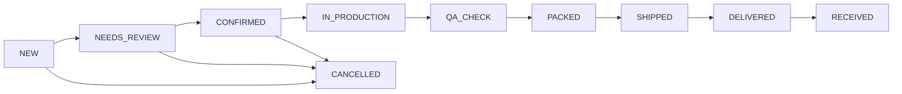

# 🎮 DTF Integration — Панель управления DTF в менеджменте

## Оглавление
1. [Контекст и цель](#1-контекст-и-цель)
2. [Анализ текущего DTF субдомена](#2-анализ-текущего-dtf-субдомена)
3. [Архитектура интеграции](#3-архитектура-интеграции)
4. [Функциональные блоки](#4-функциональные-блоки)
5. [Модели данных](#5-модели-данных)
6. [DTF Статистика (отдельная)](#6-dtf-статистика)
7. [План реализации](#7-план-реализации)

---

## 1. Контекст и цель

> [!IMPORTANT]
> **Идея пользователя (приоритет)**: DTF — это отдельная история от бренда одежды. DTF заявки, заказы, помощь с листом и прочее **НЕ входят** в статистику по клиентам, подключённым магазинам и оптовым звонкам. У DTF должен быть **отдельный блок** в менеджменте с **своей статистикой** в будущем.

**Цель**: Создать в `management.twocomms.shop` третью вкладку "DTF", которая дублирует и расширяет функционал DTF админки (`dtf.twocomms.shop/admin-panel/`) + добавляет управление DTF-заявками и заказами для менеджеров.

**Навигация** (верхний уровень):
```
[Бренд] | [DTF] | [Склад]
```

## 2. Анализ текущего DTF субдомена

### 2.1 Модели данных DTF (dtf/models.py — 723 строки, 14 моделей)

| Модель | Строки | Описание | Ключевые поля |
|--------|--------|----------|---------------|
| `DtfLead` | 51-112 | Заявки | lead_number, name, phone, contact_channel, task_description |
| `DtfLeadAttachment` | 115-125 | Файлы к заявкам | file, lead FK |
| `DtfOrder` | 177-340 | Заказы (ядро) | order_number, status(9), lifecycle_status(10), payment_status(6) |
| `DtfPricingConfig` | 343-375 | Конфигурация цен | tiers_json, base_price_per_meter, urgency_multipliers |
| `DtfUpload` | 378-403 | Загруженные файлы | sha256, mime_type, owner FK |
| `DtfPreflightReport` | 412-432 | Проверка макетов | result(pass/warn/fail), checks_json |
| `DtfQuote` | 435-465 | Расценки | length_m, unit_price, total, discount_total |
| `DtfStatusEvent` | 474-489 | История статусов | status_from → status_to, actor, messages |
| `DtfEventLog` | 492-507 | Лог событий | event_name, payload JSON, ip_hash |
| `KnowledgePost` | 515-559 | Блог/база знаний | title, slug, content_md/html, SEO |
| `DtfWork` | 568-582 | Галерея работ | image, category(macro/process/final) |
| `DtfSampleLead` | 598-660 | Заявки на семплы | sample_size(A4/A3/strip), niche, monthly_volume |
| `DtfBuilderSession` | 682-723 | Конструктор | product_type, placement, design_file, preflight_json |
| `PromoCode` | (storefront) | Промокоды | linked from views |

### 2.2 Жизненный цикл заказа DTF (10 статусов)



### 2.3 DTF Админка (текущая) — 5 вкладок

| Вкладка | Функционал | Данные |
|---------|------------|--------|
| Dashboard | Статистика | total_orders, active, awaiting_payment, shipped_today |
| Orders | Управление заказами | 80 последних, формы обновления |
| Blog | Управление блогом | CRUD постов, загрузка изображений |
| Users | Список пользователей | 60 последних по date_joined |
| Promocodes | Промокоды | CRUD, toggle, analytics |

### 2.4 Telegram уведомления DTF (6 типов)

1. `notify_new_lead()` — 🟡 новая заявка
2. `notify_new_order()` — 🟢 новый заказ
3. `notify_need_fix()` — 🟠 нужны правки
4. `notify_awaiting_payment()` — 🟣 ожидает оплату
5. `notify_paid()` — ✅ оплата подтверждена
6. `notify_shipped()` — 📦 отправлено

### 2.5 Типы заявок DTF

| Тип | Model | Источник |
|-----|-------|---------|
| Help Lead | `DtfLead(lead_type="help")` | Форма "Потрібна допомога" |
| Consultation | `DtfLead(lead_type="consultation")` | Форма "Консультація" |
| FAB Lead | `DtfLead(lead_type="fab")` | Плавающая кнопка |
| Sample Lead | `DtfSampleLead` | Страница семплов |
| Builder Submit | `DtfBuilderSession → DtfLead` | Конструктор |
| Order | `DtfOrder` | Страница заказа |

## 3. Архитектура интеграции

### 3.1 Принцип: Read + Manage, не дублирование

DTF блок в менеджменте **НЕ создаёт новый магазин DTF**. Он:
- **Читает** данные из DTF моделей (общая БД или API)
- **Управляет** заявками/заказами (менеджер принимает, отвечает, обновляет)
- **Собирает** свою отдельную статистику (вне brand KPD)

### 3.2 Shared Sessions

```python
# settings.py:707 — уже настроено:
# Shared session for trusted subdomains (dtf, management, main site)
SESSION_COOKIE_DOMAIN = '.twocomms.shop'
```

Авторизация **уже общая** — менеджер, залогиненный на management.twocomms.shop, имеет доступ к DTF моделям.

### 3.3 Права доступа (предложение)

```python
# Новая модель или расширение User:
class ManagerAccess(models.TextChoices):
    BRAND_ONLY = "brand", "Только бренд"
    DTF_ONLY = "dtf", "Только DTF"
    WAREHOUSE_ONLY = "warehouse", "Только склад"
    BRAND_DTF = "brand_dtf", "Бренд + DTF"
    ALL = "all", "Полный доступ"

# Или через groups/permissions Django:
# Group "Brand Managers" → management.view_client, management.add_client
# Group "DTF Managers" → dtf.view_dtforder, dtf.change_dtforder
# Group "Warehouse" → management.view_shop_inventory
```

## 4. Функциональные блоки DTF в менеджменте

### 4.1 Входящие заявки (Leads)

**Таблица** с фильтрацией:
| Колонка | Источник | Действие |
|---------|----------|----------|
| Номер | lead_number | Ссылка на детали |
| Тип | lead_type (help/consultation/fab) | Иконка |
| Клиент | name + phone | Клик → контакт |
| Канал связи | contact_channel | Telegram/WhatsApp/Instagram/Call |
| Описание | task_description (truncated) | Hover → полный текст |
| Дедлайн | deadline_note | Highlight если скоро |
| Статус | status (new/in_progress/closed) | Dropdown |
| Менеджер | manager_note | Editable |
| Дата | created_at | Sort |

**Действия менеджера**:
- Взять в работу (status → in_progress)
- Связаться (открыть Telegram/WhatsApp/call)
- Добавить заметку
- Создать заказ из заявки
- Закрыть заявку (с причиной)

### 4.2 Заказы (Orders)

**Kanban-board** по lifecycle_status:
```
[Нове] → [Перевірка] → [Підтверджено] → [У виробництві] → [QA] → [Упаковано] → [Відправлено] → [Доставлено] → [Отримано]
```

**Карточка заказа**:
- Номер, тип, сумма
- Клиент (имя, телефон, канал)
- Файл макета (превью)
- Статус оплаты (pending_review → awaiting → paid → partial → failed → refunded)
- ТТН и доставка
- Результат preflight (pass/warn/fail)
- Менеджерская заметка

### 4.3 Семплы

**Таблица** DtfSampleLead:
- Номер, клиент, размер семпла (A4/A3/strip)
- Ниша, объём, согласие
- Статус (new → contacted → shipped → closed)

### 4.4 Конструктор сессии

**Таблица** DtfBuilderSession:
- ID, тип продукта (tshirt/hoodie/tote/my_item), размещение
- Загруженный дизайн, preflight результат
- Статус (draft → submitted)

### 4.5 DTF Dashboard (отдельный от бренда)

Метрики:
- Заявок сегодня / за период
- Заказов: новых / в работе / отправленных / оплаченных
- Средний чек
- Среднее время обработки заявка → заказ
- Статистика по типам (help vs consultation vs fab)
- Топ каналы связи
- Конверсия заявка → заказ → оплата

## 5. Предложения по моделям

### 5.1 DtfManagerAssignment (новая)

```python
class DtfManagerAssignment(models.Model):
    """Привязка DTF заявки/заказа к конкретному менеджеру"""
    manager = models.ForeignKey(settings.AUTH_USER_MODEL, on_delete=models.CASCADE)
    lead = models.ForeignKey('dtf.DtfLead', null=True, blank=True, on_delete=models.CASCADE)
    order = models.ForeignKey('dtf.DtfOrder', null=True, blank=True, on_delete=models.CASCADE)
    sample = models.ForeignKey('dtf.DtfSampleLead', null=True, blank=True, on_delete=models.CASCADE)
    assigned_at = models.DateTimeField(auto_now_add=True)
    response_time_seconds = models.IntegerField(null=True, blank=True)  # Время до первого ответа
    note = models.TextField(blank=True)
```

### 5.2 DtfManagerStats (отдельная статистика)

```python
class DtfManagerDailyStats(models.Model):
    """Ежедневная статистика менеджера по DTF (отдельно от бренда)"""
    manager = models.ForeignKey(settings.AUTH_USER_MODEL, on_delete=models.CASCADE)
    date = models.DateField()
    leads_taken = models.IntegerField(default=0)
    leads_closed = models.IntegerField(default=0)
    orders_created = models.IntegerField(default=0)
    orders_confirmed = models.IntegerField(default=0)
    revenue_total = models.DecimalField(max_digits=12, decimal_places=2, default=0)
    avg_response_time = models.IntegerField(null=True, blank=True)  # секунды
    samples_processed = models.IntegerField(default=0)
```

## 6. DTF Статистика (отдельная от бренда)

> [!IMPORTANT]
> DTF статистика **полностью изолирована** от brand KPD/ELO. Она может иметь свой набор KPI в будущем, но изначально — это dashboard + таблицы.

### 6.1 Начальные KPI DTF

| KPI | Формула | Вес |
|-----|---------|-----|
| Время реакции | AVG(assignment.response_time_seconds) | Важно |
| Конверсия Lead→Order | orders_created / leads_taken | Важно |
| Средний чек | SUM(revenue) / COUNT(orders_confirmed) | Средне |
| Закрытые заявки/день | leads_closed / workdays | Средне |
| Оценка клиента (будущее) | Feedback score | Высоко |

### 6.2 DTF Heatmap (аналогично бренду)

DTF тоже получит свою heatmap-полосу (как на скрине пользователя), но с DTF-специфичными метриками:
- Серый = нет DTF активности
- Красный → Зелёный = от 0% до 100% DTF KPI за день

## 7. План реализации

```
Фаза 1: Read-only зеркало (1 неделя)
  - Вкладка "DTF" в навигации management
  - Таблица входящих заявок (DtfLead, DtfSampleLead)
  - Таблица заказов (DtfOrder) с фильтрацией по lifecycle_status
  - Dashboard со статистикой (total/active/awaiting/shipped)

Фаза 2: Управление (2 недели)
  - "Взять в работу" (DtfManagerAssignment)
  - Обновление статусов заказов из management
  - Заметки менеджера
  - Создание заказа из заявки
  - Telegram уведомления для DTF менеджеров

Фаза 3: DTF Статистика (1 неделя)
  - DtfManagerDailyStats модель
  - Dashboard с DTF KPI
  - DTF heatmap (отдельная от бренда)

Фаза 4: Конструктор/Семплы (1 неделя)
  - Управление builder sessions
  - Управление sample leads
  - Файлы заказов (превью, скачивание)
```

> [!TIP]
> **Ключевое**: DTF интеграция — это **мост**, а не копия. Данные живут в DTF models, management лишь предоставляет **единое рабочее место** для менеджера.
