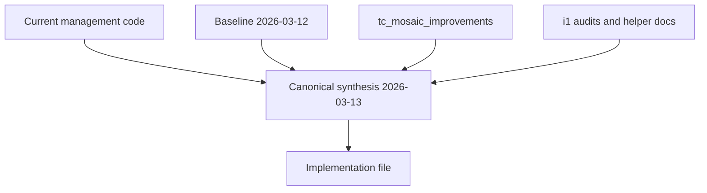

# System Architecture And Invariants

## Authority Stack

Interpretation:
- current code defines what already exists;
- this package defines what must be preserved, extended, or added;
- older report layers are inputs, not the final spec.

## Architecture Layers

| Layer | Final rule |
|---|---|
| `ACTIVE` | production-relevant and implementation-safe |
| `SHADOW` | computed and explainable, but not payroll-final |
| `DORMANT` | explicit non-activation, zero punitive effect |
| `ADMIN-ONLY` | usable for supervision and decisions, not manager punishment by default |

## System Components

### Existing anchors
- `management/models.py`
- `management/stats_service.py`
- `management/stats_views.py`
- `management/views.py`
- `management/lead_views.py`
- `management/templates/management/stats.html`
- `management/templates/management/admin.html`
- `management/management/commands/notify_test_shops.py`

### Cross-app anchors
- `orders.WholesaleInvoice`
- `storefront.Product`
- user profile Telegram fields
- `dtf` only as optional read-only bridge later

## KPD -> MOSAIC Coexistence

### Required transition principle

KPD is not deleted first. Canonical transition:
1. keep KPD as current production baseline;
2. compute shadow MOSAIC next to it;
3. store divergence and confidence in snapshots;
4. only then decide activation of individual components.

### What KPD already contains and MOSAIC must account for

| KPD area | Existing reality | MOSAIC implication |
|---|---|---|
| Effort | active tab time + points | must not accidentally disappear without explicit transition note |
| Quality | success-weighted call outcomes | replaced by `Result/EWR`, but divergence must be explained |
| Ops | CP emails + shops + invoices | must be rehomed into Process / communication / portfolio logic |
| Penalty | missed follow-ups + report discipline | rehomed into FollowUp and DataQuality |

## Versioning Contract

Every snapshot, admin decision payload and score-sensitive rendering must know:
- `formula_version`
- `defaults_version`
- `snapshot_schema_version`
- `payload_version`
- `readiness_state`
- freshness or age information

Without these fields:
- historical comparisons are semantically dirty;
- stale data looks current;
- shadow and active calculations become visually indistinguishable.

## Execution Stack

| Domain | Canonical choice |
|---|---|
| background work | Django management commands + cron |
| async approximation | DB + cache + idempotent commands |
| caching | existing short-lived cache, hardened by stale policy |
| queues | command logs and DB tables, not Celery/Redis baseline |
| duplicate matching | Python normalization + filtered candidate scoring, not `pg_trgm` assumption |

## Shared Invariants

1. current `management` remains the base app;
2. `views.py` and `stats_service.py` must be decomposed by feature growth, not endlessly extended;
3. snapshots are the source for heavy analytics, not per-request recomputation of expensive formulas;
4. admin-only metrics never silently leak into manager payroll truth;
5. tiny-team benchmarking stays conservative;
6. telemetry/telephony failures must map to operational incident semantics, not manager blame;
7. every ownership change must be reviewable;
8. reference docs must carry explicit `reference-only` semantics in implementation thinking.

## Working-Day Semantics

Daily and weekly logic must use working-context interpretation:
- weekends and excused days do not degrade daily judgement;
- weekly targets must use working-factor and later `capacity_factor`;
- rolling score windows must be based on working observations, not blind calendar decay.

## Change-Safe Rules

### Any formula change must produce
- changelog entry;
- version bump;
- validation reset window if score semantics changed materially;
- admin-visible explanation;
- manager-visible no-surprise note when surface meaning changed.

### Any rollout change must support
- explicit state switch;
- rollback path;
- stale-data handling;
- acceptance condition.

## Prohibited Implementations

- reading weights from old report docs in runtime code;
- treating shadow score as payroll-final;
- creating duplicate models for workflows already present in `management`;
- auto-penalizing from low-sample heuristics;
- using telephony/QA in money logic before maturity;
- comparing snapshots across versions without explicit compatibility handling.
