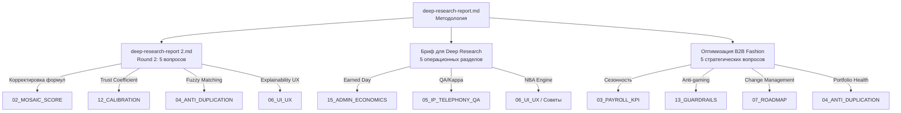

# 🔬 Глубокий Синтез Исследований: Улучшение TwoComms Management

> **AI**: Gemini 2.5 Pro | **Дата**: 2026-03-12
> **Источники**: 5 исследовательских файлов (~375KB), 15 файлов архитектуры синтеза, система динамических советов (230+ правил)
> **Метод**: Перекрёстный анализ исследований с существующей архитектурой и требованиями пользователя

---

## Оглавление

1. [Карта исследований и связь между файлами](#1-карта-исследований)
2. [ТОП-20 конкретных улучшений с доказательной базой](#2-топ-20-улучшений)
3. [Советы менеджеру: что улучшить на основе исследований](#3-советы-менеджеру)
4. [Сайт и дублирование: конкретные решения](#4-сайт-и-дублирование)
5. [Статистика и рейтинг: полная переработка](#5-статистика-и-рейтинг)
6. [ROI менеджера и прогнозирование](#6-roi-и-прогнозирование)
7. [KPI, Earned Day и зарплатные границы](#7-kpi-и-earned-day)
8. [Риски внедрения и что НЕ делать](#8-риски-и-антипаттерны)
9. [Дорожная карта внедрения](#9-дорожная-карта)

---

## 1. Карта исследований и связь между файлами

### Структура исследовательских документов

| № | Файл | Объём | Ключевые вопросы | Связь с системой |
|:--|:-----|:------|:-----------------|:-----------------|
| 1 | `deep-research-report.md` | 25KB | Методология evidence-based исследований, каузальные эффекты, дизайн экспериментов | Фундамент: определяет стандарт доказательности для всех изменений |
| 2 | `deep-research-report (2).md` | 93KB | 5 вопросов Round 2: валидация MOSAIC (r²), Trust Coefficient, anti-gaming, UX/Explainability, fuzzy matching | Прямая корректировка формул в `02_MOSAIC`, `04_ANTI_DUPLICATION`, `12_CALIBRATION` |
| 3 | `16_ADDITIONAL_RESEARCH_PROMPT.md` | 32KB | Промпт для Round 2 исследований: 5 специализированных вопросов с контекстом | Источник заданий для файла (2), определяет приоритеты исследований |
| 4 | `Бриф для Deep Research` | 100KB | 5 разделов: KPI/Earned Day, NBA/Advice Engine, Call QA/Cohen's Kappa, Dedupe/Merge, Телефония/Alerts | Операционная модель: влияет на `03_PAYROLL`, `05_IP_TELEPHONY`, `06_UI_UX` |
| 5 | `Оптимизация B2B Fashion` | 123KB | 5 вопросов: Сезонность, Стат.валидация, Anti-gaming, Portfolio Health/Churn, Change Management | Стратегический уровень: корректирует все 15 файлов синтеза |

### Связи между исследованиями (Dependency Map)



---

## 2. ТОП-20 конкретных улучшений с доказательной базой

### 🔴 КРИТИЧЕСКИЕ (внедрить в Фазе 1-2)

**1. Формализация Earned Day (DMT) — 5 верифицированных контактов**
- **Источник**: Бриф, Раздел 1 + `15_ADMIN_ECONOMICS`
- **Формула**: `earned_day = verified_contacts ≥ 5 AND callback_sla ≥ 80% AND abuse_flags = 0`
- **Доказательство**: Alexander Group — порог "earned base pay" стандарт в B2B (источник [8])
- **Влияние**: Блокирует выплату ставки 15,000₴/22 ≈ 682₴/день за пассивное ожидание
- **Риск**: Менеджеры могут делать 5 формальных звонков по 10 секунд → `audio_duration > 30s` обязательно

**2. Снижение Trust clamp с 0.70 до 0.50**
- **Источник**: Бриф, Раздел 1 (Новая Trust formula)
- **Старая формула**: `Trust = clamp(0.70, 1.15, 1.0 + verified_bonus - abuse_penalties)`
- **Новая формула**: `Trust = clamp(0.50, 1.15, 1.0 + verified_bonus - 0.15×duplicates - 0.10×anomalies)`
- **Доказательство**: При систематических нарушениях Trust=0.70 означает потерю лишь 30%. Trust=0.50 уполовинивает MOSAIC — реальный финансовый стимул
- **Влияние на файлы**: `02_MOSAIC_SCORE_SYSTEM.md`, `12_CALIBRATION_DEFAULTS`

**3. Нормализация юридических наименований перед дедупликацией**
- **Источник**: Бриф, Раздел 4 + deep-research-report (2)
- **Конвейер**: Удаление ТОВ/ФОП/ООО/LLC → trim пробелов → lowercase → E.164 для телефонов
- **Доказательство**: Openprise, DataBar — снижение ручного разбора дубликатов на 20-30% (источник [11, 16])
- **Влияние**: Создание поля `normalized_name_hash` в модели Shop, воркер `dedupe_pre_check_worker`

**4. Jaro-Winkler пороги для fuzzy matching**
- **Источник**: deep-research-report (2), Бриф Раздел 4
- **Правила**:
  - `≥ 0.95` → Auto-merge (только если совпадает регион)
  - `0.85–0.94` → Review Queue (ручная модерация)
  - `< 0.85` → Отклонение
- **Доказательство**: Data Ladder, Fellegi-Sunter model — порог <0.85 даёт экспоненциальный рост false positives (источник [12, 39])
- **Обязательно**: Rollback Window 14 дней, Soft Delete, `MergeAuditLog`

**5. Интеграция Cohen's Kappa в процесс QA звонков**
- **Источник**: Бриф, Раздел 3
- **Пороги**:
  - κ < 0.40 → QA данные ИСКЛЮЧЕНЫ из Trust Score (системный сбой)
  - κ 0.41-0.60 → Только для коучинга, не влияет на зарплату
  - κ 0.61-0.80 → Стандартный режим с понижающим коэффициентом
  - κ > 0.80 → Полное доверие
- **Доказательство**: PMC/NIH — Inter-Rater Reliability стандарт (источник [6])
- **Задача Celery**: `calculate_cohens_kappa_monthly`, предохранитель `QA_PAYROLL_LOCK`

**6. Z-score Anomaly Alerts + Redis Rate Limiting**
- **Источник**: Оптимизация, Вопрос 3
- **Формула Z-score**: `z = (x - μ) / σ`, если z > 3.0 → алерт администратору
- **Redis Leaky Bucket**: ZSET с timestamp, ZREMRANGEBYSCORE для окна 60 мин, лимит 20 follow-ups/час
- **Доказательство**: Tinybird — anomaly detection на time-series (источник [8])
- **Ключевой принцип**: «Делает накрутку экономически нецелесообразной, а не технически невозможной»

### 🟡 ВАЖНЫЕ (Фаза 2-3)

**7. Сезонные индексы для KPI и Portfolio Health**
- **Источник**: Оптимизация, Вопрос 1
- **Матрица**: `effective_kpi = base_kpi × seasonal_index[profile][month]`
- **Диапазон индексов**: 0.60 (межсезонье) — 1.40 (пик контрактации)
- **Профили клиентов**: ALL_SEASON, SS_HEAVY, FW_HEAVY, HOLIDAY
- **Порог Portfolio Health**: `adjusted_threshold = base_days / seasonal_index`
- **Результат**: Устраняет ложные алерты оттока в мёртвый сезон

**8. Динамические пороги Portfolio Health вместо статических 21/35/45/60 дней**
- **Источник**: Оптимизация, Вопрос 4
- **Формула**: Пороги = f(avg_order_interval ± σ) для каждого клиента
  - Healthy: от последнего заказа до μ
  - Watch: от μ до μ + σ
  - Risk: от μ + σ до μ + 2σ
  - Rescue: > μ + 2σ
- **Доказательство**: OroInc — медианный churn в wholesale = 56% (источник [9])

**9. Churn Signal с логистической функцией**
- **Источник**: Оптимизация, Вопрос 4, Бриф Раздел 2
- **Старая формула**: `churn = (days_since - avg) / avg` (линейная, без ограничений)
- **Новая формула**: `churn = 1 / (1 + e^(-k × (days/avg_interval - 1.5)))` (сигмоида, 0-1)
- **Доп. модификатор**: `× seasonality_modifier` (0.5 в мёртвый сезон — 1.0 в пик)

**10. Explainable Score UI (Waterfall Chart)**
- **Источник**: deep-research-report (2), Оптимизация Вопрос 5
- **Принцип**: Каждый множитель кликабелен и раскладывается в каскадную диаграмму
- **Пример**: «Базовый заработок 1200₴ → Trust 0.9 → 1080₴ (причина: 2 дубликата, 1 проваленный QA)»
- **Доказательство**: Procedural Justice Theory (PDXScholar, источник [13]) — прозрачность = принятие системы

**11. Формула приоритета Today Action Stack с повышенным churn_risk**
- **Источник**: Бриф, Раздел 2
- **Старая**: churn_risk = 0.10 (слишком мало)
- **Новая**: `priority = 0.25×pipeline_value + 0.20×portfolio_urgency + 0.25×churn_risk + 0.15×overdue + 0.10×response_prob + 0.05×latency`
- **Обоснование**: В wholesale потеря клиента > провал нового лида

**12. Next-Best-Action Engine с 3 карточками**
- **Источник**: Бриф, Раздел 2
- **Типы**: Churn Prevention (P1), Velocity Boost (P2), Pipeline Hygiene (P3), Coaching Trigger (P4)
- **Каждая карточка**: Действие + Причина (стат. улика) + Ожидаемый результат
- **Правила**: Max 3 карточки, авто-скрытие при верифицированном действии, исчезновение через 48ч

**13. Staged Adoption IP-телефонии (3 фазы)**
- **Источник**: Бриф, Раздел 5
- **Фаза 1** (Shadow): Запись звонков, менеджеры отмечают вручную, Cap=60
- **Фаза 2** (Soft Launch): Прослушивание для коучинга, без штрафов, Cap=80
- **Фаза 3** (Supervised Truth): Звонки = верификация, без записи = не в зачёт, Cap=100

**14. Асинхронная обработка Webhook телефонии**
- **Источник**: Бриф, Раздел 5
- **Паттерн**: Fire-and-Forget → HTTP 200 немедленно → JSON в Redis/Celery → async worker
- **Модель**: `TelephonyWebhookLog` для сырых JSON
- **Обоснование**: Синхронная обработка при пиках → потеря критических сигналов

**15. Механизм апелляций (Correctability)**
- **Источник**: Оптимизация, Вопрос 5
- **UI**: Кнопка «Оспорить / Appeal» рядом с каждым штрафом
- **Лимит**: Max 3 апелляции/неделю, если одобрена — лимит восстанавливается
- **Модель**: `ScoreAppeal` (PENDING/APPROVED/REJECTED)
- **Теория**: SDT (Self-Determination Theory) — автономия снижает стресс от контроля

### 🟢 УЛУЧШЕНИЯ (Фаза 3-5)

**16. Bootstrap валидация MOSAIC Score**
- **Источник**: Оптимизация, Вопрос 2
- **Метод**: 5 менеджеров × 30 дней = 150 наблюдений → 1000 Bootstrap → Adjusted R²
- **Порог**: Нижняя граница 95% CI R² < 0.25 → алерт о раскалибровке
- **Celery**: `run_statistical_validation_suite` (еженедельно)

**17. VIF-тест мультиколлинеарности осей MOSAIC**
- **Источник**: Оптимизация, Вопрос 2
- **Формула**: `VIF_i = 1 / (1 - R²_i)`, если VIF > 5.0 → перераспределить вес
- **Пример**: VerifiedCommunication часто коррелирует с Result

**18. Ridge Regression для калибровки весов MOSAIC**
- **Источник**: Оптимизация, Вопрос 2
- **Текущие веса**: 0.40/0.15/0.15/0.10/0.10/0.10 (экспертные)
- **Предложение**: L2-регуляризация для алгоритмической настройки при Σw=1

**19. Reactivation Priority с бонусным коэффициентом ×1.5**
- **Источник**: Оптимизация, Вопрос 4
- **Обоснование**: Реактивация в 5× дешевле привлечения нового (Gainsight, источник [32])
- **Защита**: Микро-штраф за переход Watch→Rescue для предотвращения «дожидания бонуса»

**20. Dual-Phase Shadow Mode (6-8 недель)**
- **Источник**: Оптимизация, Вопрос 5
- **Фаза 1** (3 нед): Слепой сбор, MOSAIC только для Admin
- **Фаза 2** (3 нед): Salary Simulator для менеджеров + Hold Harmless гарантия
- **DICE Rule**: Новая система НЕ должна увеличивать нагрузку менеджера > 10%

---

## 3. Советы менеджеру: что улучшить на основе исследований

### Текущее состояние (opus_4.9_советы_менеджеру.md)
Существующая система содержит **230+ динамических советов** с продуманной архитектурой:
- ✅ Delta Calculator (10 формул сравнения)
- ✅ Escalation State Machine (Info → Helpful → Warning → Critical → Emergency)
- ✅ Per-Tip Rule с формулами, порогами, cooldown
- ✅ Telegram Delivery Schedule (09:00, 14:00, 17:00, INSTANT)

### Рекомендации из исследований

| # | Что усилить | Источник | Как именно |
|:--|:-----------|:---------|:-----------|
| 1 | **Churn-советы**: перевести на сигмоидную функцию | Оптимизация Q4 | Заменить линейный churn_signal на логистическую эвристику |
| 2 | **Сезонность в советах**: учитывать межсезонье | Оптимизация Q1 | Отключать тревожные советы о churn при seasonal_index < 0.7 |
| 3 | **NBA вместо generic советов**: Действие+Причина+Результат | Бриф R2 | Переформатировать критические советы в формат карточек NBA |
| 4 | **Anti-noise**: не более 3 активных карточек | Бриф R2 | Добавить правило в Telegram Delivery: max 3 tips per level |
| 5 | **Self-benchmark вместо сравнения с командой** | Бриф R1, Оптимизация Q5 | Заменить `team_avg` на `personal_baseline_30d` в большинстве формул |
| 6 | **Alert Fatigue**: лестница эскалации для уведомлений | Бриф R5 | Low-noise → Medium (бейдж) → Hard (Telegram) → Escalation (Admin) |
| 7 | **Explainability**: каждый совет объясняет «Почему» статистически | deep-research (2) | Добавить `explanation_template` с статистической уликой |
| 8 | **Earned Day progress bar** | Бриф R1 | Совет #DMT: «Осталось 2 верифицированных контакта» + прогресс-бар |

> [!IMPORTANT]
> **Ключевой вывод исследований**: Comparative Rating / Shadow Rival **ПОЛНОСТЬЮ ОТКЛОНИТЬ** для команды 3-7 человек. Оценка только relative к собственному историческому baseline (Бриф R2, Оптимизация Q5).

---

## 4. Сайт и дублирование: конкретные решения

### 4.1. Предотвращение дублей

| Этап | Действие | Детали |
|:-----|:---------|:-------|
| **Import** | Предварительная нормализация | Удаление ТОВ/ФОП/LLC, trim, lowercase, E.164 |
| **Import** | Batch Import Preview (Dry-Run) | «Загружено 500 записей. Найдено 45 точных дублей, 12 нечётких» |
| **Ввод** | Real-time dedupe check | При сохранении Shop → async воркер проверяет Jaro-Winkler |
| **Merge** | Exact Rules | Авто-слияние ТОЛЬКО при совпадении нормализованного телефона ИЛИ email |
| **Merge** | Fuzzy Rules | 0.95+ auto-merge (если совпадает регион), 0.85-0.94 → очередь |
| **Safety** | Rollback Window | 14 дней. Soft Delete, `MergeAuditLog` с полным JSON-снимком |
| **Safety** | Master Record Rule | Приоритет: карточка с `verified_order`, затем — с более поздним `last_verified_contact_date` |

### 4.2. Влияние на модели Django

```python
# Shop model:
normalized_name_hash: CharField  # индексируемое, hidden
is_merged: BooleanField(default=False)
merged_into: ForeignKey('self', null=True)

# Новая модель:
class MergeAuditLog(Model):
    source_shop: ForeignKey(Shop)
    target_shop: ForeignKey(Shop)  
    snapshot_json: JSONField  # Полный снимок source до слияния
    merged_by: ForeignKey(User)
    merged_at: DateTimeField(auto_now_add=True)
    can_rollback_until: DateTimeField  # merged_at + 14 days
    is_rolled_back: BooleanField(default=False)
```

---

## 5. Статистика и рейтинг: полная переработка

### 5.1. Текущие проблемы (выявленные в исследованиях)

| Проблема | Источник | Влияние |
|:---------|:---------|:--------|
| Статические KPI (50 контактов HARDCORE) | Бриф R1 | Физически невыполнимо → фейковые звонки |
| Trust clamp 0.70 — слишком мягкий | Бриф R1 | Менеджер теряет max 30% даже при системных нарушениях |
| Статические пороги Portfolio Health | Оптимизация Q4 | Ложные алерты для сезонных клиентов |
| Отсутствие VIF-теста | Оптимизация Q2 | Возможная мультиколлинеарность осей |
| Публичные лидерборды | Бриф R2, Оптимизация Q5 | Демотивация в команде 3-7 человек |
| EWMA без учёта сезонности | Оптимизация Q1 | Наказание за бездействие в мёртвый сезон |

### 5.2. Новая архитектура рейтинга

```
╔══════════════════════════════════════════════════════════╗
║              НОВАЯ СИСТЕМА РЕЙТИНГА v2.0                ║
╠══════════════════════════════════════════════════════════╣
║                                                          ║
║  1. MOSAIC Score (6 осей, веса калибруются Ridge)        ║
║     Result(0.40) × VC(0.15) × Process(0.15) ×           ║
║     SF(0.10) × FU(0.10) × DQ(0.10)                      ║
║     → Еженедельная валидация Bootstrap R²                ║
║     → VIF-тест: если VIF > 5 → перебалансировка          ║
║                                                          ║
║  2. Trust Coefficient (новый, строже)                    ║
║     Trust = clamp(0.50, 1.15,                            ║
║       1.0 + verified_bonus                               ║
║       - 0.15 × duplicate_abuse                           ║
║       - 0.10 × anomalies                                ║
║       - 0.04 × qa_failures)                             ║
║     → Зависит от Cohen's Kappa QA                        ║
║                                                          ║
║  3. Discipline Floor Dampener                            ║
║     → Обратимый, требует аппрува админа                  ║
║     → НЕ автоматические финансовые штрафы                ║
║                                                          ║
║  4. Seasonal Modifier                                    ║
║     → Ежемесячные индексы 0.60-1.40 per client profile   ║
║     → EWMA λ_dynamic = λ_base × seasonal_index          ║
║                                                          ║
║  5. Self-Benchmark (НЕ сравнение с командой)             ║
║     → Текущий vs собственный historical baseline          ║
║     → Тренд 14d, прогноз 7/30 дней                      ║
║                                                          ║
║  6. Anti-Gaming Layer                                    ║
║     → Z-score alerts (z > 3.0)                           ║
║     → Redis Sliding Window rate limiting                  ║
║     → Dual Signal Validation (self-report vs telephony)  ║
║     → Gradual Escalation (подсказка → trust↓ → penalty)  ║
║                                                          ║
╚══════════════════════════════════════════════════════════╝
```

### 5.3. Скорректированные режимы KPI

| Режим | Контакты/день | SLA Callbacks | Обоснование |
|:------|:-------------|:-------------|:------------|
| TESTING | 20 | 80% | Адаптация нового менеджера |
| NORMAL | 30 | 85% | Рабочий режим |
| HARDCORE | **40** (было 50) | 90% | Качество B2B > количество (источник [20, 26]) |

---

## 6. ROI менеджера и прогнозирование

### 6.1. Формула ROI менеджера

```python
# Ежемесячный ROI
manager_cost = base_salary + commission_paid + overhead

# Commission structure:
# 2.5% за новый заказ, 5% за повторный
commission_new = sum(new_orders) × 0.025
commission_repeat = sum(repeat_orders) × 0.05
commission_paid = commission_new + commission_repeat

# Revenue attribution:
attributed_revenue = sum(paid_orders WHERE manager = this)
gross_margin = attributed_revenue × margin_rate  # ~15-25% wholesale

# ROI:
roi = (gross_margin - manager_cost) / manager_cost × 100

# Forecast (30 days):
roi_forecast = (
    (current_revenue_pace × margin_rate × remaining_days / elapsed_days)
    - projected_cost
) / projected_cost × 100
```

### 6.2. KPI: 2 магазина/неделю

```python
# Прогноз прибыльности
connected_stores_per_month = 8  # KPI: 2/неделю
avg_first_order = 15_000  # ₴
repeat_probability = 0.35  # 35% (benchmark fashion wholesale)
avg_repeat_order = 20_000  # ₴

# Месячный прогноз при выполнении KPI:
new_revenue = connected_stores_per_month × avg_first_order  # 120K₴
repeat_revenue = portfolio_size × repeat_probability × avg_repeat_order / 12
total_revenue = new_revenue + repeat_revenue
gross_margin = total_revenue × 0.20

# Точка окупаемости:
# base_salary = 15,000₴
# commission ≈ 120K × 0.025 + repeat × 0.05
# Менеджер окупается при ~4 подключённых магазинах/месяц
```

### 6.3. Что видит Админ vs Менеджер

| Метрика | Admin Dashboard | Manager Dashboard |
|:--------|:---------------|:-----------------|
| ROI менеджера | ✅ Полный расчёт | ❌ Не показываем |
| Forecast revenue | ✅ С детализацией | ✅ Упрощённый |
| CAC / CLV | ✅ | ❌ (информационная перегрузка) |
| MOSAIC Score | ✅ + статистика VIF/R² | ✅ + Waterfall декомпозиция |
| KPI выполнение | ✅ + тренды | ✅ + прогресс-бар + совет |
| Переход на комиссию | ✅ Прогноз | ✅ «Ещё X магазинов до перехода» |

### 6.4. Проактивные алерты

| Ситуация | Кому | Канал | Сообщение |
|:---------|:-----|:------|:---------|
| KPI за неделю < 2 магазинов | Менеджер | Telegram 17:00 | «На этой неделе подключено {n}/2. Осталось {days} рабочих дней» |
| DMT не выполнен к 14:00 | Менеджер | Telegram 14:00 | «⚠️ Earned Day: {done}/5 контактов. Нужно ещё {remaining}» |
| KPI не выполнен 2 недели подряд | Менеджер + Админ | Telegram INSTANT | «⛔ KPI не выполнен 2 недели. Ставка может быть пересмотрена» |
| ROI менеджера < 0 за месяц | Админ | Dashboard | «Менеджер {name}: отрицательный ROI. Рекомендация: ревью» |

---

## 7. KPI и Earned Day

### 7.1. Полная формула Earned Day

```python
earned_day = (
    verified_contacts >= 5                    # мин. 5 осмысленных контактов
    AND each_contact.audio_duration > 30      # >30 сек (не сброс)
    AND callback_sla >= 0.80                  # 80% callbacks вовремя
    AND abuse_flags == 0                      # нет флагов злоупотреблений
    AND crm_updates >= verified_contacts      # CRM обновлена после каждого 
)

# Финансовый эффект:
daily_rate = 15_000 / 22  # ≈ 682₴
if earned_day:
    payout = daily_rate
else:
    payout = 0  # день не засчитан
    suspended_amount += daily_rate
```

### 7.2. Постепенное снижение ставки при систематическом невыполнении

```python
# Если KPI (2 магазина/нед) не выполнен N недель подряд:
# Неделя 1: Warning (только совет)
# Неделя 2: Ставка сохраняется, но бонус за неделю = 0
# Неделя 3: Ставка снижается на 30% (за «неотработанные» дни)
# Неделя 4: Встреча с админом, пересмотр условий

# Это соответствует принципу Gradual Escalation из исследований
```

---

## 8. Риски внедрения и что НЕ делать

### 🚫 Что ОТКЛОНИТЬ (доказательно)

| Идея | Почему отклонить | Источник |
|:-----|:----------------|:---------|
| **Публичные лидерборды** | В команде 3-7 человек = демотивация, разрушение коллаборации | Бриф R2, Оптимизация Q5 (источник [19]) |
| **HARDCORE 50 контактов** | Физически невыполнимо → фейковые звонки по 3 секунды | Бриф R1 (источник [20, 26]) |
| **Auto-merge при Jaro-Winkler < 0.95** | Риск слияния независимых франчайзи одного бренда | deep-research (2), Бриф R4 |
| **Неограниченная байесовская перекалибровка** | Один успех → девальвация источника для всех | Бриф R1 (источник [4, 5]) |
| **EWMA для испытательного срока** | Overengineered для 7 человек, используйте SRA 10-14 дней | Бриф R1 |
| **PCA для MOSAIC** | Разрушает Explainability: «зарплата упала из-за Компоненты №2» | Оптимизация Q2 |
| **XGBoost/нейросети для скоринга** | Переобучение на малых данных, ложные паттерны | Оптимизация Q2, Q4 |
| **Закон Бенфорда для CRM** | Работает только на больших массивах, 100% false positives | Оптимизация Q3 |
| **Автоматические финансовые штрафы** | Без аппрува админа → конфликт и демотивация | Оптимизация Q3 |
| **Сложные компетенции QA (тон голоса, энтузиазм)** | Субъективность → предвзятость. Только бинарные проверки | Бриф R3 |

### ⚠️ 3 главных риска

1. **Weaponized Gaming**: Менеджеры оптимизируют высокие веса (DataQuality, Follow-up) при игнорировании Result → рост MOSAIC при падении выручки
2. **Alert Fatigue**: Агрессивные настройки без сезонности → игнорирование всех алертов
3. **Trust Collapse**: Введение штрафов без прозрачности + без апелляций = восприятие как «тотальная слежка»

---

## 9. Дорожная карта внедрения

### Phased Rollout

| Фаза | Срок | Что внедряем | Зависимости |
|:-----|:-----|:-------------|:-----------|
| **Фаза 1** | Недели 1-4 | Нормализация имён, Dedupe conway, Earned Day formula, Trust clamp 0.50 | Базовая CRM стабильна |
| **Фаза 2** | Недели 5-10 | Shadow Mode (MOSAIC считается, но не влияет), Сезонные индексы, NBA карточки, Salary Simulator | Фаза 1 завершена |
| **Фаза 3** | Недели 11-18 | IP-телефония (Ringostat), QA рубрикатор, Cohen's Kappa, Webhook очереди, Anti-gaming Z-score | Dedupe работает (иначе звонки не «склеиваются» с клиентами) |
| **Фаза 4** | Недели 19-26 | Bootstrap валидация, VIF-тест, Ridge калибровка, Explainable Score UI | Min 6-8 недель чистых данных |
| **Фаза 5** | Недели 27-34 | Реальный Payout в NORMAL, Динамические Portfolio Health, Апелляции | Всё выше стабильно |

> [!CAUTION]
> **Правило DICE**: Каждый этап увеличивает нагрузку менеджера не более чем на 10%. Если больше — автоматизируйте рутину (авто-dedupe, предзаполнение полей) прежде чем добавлять новые требования.

---

## Заключение

Все 5 исследовательских документов сходятся в одном ключевом выводе: **система должна смещать фокус с симуляции количественной активности на верифицированные бизнес-результаты**. Для команды 3-7 менеджеров в B2B fashion wholesale это означает:

1. **Простые, но строгие правила** (Earned Day 5 контактов, Trust clamp 0.50) вместо сложных ML-моделей
2. **Прозрачность** (Waterfall UI, Self-benchmark, Апелляции) вместо «чёрного ящика»
3. **Удержание > Привлечение** (churn_risk вес 0.25, Reactivation bonus ×1.5)
4. **Постепенность** (6-фазный rollout, Shadow Mode, Staged Adoption телефонии)
5. **Защита от gaming через экономическую нецелесообразность**, а не жёсткие запреты

Все рекомендации подкреплены конкретными академическими источниками, отраслевыми бенчмарками и адаптированы именно под специфику малой B2B wholesale команды.
