# Gemini 2.5 Pro — Диаграммы архитектуры внедрения

> **Модель**: Gemini 2.5 Pro (Antigravity)
> **Дата**: 2026-03-13
> **Назначение**: Визуальная карта внедрения для финального кодекса → имплементационного файла

---

## 1. Общая архитектура системы: Текущее состояние → Целевое

```mermaid
graph TB
    subgraph CURRENT["🟢 ТЕКУЩАЯ СИСТЕМА (production)"]
        direction TB
        C_MODELS["models.py<br/>22 модели • 1160 строк"]
        C_STATS["stats_service.py<br/>KPD + Advice • 1259 строк"]
        C_VIEWS["views.py<br/>5912 строк"]
        C_SHOP["shop_views.py<br/>946 строк"]
        C_STATSV["stats_views.py<br/>222 строки"]
        C_LEAD["lead_views.py<br/>234 строки"]
        C_PARSE["parsing_views.py<br/>381 строка"]
        C_CONST["constants.py<br/>POINTS table • 24 строки"]
        C_ADMIN["admin.py<br/>6 моделей • 78 строк"]
        C_CMD["commands/<br/>notify_test_shops.py"]
        C_TPLS["templates/<br/>17 HTML файлов"]
        C_URLS["urls.py<br/>75 URL patterns"]
    end

    subgraph TARGET["🔵 ЦЕЛЕВАЯ СИСТЕМА (после внедрения)"]
        direction TB
        T_SCORE["services/score_service.py<br/>EWR + MOSAIC"]
        T_TRUST["services/trust_service.py<br/>Trust production/diagnostic"]
        T_CHURN["services/churn_service.py<br/>Weibull + portfolio"]
        T_DEDUP["services/dedupe_service.py<br/>Normalization + matching"]
        T_PAY["services/payroll_service.py<br/>Commission + soft-floor + SPIFF"]
        T_SNAP["services/snapshot_service.py<br/>Nightly orchestration"]
        T_FORE["services/forecast_service.py<br/>Pipeline + economics"]
        T_ADV["services/advice_service.py<br/>Enhanced tips"]
        T_MODELS["models.py EXTENDED<br/>+6 новых моделей"]
        T_CMDS["commands/<br/>+4 новые команды"]
        T_TPLS2["templates/<br/>+8 новых компонентов"]
    end

    CURRENT -->|"Phase 0-4<br/>Постепенная<br/>трансформация"| TARGET

    style CURRENT fill:#1a1a2e,stroke:#16213e,color:#e94560
    style TARGET fill:#0f3460,stroke:#533483,color:#e94560
```

---

## 2. Фазовая модель внедрения

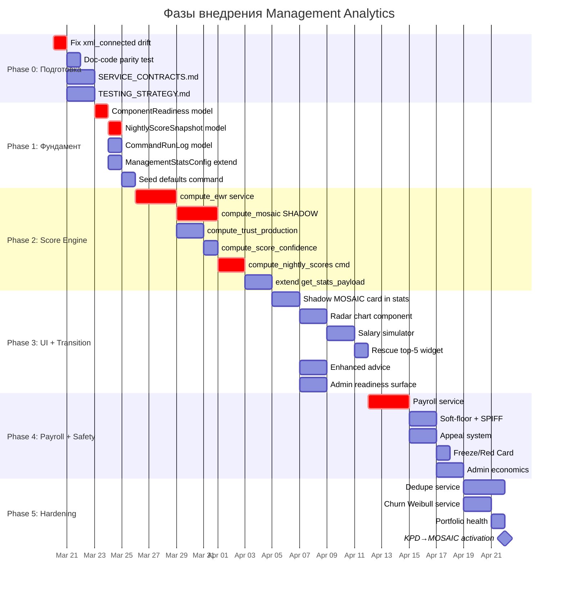

---

## 3. Модельная диаграмма: Существующие + Новые модели

```mermaid
erDiagram
    User ||--o{ Client : "owner"
    User ||--o{ Shop : "created_by / managed_by"
    User ||--o{ ManagementLead : "added_by / processed_by"
    User ||--o{ Report : "owner"
    User ||--o{ ManagementDailyActivity : "user"
    User ||--o{ ManagerCommissionAccrual : "owner"
    User ||--o{ ManagerPayoutRequest : "owner"
    User ||--o{ ClientFollowUp : "owner"
    User ||--o{ ManagementContract : "created_by"

    Client ||--o{ ClientFollowUp : "client"
    Client ||--o{ Report : "via owner"
    
    Shop ||--o{ ShopPhone : "shop"
    Shop ||--o{ ShopShipment : "shop"
    Shop ||--o{ ShopCommunication : "shop"
    Shop ||--o{ ShopInventoryMovement : "shop"

    ManagementLead }o--|| LeadParsingJob : "parser_job"
    ManagementLead ||--o| Client : "converted_client"

    ManagerCommissionAccrual }o--|| WholesaleInvoice : "invoice"
    ShopShipment }o--o| WholesaleInvoice : "wholesale_invoice"

    ManagementStatsConfig ||--|| ManagementStatsConfig : "singleton pk=1"

    Client {
        int id PK
        string shop_name
        string phone
        string phone_normalized
        string source
        string call_result
        int points_override
        FK owner
        datetime created_at
    }

    Shop {
        int id PK
        string name
        string shop_type
        FK created_by
        FK managed_by
        date test_connected_at
        int test_period_days
        datetime next_contact_at
    }

    NightlyScoreSnapshot {
        int id PK
        FK manager
        date snapshot_date
        float mosaic_score
        float ewr_score
        json axes_breakdown
        json raw_data
        string formula_version
        string defaults_version
        float score_confidence
        string job_run_id
        datetime computed_at
    }

    ComponentReadiness {
        int id PK
        string component
        string status
        datetime activated_at
        string reason
    }

    CommandRunLog {
        int id PK
        string command_name
        datetime started_at
        datetime finished_at
        string status
        int rows_processed
        int warnings_count
        text traceback_excerpt
    }

    ScoreAppeal {
        int id PK
        FK manager
        string appeal_type
        string status
        text reason
        text resolution
        FK resolved_by
        datetime created_at
    }

    CallRecord {
        int id PK
        FK client
        FK owner
        string source
        datetime started_at
        int duration_seconds
        string direction
        string outcome
        string provider_call_id
        json raw_payload
    }
```

---

## 4. Score Pipeline: KPD → MOSAIC transition

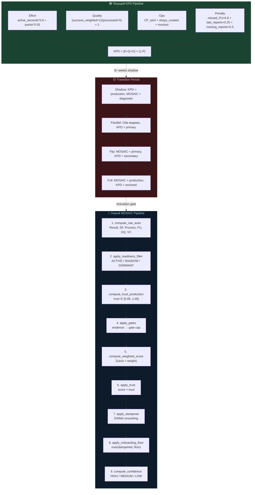

---

## 5. Data Flow: Nightly Score Computation

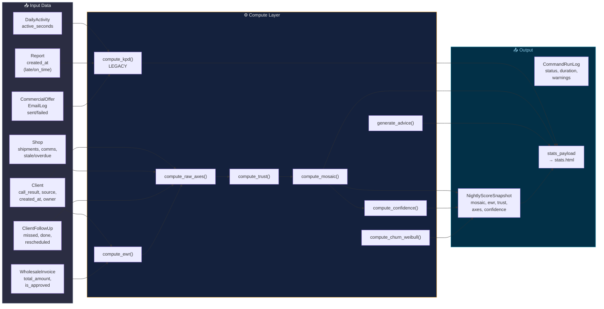

---

## 6. File Decomposition: Текущая → Целевая структура

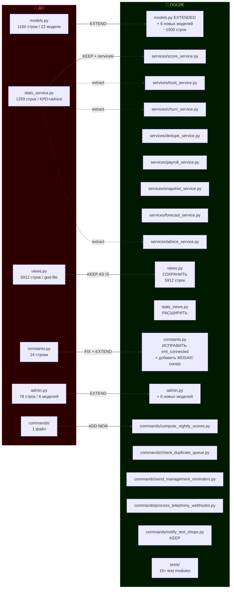

---

## 7. Telegram Integration Flow

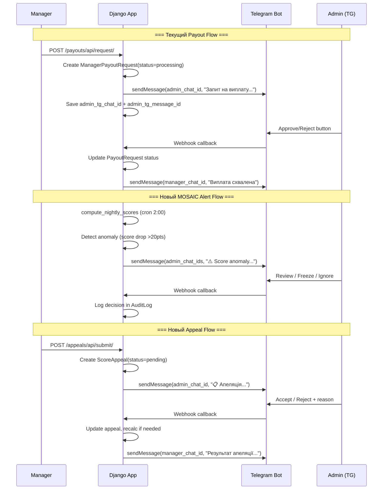

---

## 8. Client Lifecycle: Full Journey (Lead → Client → Shop → Revenue)

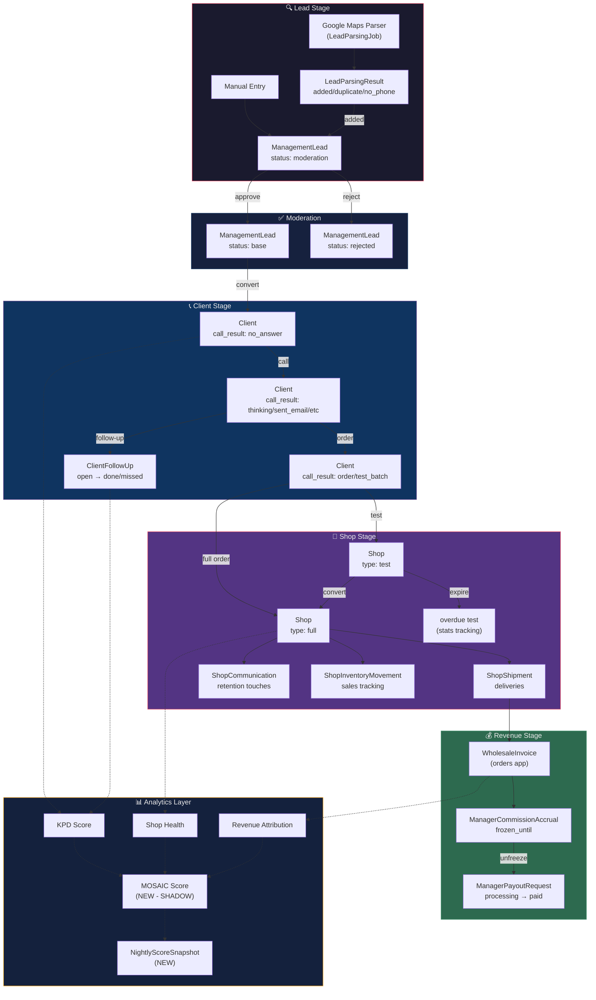

---

## 9. MOSAIC Score Axes: Weight Distribution

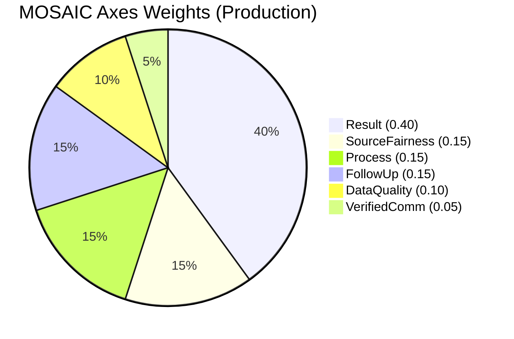

---

## 10. Migration Dependency Chain

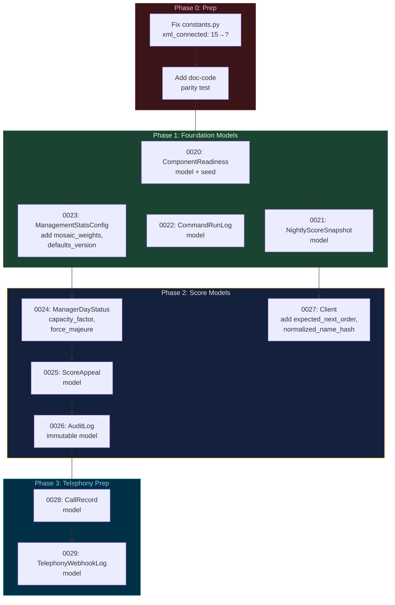

---

## 11. URL Structure Map: Текущие + Новые endpoints

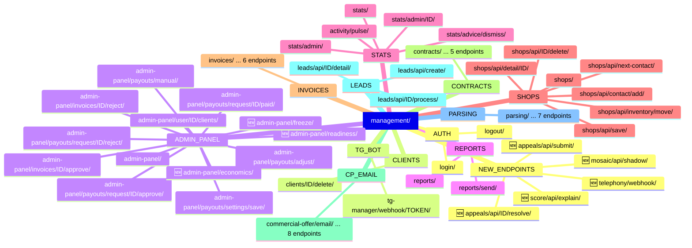

---

## 12. ComponentReadiness State Machine

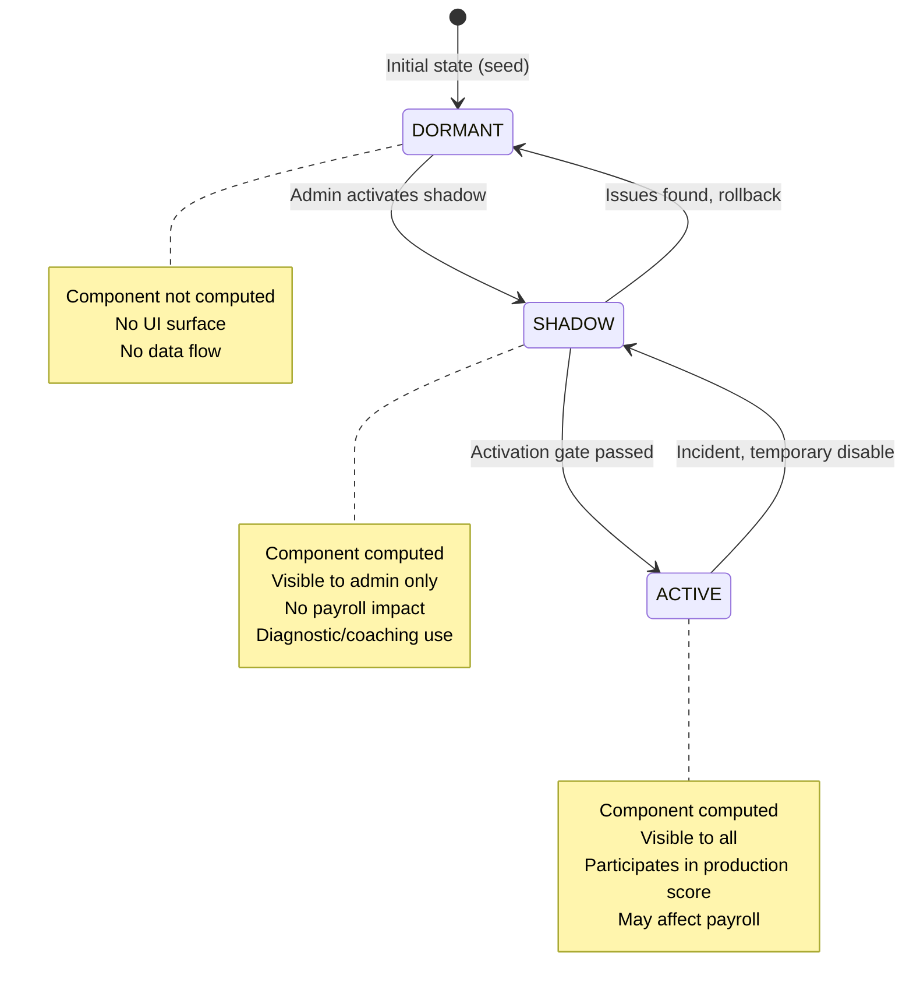

---

## 13. KPD ↔ MOSAIC Component Mapping

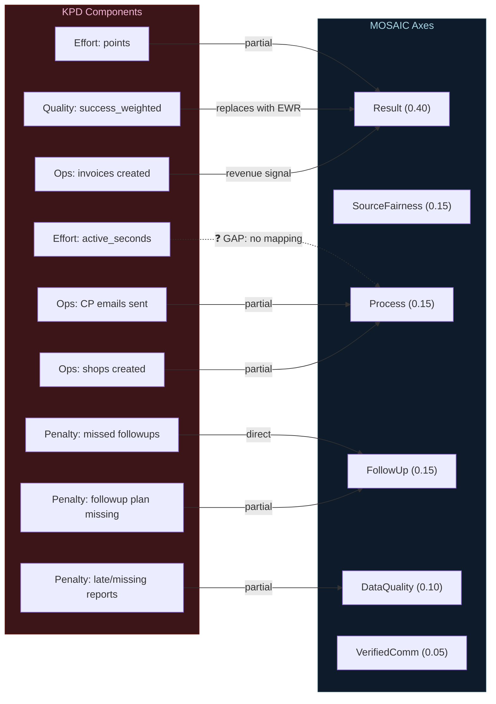

---

*Диаграммы подготовлены: Gemini 2.5 Pro (Antigravity), 2026-03-13*
*Формат: Mermaid — рендерится в GitHub, GitLab, Jetbrains IDE, VS Code*
